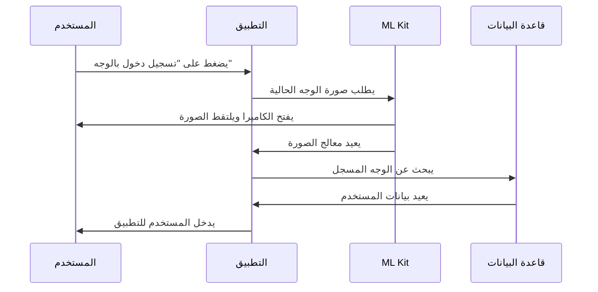
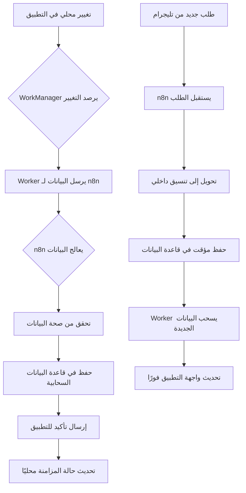

# 🏪 تطبيق إدارة المحل التجاري | Business Management App

تطبيق مخصص لإدارة المحلات التجارية بطريقة احترافية ومرنة.
يُعد نظامًا شاملاً لإدارة **البيع، الشراء، العملاء، الموردين، المصاريف، الفروع، والموظفين** مع دعم المزامنة السحابية وإدارة الصلاحيات.

---

## 📌 نظرة عامة

يهدف التطبيق إلى مساعدة أصحاب المحلات في إدارة أعمالهم اليومية من خلال نظام متكامل وسهل الاستخدام يدعم:
- البيع والشراء وإدارة الفواتير.
- متابعة المخزون والموردين.
- مراقبة الموظفين والفروع.
- تتبع المصاريف والأرباح.
- إنشاء العروض والتخفيضات ونظام ولاء العملاء.
- حفظ البيانات محليًا مع إمكانية المزامنة السحابية.

---

## 🎯 أهداف التطبيق

- 🔹 أتمتة العمليات اليومية (بيع، شراء، جرد، تقارير).
- 🔹 تحسين دقة إدارة البيانات وتجنب الأخطاء اليدوية.
- 🔹 تسهيل متابعة الأداء والمبيعات عبر تقارير تحليلية ذكية.
- 🔹 دعم تعدد الفروع والمستخدمين بصلاحيات مختلفة.
- 🔹 العمل دون اتصال بالإنترنت مع مزامنة لاحقة.
- 🔹 توفير نظام ولاء وعروض مخصص لزيادة التفاعل مع العملاء.

---

## 🧩 البنية المعمارية للتطبيق

التطبيق مبني باستخدام **Clean Architecture** و **MVVM** لضمان فصل المهام وقابلية التوسع.

### الطبقات الرئيسية:
1. **Data Layer**
   - Room Entities
   - DAO
   - Repository
   - Remote Source (Cloud Sync)

2. **Domain Layer**
   - Models
   - Use Cases
   - Repository Interfaces

3. **Presentation Layer**
   - ViewModels
   - Jetpack Compose UI

### التقنيات المستخدمة:
- 🧱 **Kotlin**
- ⚙️ **Jetpack Compose**
- 🧩 **Room Database**
- 🧠 **Hilt (Dependency Injection)**
- 🔄 **WorkManager (Sync & Backup)**
- 🌐 **Cloud Integration (n8n / Firebase)**
- 📊 **Coroutines & Flow**

---

## 📱 وحدات التطبيق (Features & Modules)

| الوحدة | الوظائف الأساسية | الوثائق التفصيلية |
|---------|------------------|-------------------|
| 💵 **نقطة البيع (POS)** | إدارة عمليات البيع اليومية وطباعة الفواتير. | [📖 `features/01-pos.md`](docs/features/01-pos.md) |
| 👥 **العملاء (Customers)** | إضافة العملاء، تتبع الديون، ونظام الولاء. | [📖 `features/03-customers.md`](docs/features/03-customers.md) |
| 🏭 **الموردين (Suppliers)** | إدارة المشتريات والفواتير الخاصة بالموردين. | [📖 `features/04-suppliers.md`](docs/features/04-suppliers.md) |
| 🧑‍💼 **الموظفون (Employees)** | إدارة حسابات الموظفين، الصلاحيات، وتتبع الأداء. | [📖 `features/05-employees.md`](docs/features/05-employees.md) |
| 🏢 **الفروع (Branches)** | دعم تعدد الفروع وتحديد الفرع النشط في الجلسة. | [📖 `features/11-branches.md`](docs/features/11-branches.md) |
| 📦 **المنتجات والمخزون** | إدارة المنتجات، الكميات، التنبيهات، وإنشاء الباركود. | [📖 `features/02-inventory.md`](docs/features/02-inventory.md) |
| 🧾 **الفواتير (Invoices)** | إنشاء، حفظ، وطباعة الفواتير مع تفاصيل العميل والمبيعات. | [📖 `features/08-invoices.md`](docs/features/08-invoices.md) |
| 💰 **المصاريف (Expenses)** | تسجيل المصاريف اليومية وربطها بالتقارير المالية. | [📖 `features/06-expenses.md`](docs/features/06-expenses.md) |
| 🎁 **العروض والتخفيضات** | إعداد تخفيضات تلقائية أو محدودة على المنتجات. | [📖 `features/10-loyalty-and-discounts.md`](docs/features/10-loyalty-and-discounts.md) |
| 🎯 **نظام الولاء** | مكافأة العملاء بالنقاط حسب المشتريات. | [📖 `features/10-loyalty-and-discounts.md`](docs/features/10-loyalty-and-discounts.md) |
| 🌐 **الطلبات أونلاين** | استقبال الطلبات من البوت أو الموقع ومراجعتها داخل التطبيق. | [📖 `features/09-online-orders.md`](docs/features/09-online-orders.md) |
| 📊 **التقارير (Reports)** | تقارير تحليلية للمبيعات، الأرباح، الأداء، والديون. | [📖 `features/07-reports.md`](docs/features/07-reports.md) |
| ⚙️ **الإعدادات (Settings)** | إدارة اللغة، الطابعة، المزامنة، والنسخ الاحتياطي. | [📖 `features/08-settings.md`](docs/features/08-settings.md) |

---

## 🔐 نظام الصلاحيات والجلسات (Permissions & Sessions)

### 🧑‍💻 إدارة الأدوار
الدور	الصلاحيات
المدير العام	يمتلك وصولًا كاملًا إلى جميع الوحدات وجميع الفروع، مع صلاحيات كاملة تشمل الإضافة، التعديل، والحذف.
مدير الفرع	يمتلك وصولًا كاملًا إلى جميع وحدات الفرع الخاص به فقط، مع صلاحيات كاملة تشمل الإضافة، التعديل، والحذف.
البائع	يمتلك وصولًا جزئيًا إلى بعض الوحدات، مع صلاحيات محدودة تشمل الإضافة أو التعديل فقط.
الموظف	يمتلك صلاحية تسجيل الحضور فقط.

### 🪪 إدارة الجلسات:
- حفظ جلسة المستخدم (UserSession) تحتوي على:
  - User ID
  - Branch ID
  - Role & Permissions
  - Session Time

- تحديد الفرع الحالي وتأثيره على جميع العمليات.
- حماية الجلسة عبر تسجيل الخروج التلقائي عند الخمول.
- دعم التحقق البيومتري (Face ID / Fingerprint).

📖 **[للمزيد من التفاصيل: `security/05-role-management.md`](docs/security/05-role-management.md)**

---

## 📂 بنية المجلدات (Project Structure)

```
com.businessmanagement/
│
├── core/
│   ├── util/
│   ├── network/
│   ├── database/
│   ├── di/
│   ├── workers/
│   └── session/
│
├── features/
│   ├── pos/
│   ├── customers/
│   ├── suppliers/
│   ├── employees/
│   ├── branches/
│   ├── products/
│   ├── invoices/
│   ├── reports/
│   ├── expenses/
│   ├── offers/
│   ├── loyalty/
│   ├── online_orders/
│   ├── settings/
│   └── sync/
│
├── navigation/
└── MainApp.kt
```

---

## 🧠 خطة التوسّع المستقبلية (Future Development Plan)

- 🤖 **ذكاء اصطناعي للمبيعات:** تحليل البيانات واقتراح المنتجات الرائجة.
- 💬 **تكامل مع بوت تليغرام:** استقبال الطلبات والردود الذكية.
- 🧾 **نظام فواتير إلكترونية:** متوافق مع الأنظمة الحكومية.
- 🖥️ **لوحة تحكم ويب للإدارة:** لمتابعة الأداء من أي مكان.
- 🚚 **نظام توصيل ذكي:** متابعة الطلبات وتحديد مواقع السائقين.
- ☁️ **مزامنة سحابية محسّنة:** باستخدام WebSockets لتحديث فوري.

---

## 🧱 التقنيات والمكتبات الرئيسية

| التقنية | الغرض |
|----------|--------|
| Kotlin | اللغة الأساسية |
| Jetpack Compose | واجهة المستخدم |
| Room | قاعدة البيانات المحلية |
| Hilt | إدارة الاعتماديات |
| WorkManager | مهام الخلفية |
| ML Kit | ميزات الذكاء الاصطناعي (بصمة الوجه) |
| Coroutines / Flow | معالجة غير متزامنة |
| Firebase / n8n | التكامل السحابي |

📖 **[للمزيد من التفاصيل: `architecture/05-cloud-sync.md`](docs/architecture/05-cloud-sync.md)**

---

## 🧰 طريقة التشغيل (Build & Run)

1. افتح المشروع في **Android Studio (Arctic Fox أو أحدث)**.
2. تأكد من تفعيل **Gradle Sync** بنجاح.
3. شغّل التطبيق على **محاكي أو جهاز فعلي**.
4. استمتع بإدارة متجرك باحترافية ⚡

📖 **[للمزيد من التفاصيل: `getting-started/01-setup.md`](docs/getting-started/01-setup.md)**

---

## 🚀 الخاتمة

> تطبيق **إدارة المحل التجاري** ليس مجرد برنامج محاسبة،
> بل هو نظام ذكي متكامل لإدارة وتشغيل وتطوير نشاطك التجاري بثقة ومرونة.

---

### 🧩 المؤلف

**Hamza K.**
مطور Android متخصص في بناء أنظمة تجارية متكاملة
📧 للتواصل: *(أضف بريدك الإلكتروني إن رغبت)*

---

## 📚 الوثائق التفصيلية

للحصول على وثائق مفصلة لكل ميزة، راجع مجلد [`docs/`](docs/README.md):

- 🏗️ **[البنية المعمارية](docs/overview/03-architecture.md)**
- 💵 **[نقطة البيع](docs/features/01-pos.md)**
- 🌐 **[الطلبات أونلاين](docs/features/09-online-orders.md)**
- 🎁 **[نظام الولاء](docs/features/10-loyalty-and-discounts.md)**
- 🏢 **[إدارة الفروع](docs/features/11-branches.md)**
- 🤖 **[بصمة الوجه](docs/features/12-face-recognition.md)**
- 💾 **[النسخ الاحتياطي](docs/features/13-backup-restore.md)**
- 🏷️ **[نظام الباركود](docs/features/14-printing-barcode.md)**

---

## 🔗 روابط مفيدة

- 📖 **[دليل المساهمة](docs/contributing/01-how-to-contribute.md)**
- 🔒 **[دليل الأمان](docs/security/01-authentication.md)**
- ⚙️ **[دليل الإعداد](docs/getting-started/01-setup.md)**

---

## 📡 API Documentation | وثائق API

للحصول على وثائق API شاملة للمطورين والتكاملات:

### 🔗 API References
- 🌐 **[API Endpoints](docs/api/endpoints.md)** - قائمة شاملة بنقاط النهاية
- 🔐 **[API Authentication](docs/api/authentication.md)** - دليل المصادقة والأمان
- 📊 **[Data Models](docs/api/data-models.md)** - نماذج البيانات والاستجابات
- 🚀 **[API Examples](docs/api/examples.md)** - أمثلة عملية للاستخدام

### 🛠️ API Features
- RESTful API design
- JSON request/response format
- Rate limiting and quotas
- Error handling and status codes
- Webhook support for real-time updates

---

## 🔧 Database Schema | مخطط قاعدة البيانات

### 📋 Database Documentation
- 🗂️ **[Entity Relationship Diagram](docs/database/erd.md)** - مخطط العلاقات
- 📊 **[Table Structures](docs/database/tables.md)** - هيكل الجداول التفصيلي
- 🔍 **[Indexing Strategy](docs/database/indexing.md)** - استراتيجية الفهرسة
- 💾 **[Migration Guide](docs/database/migrations.md)** - دليل الترقية والنسخ الاحتياطي

### 🗄️ Database Features
- Room Database with Kotlin
- Automatic schema migrations
- Data encryption at rest
- Backup and restore capabilities
- Offline-first data synchronization

---

## 🧪 Testing Documentation | وثائق الاختبار

### ✅ Testing Guides
- 🧩 **[Unit Tests](docs/testing/unit-tests.md)** - اختبارات الوحدات
- 🔗 **[Integration Tests](docs/testing/integration.md)** - اختبارات التكامل
- 🎯 **[UI Tests](docs/testing/ui-tests.md)** - اختبارات واجهة المستخدم
- 📊 **[Testing Best Practices](docs/testing/best-practices.md)** - أفضل الممارسات

### 🧪 Testing Features
- Comprehensive test coverage
- Mock data generation
- Performance testing
- Automated testing pipeline
- Code quality metrics

---

## 🚨 Troubleshooting & FAQ | استكشاف الأخطاء والأسئلة الشائعة

### ❓ Common Issues
- 🔧 **[Setup Problems](docs/faq/setup-issues.md)** - مشاكل التثبيت والإعداد
- 🌐 **[Network Issues](docs/faq/network-problems.md)** - مشاكل الشبكة والمزامنة
- 💾 **[Data Issues](docs/faq/data-problems.md)** - مشاكل البيانات والنسخ الاحتياطي
- 🔐 **[Permission Issues](docs/faq/permission-problems.md)** - مشاكل الصلاحيات والوصول

### 💡 FAQ Sections
- 📱 **[General Questions](docs/faq/general.md)** - أسئلة عامة
- 🚀 **[Performance](docs/faq/performance.md)** - الأداء والتحسين
- 🔒 **[Security](docs/faq/security.md)** - الأمان والخصوصية
- 🛠️ **[Development](docs/faq/development.md)** - التطوير والمساهمة

### 🔍 Quick Solutions
- **مزامنة البيانات**: تحقق من اتصال الإنترنت وأعد المحاولة
- **مشاكل الطباعة**: تأكد من تثبيت تعريفات الطابعة الصحيحة
- **بطء التطبيق**: أعد تشغيل التطبيق وقاعدة البيانات
- **مشاكل النسخ الاحتياطي**: تحقق من مساحة التخزين المتاحة

---

## 🔄 Implementation Details | تفاصيل التنفيذ

### 📱 Online Orders Management UI | واجهة إدارة الطلبات أونلاين

#### 🎨 Order Management Interface
```
┌─────────────────────────────────────────────────┐
│  📋 الطلبات الجديدة (3)  │  🔄 قيد المعالجة (5)   │
├─────────────────────────────────────────────────┤
│ ╔══════════════════════════════════════════════╗ │
│ ║ 🆕 طلب #1234 - محمد أحمد                    ║ │
│ ║ 📞 0551234567  | 📍 الرياض، حي النخيل        ║ │
│ ║ 🛒 3 منتجات - 150 ريال                      ║ │
│ ║ ⏰ قبل 15 دقيقة                             ║ │
│ ║                                              ║ │
│ ║ [✅ قبول] [❌ رفض] [👁️ عرض التفاصيل]         ║ │
│ ╚══════════════════════════════════════════════╝ │
│                                              │
│ ╔══════════════════════════════════════════════╗ │
│ ║ 🔄 طلب #1235 - فاطمة علي                    ║ │
│ ║ 📱 تم الطلب عبر تيليجرام                    ║ │
│ ║ 🛍️ 2 منتج - 89 ريال                         ║ │
│ ╚══════════════════════════════════════════════╝ │
└─────────────────────────────────────────────────┘
```

#### 🎯 Key UI Elements
- **Order Status Colors**:
  - 🟡 **جديد**: أصفر - يتطلب مراجعة
  - 🔵 **قيد المعالجة**: أزرق - تم قبوله
  - 🟢 **مكتمل**: أخضر - تم التسليم
  - 🔴 **ملغي**: أحمر - تم رفضه

- **Quick Actions**:
  - ✅ **قبول تلقائي**: قبول الطلب وإرسال تأكيد
  - 👁️ **عرض التفاصيل**: مراجعة المنتجات والعنوان
  - 📞 **اتصال العميل**: اتصال سريع بالعميل

---

### 🤖 Face Recognition Implementation | تنفيذ بصمة الوجه

#### 🔐 Authentication Flow


#### ⚙️ Registration Process
1. **التقاط الصورة الأولى**: الوجه في إضاءة جيدة
2. **التحقق من الجودة**: التأكد من وضوح الملامح
3. **حفظ النموذج**: تخزين الميزات الوجهية
4. **التشفير**: حماية البيانات محليًا

---

### 🔄 Sync Workflow Diagram | مخطط سير المزامنة

#### ☁️ WorkManager ↔ n8n Integration


#### ⏱️ Sync Timing Strategy
- **فوري**: طلبات العملاء والمدفوعات الحرجة
- **كل 5 دقائق**: تحديث المخزون والأسعار
- **كل ساعة**: تقارير المبيعات والإحصائيات
- **يدوي**: عند طلب المستخدم صراحة

---

### 🔐 Permission Implementation | تطبيق الصلاحيات عمليًا

#### 💻 ViewModel Permission Checks
```kotlin
class OrdersViewModel @Inject constructor(
    private val userSession: UserSession
) : ViewModel() {

    val uiState = MutableStateFlow<OrderUiState>(Loading)

    init {
        loadOrders()
    }

    private fun loadOrders() {
        viewModelScope.launch {
            // ✅ مدير الفرع يرى جميع الطلبات
            if (userSession.role == Role.BRANCH_MANAGER) {
                val orders = getAllOrders()
                uiState.value = OrdersLoaded(orders)
            }
            // ⚠️ البائع يرى طلبات فرعه فقط
            else if (userSession.role == Role.CASHIER) {
                val orders = getBranchOrders(userSession.branchId)
                uiState.value = OrdersLoaded(orders)
            }
            // ❌ الموظف لا يرى الطلبات
            else {
                uiState.value = AccessDenied
            }
        }
    }
}
```

#### 🎨 Compose UI Permission-Based Display
```kotlin
@Composable
fun OrdersScreen(
    viewModel: OrdersViewModel = hiltViewModel(),
    onNavigateToOrderDetail: (String) -> Unit
) {
    val uiState by viewModel.uiState.collectAsState()

    Scaffold(
        topBar = {
            TopAppBar(
                title = { Text("إدارة الطلبات") },
                actions = {
                    // 👑 فقط المدير يرى زر التقارير
                    if (userSession.role == Role.ADMIN) {
                        IconButton(onClick = { /* فتح التقارير */ }) {
                            Icon(Icons.Filled.Analytics, "التقارير")
                        }
                    }
                }
            )
        }
    ) { paddingValues ->
        when (uiState) {
            is OrdersLoaded -> {
                LazyColumn(contentPadding = paddingValues) {
                    items((uiState as OrdersLoaded).orders) { order ->
                        OrderItem(
                            order = order,
                            showActions = userSession.canManageOrders,
                            onAccept = { viewModel.acceptOrder(order.id) },
                            onReject = { viewModel.rejectOrder(order.id) }
                        )
                    }
                }
            }
            AccessDenied -> {
                Text(
                    "ليس لديك صلاحية لعرض الطلبات",
                    modifier = Modifier.padding(16.dp)
                )
            }
        }
    }
}
```

---

### 📊 Advanced Analytics Examples | أمثلة التقارير المتقدمة

#### 📈 Sales Performance Dashboard
```kotlin
@Composable
fun SalesAnalyticsScreen() {
    Column {
        // 📊 رسم بياني للمبيعات الشهرية
        Card(modifier = Modifier.fillMaxWidth().height(200.dp)) {
            Text("مبيعات الشهر الحالي", style = MaterialTheme.typography.h6)
            // استخدام مكتبة Compose Charts
            LineChart(
                data = monthlySalesData,
                colors = listOf(Color.Green, Color.Blue, Color.Red)
            )
        }

        Row {
            // 📊 إحصائيات سريعة
            Card(modifier = Modifier.weight(1f)) {
                Text("إجمالي المبيعات")
                Text("125,500 ريال", style = MaterialTheme.typography.h4)
            }
            Card(modifier = Modifier.weight(1f)) {
                Text("عدد الطلبات")
                Text("342 طلب", style = MaterialTheme.typography.h4)
            }
        }

        // 🏢 مقارنة بين الفروع
        Card(modifier = Modifier.fillMaxWidth()) {
            Text("أداء الفروع", style = MaterialTheme.typography.h6)
            BarChart(
                data = branchPerformance,
                labels = listOf("الفرع الرئيسي", "فرع النخيل", "فرع الملز")
            )
        }
    }
}
```

#### 🎯 Key Analytics Metrics
- **📈 Sales Trends**: اتجاهات المبيعات مع التنبؤ
- **👥 Customer Behavior**: سلوك العملاء والتفضيلات
- **🏪 Branch Comparison**: مقارنة أداء الفروع
- **⏰ Peak Hours**: ساعات الذروة والأوقات المزدحمة
- **📦 Product Performance**: أداء المنتجات والفئات الأكثر مبيعًا
