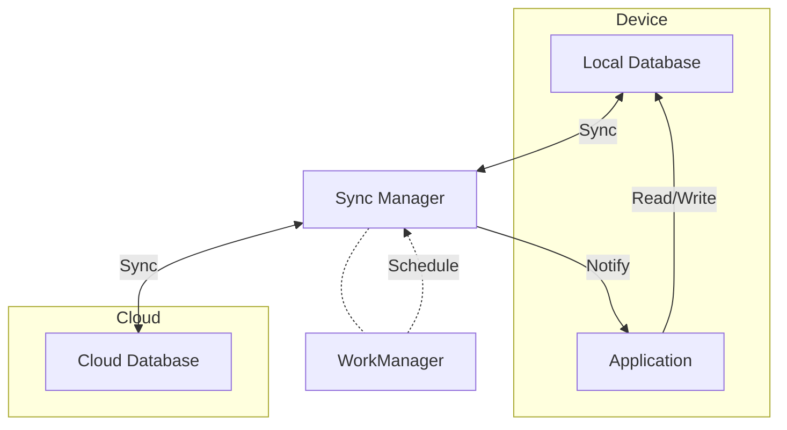
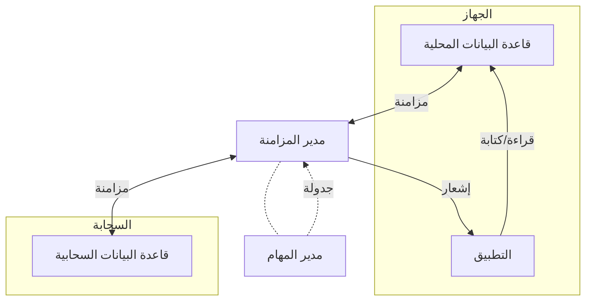

# ☁️ Cloud Sync System

<div dir="rtl">

# ☁️ نظام المزامنة السحابية

</div>

## 📋 Overview | نظرة عامة

The Cloud Sync system provides seamless data synchronization between the local database and the cloud, ensuring data consistency across multiple devices and enabling offline-first functionality. It handles conflict resolution, network conditions, and data integrity.

<div dir="rtl">

## 📋 نظرة عامة

يوفر نظام المزامنة السحابية مزامنة سلسة للبيانات بين قاعدة البيانات المحلية والسحابة، مما يضمن اتساق البيانات عبر أجهزة متعددة وتمكين وظيفة العمل دون اتصال بالإنترنت. يتعامل مع حل التعارضات وظروف الشبكة وسلامة البيانات.

</div>

## 🎯 Key Features | الميزات الرئيسية

### 1. Offline-First Architecture
- **Local Database**: All operations work offline
- **Queue System**: Tracks changes when offline
- **Automatic Sync**: Syncs when connection is restored
- **Conflict Resolution**: Handles data conflicts intelligently

### 2. Data Synchronization
- **Bidirectional Sync**: Changes sync both ways
- **Incremental Updates**: Only syncs changed data
- **Batching**: Efficient network usage
- **Retry Mechanism**: Handles network failures

### 3. Security
- **End-to-End Encryption**: Data encrypted in transit and at rest
- **Authentication**: Secure user authentication
- **Authorization**: Role-based access control
- **Audit Logs**: Tracks all sync operations

### 4. Performance
- **Background Processing**: Doesn't block UI
- **Throttling**: Prevents excessive network usage
- **Compression**: Reduces data transfer size
- **Selective Sync**: Syncs only necessary data

<div dir="rtl">

## 🎯 المميزات الرئيسية

### 1. بنية تعمل دون اتصال بالإنترنت أولاً
- **قاعدة بيانات محلية**: تعمل جميع العمليات دون اتصال
- **نظام الطابور**: يتتبع التغييرات عند عدم الاتصال
- **مزامنة تلقائية**: تتم المزامنة عند استعادة الاتصال
- **حل التعارضات**: يتعامل مع تعارضات البيانات بذكاء

### 2. مزامنة البيانات
- **مزامنة ثنائية الاتجاه**: تتم مزامنة التغييرات في كلا الاتجاهين
- **تحديثات تدريجية**: تتم مزامنة البيانات المتغيرة فقط
- **التجميع**: استخدام فعال لشبكة الإنترنت
- **آلية إعادة المحاولة**: تتعامل مع فشل الشبكة

### 3. الأمان
- **تشفير من طرف إلى طرف**: تشفير البيانات أثناء النقل والتخزين
- **المصادقة**: مصادقة آمنة للمستخدمين
- **الترخيص**: تحكم في الوصول قائم على الأدوار
- **سجلات التدقيق**: يتتبع جميع عمليات المزامنة

### 4. الأداء
- **معالجة في الخلفية**: لا تعيق واجهة المستخدم
- **التحكم في الاستهلاك**: يمنع الاستخدام المفرط للشبكة
- **ضغط البيانات**: يقلل حجم البيانات المنقولة
- **مزامنة انتقائية**: تتم مزامنة البيانات الضرورية فقط

</div>

## 🏗️ Architecture | البنية المعمارية

### System Components


### Data Flow
1. Application makes changes to local database
2. Sync Manager detects changes and adds to sync queue
3. When online, Sync Manager processes queue
4. Changes are pushed to cloud
5. Cloud changes are pulled to local database
6. Application is notified of updates

<div dir="rtl">

## 🏗️ البنية المعمارية

### مكونات النظام


### تدفق البيانات
1. يقوم التطبيق بإجراء تغييرات على قاعدة البيانات المحلية
2. يكتشف مدير المزامنة التغييرات ويضيفها إلى قائمة الانتظار
3. عند الاتصال بالإنترنت، يعالج مدير المزامنة قائمة الانتظار
4. يتم دفع التغييرات إلى السحابة
5. يتم سحب التغييرات من السحابة إلى قاعدة البيانات المحلية
6. يتم إخطار التطبيق بالتحديثات

</div>

## 🛠 Implementation | التنفيذ

### 1. Sync Manager

```kotlin
class SyncManager @Inject constructor(
    private val workManager: WorkManager,
    private val networkMonitor: NetworkMonitor,
    private val syncStatusDao: SyncStatusDao,
    private val syncWorkers: Map<Class<out Syncable>, @JvmSuppressWildcards SyncWorker>
) {
    
    private val syncLock = Any()
    private var isSyncing = false
    
    suspend fun sync() {
        if (!networkMonitor.isOnline()) {
            return // No network, can't sync
        }
        
        synchronized(syncLock) {
            if (isSyncing) {
                return // Sync already in progress
            }
            isSyncing = true
        }
        
        try {
            // Sync each entity type in order
            syncEntityType<Customer>()
            syncEntityType<Product>()
            syncEntityType<Order>()
            syncEntityType<Inventory>()
            
            // Update last sync time
            syncStatusDao.updateLastSync(System.currentTimeMillis())
        } finally {
            synchronized(syncLock) {
                isSyncing = false
            }
        }
    }
    
    private suspend inline fun <reified T : Syncable> syncEntityType() {
        val entityClass = T::class.java
        val worker = syncWorkers[entityClass] ?: return
        
        // Get last sync time for this entity type
        val lastSync = syncStatusDao.getLastSync(entityClass.name)?.lastSyncTime ?: 0L
        
        // Push local changes to server
        worker.pushChanges(lastSync)
        
        // Pull changes from server
        worker.pullChanges(lastSync)
        
        // Update sync time
        syncStatusDao.updateSyncTime(entityClass.name, System.currentTimeMillis())
    }
    
    fun schedulePeriodicSync() {
        val constraints = Constraints.Builder()
            .setRequiredNetworkType(NetworkType.CONNECTED)
            .setRequiresBatteryNotLow(true)
            .build()
            
        val syncRequest = PeriodicWorkRequestBuilder<SyncWorker>(
            repeatInterval = 15, // minutes
            repeatIntervalTimeUnit = TimeUnit.MINUTES,
            flexTimeInterval = 5, // minutes
            flexTimeIntervalUnit = TimeUnit.MINUTES
        )
        .setConstraints(constraints)
        .addTag("sync_worker")
        .build()
        
        workManager.enqueueUniquePeriodicWork(
            "sync_work",
            ExistingPeriodicWorkPolicy.REPLACE,
            syncRequest
        )
    }
}

interface Syncable {
    val id: String
    val lastModified: Long
    val isDeleted: Boolean
}

interface SyncWorker {
    suspend fun pushChanges(since: Long)
    suspend fun pullChanges(since: Long)
}
```

### 2. Network Monitor

```kotlin
class NetworkMonitor @Inject constructor(
    private val context: Context,
    private val connectivityManager: ConnectivityManager
) {
    
    private val networkCallback = object : ConnectivityManager.NetworkCallback() {
        override fun onAvailable(network: Network) {
            super.onAvailable(network)
            _isOnline.value = true
            _networkType.value = getNetworkType()
        }
        
        override fun onLost(network: Network) {
            super.onLost(network)
            _isOnline.value = isNetworkAvailable()
            _networkType.value = getNetworkType()
        }
    }
    
    private val _isOnline = MutableStateFlow(isNetworkAvailable())
    val isOnline: StateFlow<Boolean> = _isOnline
    
    private val _networkType = MutableStateFlow(getNetworkType())
    val networkType: StateFlow<NetworkType> = _networkType
    
    init {
        if (Build.VERSION.SDK_INT >= Build.VERSION_CODES.N) {
            connectivityManager.registerDefaultNetworkCallback(networkCallback)
        } else {
            val networkRequest = NetworkRequest.Builder()
                .addCapability(NetworkCapabilities.NET_CAPABILITY_INTERNET)
                .build()
            connectivityManager.registerNetworkCallback(networkRequest, networkCallback)
        }
    }
    
    private fun isNetworkAvailable(): Boolean {
        val activeNetwork = connectivityManager.activeNetwork ?: return false
        val networkCapabilities = connectivityManager.getNetworkCapabilities(activeNetwork) ?: return false
        return networkCapabilities.hasCapability(NetworkCapabilities.NET_CAPABILITY_INTERNET) &&
               networkCapabilities.hasCapability(NetworkCapabilities.NET_CAPABILITY_VALIDATED)
    }
    
    private fun getNetworkType(): NetworkType {
        val activeNetwork = connectivityManager.activeNetwork ?: return NetworkType.NONE
        val networkCapabilities = connectivityManager.getNetworkCapabilities(activeNetwork) ?: 
            return NetworkType.NONE
            
        return when {
            networkCapabilities.hasTransport(NetworkCapabilities.TRANSPORT_WIFI) -> NetworkType.WIFI
            networkCapabilities.hasTransport(NetworkCapabilities.TRANSPORT_CELLULAR) -> NetworkType.CELLULAR
            networkCapabilities.hasTransport(NetworkCapabilities.TRANSPORT_ETHERNET) -> NetworkType.ETHERNET
            else -> NetworkType.OTHER
        }
    }
    
    fun unregister() {
        connectivityManager.unregisterNetworkCallback(networkCallback)
    }
    
    enum class NetworkType {
        NONE, WIFI, CELLULAR, ETHERNET, OTHER
    }
}
```

### 3. Data Sync Adapters

#### Base Sync Adapter
```kotlin
abstract class BaseSyncAdapter<T : Syncable> @Inject constructor(
    private val localDao: BaseDao<T>,
    private val remoteApi: BaseApi<T>,
    private val syncStatusDao: SyncStatusDao,
    private val mapper: EntityMapper<T, NetworkEntity>
) : SyncWorker {
    
    abstract val entityClass: Class<T>
    
    override suspend fun pushChanges(since: Long) {
        try {
            // Get local changes since last sync
            val localChanges = localDao.getModifiedSince(since)
            if (localChanges.isEmpty()) return
            
            // Convert to network models
            val networkEntities = localChanges.map { mapper.mapToNetwork(it) }
            
            // Push to server
            val response = remoteApi.pushChanges(networkEntities)
            
            // Handle response
            if (response.isSuccessful) {
                // Update sync status for successful items
                val syncedIds = response.body()?.map { it.id } ?: return
                localDao.markAsSynced(syncedIds, System.currentTimeMillis())
            } else {
                // Handle error
                handleSyncError(response.code(), response.errorBody()?.string())
            }
        } catch (e: Exception) {
            // Handle network or other errors
            handleSyncException(e)
        }
    }
    
    override suspend fun pullChanges(since: Long) {
        try {
            // Get changes from server
            val response = remoteApi.getChanges(since)
            
            if (response.isSuccessful) {
                val networkEntities = response.body() ?: return
                
                // Convert to local models
                val localEntities = networkEntities.map { mapper.mapToLocal(it) }
                
                // Save to local database
                localDao.upsertAll(localEntities)
                
                // Update sync status
                syncStatusDao.updateSyncTime(entityClass.name, System.currentTimeMillis())
            } else {
                // Handle error
                handleSyncError(response.code(), response.errorBody()?.string())
            }
        } catch (e: Exception) {
            // Handle network or other errors
            handleSyncException(e)
        }
    }
    
    protected open fun handleSyncError(code: Int, message: String?) {
        // Log error
        Log.e("SyncAdapter", "Sync failed with code $code: $message")
        
        // You might want to implement retry logic or notify user
        when (code) {
            HTTP_UNAUTHORIZED -> {
                // Handle unauthorized (e.g., token expired)
            }
            HTTP_FORBIDDEN -> {
                // Handle forbidden
            }
            // Add more error codes as needed
        }
    }
    
    protected open fun handleSyncException(e: Exception) {
        // Log exception
        Log.e("SyncAdapter", "Sync failed with exception", e)
    }
    
    companion object {
        private const val HTTP_UNAUTHORIZED = 401
        private const val HTTP_FORBIDDEN = 403
    }
}
```

#### Customer Sync Adapter
```kotlin
class CustomerSyncAdapter @Inject constructor(
    private val localDao: CustomerDao,
    private val remoteApi: CustomerApi,
    syncStatusDao: SyncStatusDao,
    mapper: CustomerMapper
) : BaseSyncAdapter<Customer>(localDao, remoteApi, syncStatusDao, mapper) {
    
    override val entityClass = Customer::class.java
}

@Dao
abstract class CustomerDao : BaseDao<Customer>() {
    
    @Query("SELECT * FROM customers WHERE lastModified > :since AND isDeleted = 0")
    abstract suspend fun getModifiedSince(since: Long): List<Customer>
    
    @Query("UPDATE customers SET isSynced = 1, lastSyncTime = :timestamp WHERE id IN (:ids)")
    abstract suspend fun markAsSynced(ids: List<String>, timestamp: Long)
}

interface CustomerApi : BaseApi<Customer> {
    
    @GET("api/customers/changes")
    suspend fun getChanges(@Query("since") since: Long): Response<List<NetworkCustomer>>
    
    @POST("api/customers/sync")
    suspend fun pushChanges(@Body customers: List<NetworkCustomer>): Response<List<NetworkCustomer>>
}
```

### 4. Conflict Resolution

```kotlin
class ConflictResolver {
    
    fun <T : Syncable> resolveConflict(
        local: T,
        remote: T,
        strategy: ConflictResolutionStrategy = ConflictResolutionStrategy.SERVER_WINS
    ): T {
        return when (strategy) {
            ConflictResolutionStrategy.LOCAL_WINS -> local
            ConflictResolutionStrategy.SERVER_WINS -> remote
            ConflictResolutionStrategy.MERGE -> merge(local, remote)
            ConflictResolutionStrategy.PROMPT_USER -> promptUser(local, remote)
        }
    }
    
    private fun <T : Syncable> merge(local: T, remote: T): T {
        // Implement custom merge logic based on your requirements
        // This is a simple example that takes non-null fields from both versions
        return local.copy(
            // Merge fields as needed
            lastModified = maxOf(local.lastModified, remote.lastModified),
            isDeleted = remote.isDeleted // Prefer remote deletion status
        )
    }
    
    private fun <T : Syncable> promptUser(local: T, remote: T): T {
        // In a real app, you would show a dialog to the user
        // and return their selection
        // For now, we'll default to server wins
        return remote
    }
    
    enum class ConflictResolutionStrategy {
        LOCAL_WINS,
        SERVER_WINS,
        MERGE,
        PROMPT_USER
    }
}
```

## 🧪 Testing | الاختبار

### 1. Unit Tests

```kotlin
@RunWith(JUnit4::class)
class SyncManagerTest {
    
    @get:Rule
    val instantTaskExecutorRule = InstantTaskExecutorRule()
    
    private lateinit var syncManager: SyncManager
    private val workManager = mockk<WorkManager>(relaxed = true)
    private val networkMonitor = mockk<NetworkMonitor>()
    private val syncStatusDao = mockk<SyncStatusDao>()
    private val customerSyncWorker = mockk<SyncWorker>()
    private val productSyncWorker = mockk<SyncWorker>()
    
    @Before
    fun setup() {
        // Mock network is online
        coEvery { networkMonitor.isOnline() } returns true
        
        // Create sync manager with mock workers
        syncManager = SyncManager(
            workManager = workManager,
            networkMonitor = networkMonitor,
            syncStatusDao = syncStatusDao,
            syncWorkers = mapOf(
                Customer::class.java to customerSyncWorker,
                Product::class.java to productSyncWorker
            )
        )
    }
    
    @Test
    fun `sync should call sync on all workers`() = runTest {
        // Given
        coEvery { customerSyncWorker.pushChanges(any()) } returns Unit
        coEvery { customerSyncWorker.pullChanges(any()) } returns Unit
        coEvery { productSyncWorker.pushChanges(any()) } returns Unit
        coEvery { productSyncWorker.pullChanges(any()) } returns Unit
        
        // When
        syncManager.sync()
        
        // Then
        coVerify {
            customerSyncWorker.pushChanges(any())
            customerSyncWorker.pullChanges(any())
            productSyncWorker.pushChanges(any())
            productSyncWorker.pullChanges(any())
        }
    }
    
    @Test
    fun `sync should not proceed when offline`() = runTest {
        // Given
        coEvery { networkMonitor.isOnline() } returns false
        
        // When
        syncManager.sync()
        
        // Then
        coVerify(exactly = 0) {
            customerSyncWorker.pushChanges(any())
        }
    }
    
    @Test
    fun `schedulePeriodicSync should enqueue work with correct constraints`() = runTest {
        // When
        syncManager.schedulePeriodicSync()
        
        // Then
        verify {
            workManager.enqueueUniquePeriodicWork(
                "sync_work",
                ExistingPeriodicWorkPolicy.REPLACE,
                any()
            )
        }
    }
}
```

### 2. Integration Tests

```kotlin
@RunWith(AndroidJUnit4::class)
@MediumTest
class SyncIntegrationTest {
    
    @get:Rule
    val hiltRule = HiltAndroidRule(this)
    
    @Inject
    lateinit var context: Context
    
    @Inject
    lateinit var database: AppDatabase
    
    @Inject
    lateinit var customerDao: CustomerDao
    
    @Inject
    lateinit var syncManager: SyncManager
    
    private val mockServer = MockWebServer()
    
    @Before
    fun setup() {
        hiltRule.inject()
        mockServer.start()
        
        // Configure base URL for API
        val baseUrl = mockServer.url("/").toString()
        // Re-initialize your API clients with the mock server URL
    }
    
    @After
    fun cleanup() {
        mockServer.shutdown()
        database.close()
    }
    
    @Test
    fun testSyncWithServer() = runTest {
        // Given
        val testCustomer = Customer(
            id = "test123",
            name = "Test User",
            email = "test@example.com",
            phone = "+1234567890",
            lastModified = System.currentTimeMillis()
        )
        
        // Mock server response
        val response = MockResponse()
            .setResponseCode(200)
            .setBody("""
                [
                    {
                        "id": "test123",
                        "name": "Test User Updated",
                        "email": "updated@example.com",
                        "phone": "+1234567890",
                        "lastModified": ${System.currentTimeMillis() + 1000},
                        "isDeleted": false
                    }
                ]
            """.trimIndent())
        
        mockServer.enqueue(response)
        
        // When
        syncManager.sync()
        
        // Then
        val updatedCustomer = customerDao.getById("test123")
        assertNotNull(updatedCustomer)
        assertEquals("Test User Updated", updatedCustomer?.name)
        assertEquals("updated@example.com", updatedCustomer?.email)
    }
    
    @Test
    fun testOfflineChangesSync() = runTest {
        // Given - create a local customer while offline
        val testCustomer = Customer(
            id = "offline123",
            name = "Offline User",
            email = "offline@example.com",
            phone = "+1987654321",
            lastModified = System.currentTimeMillis(),
            isSynced = false
        )
        
        customerDao.insert(testCustomer)
        
        // When - come back online and sync
        val response = MockResponse()
            .setResponseCode(200)
            .setBody("""
                [
                    {
                        "id": "offline123",
                        "name": "Offline User",
                        "email": "offline@example.com",
                        "phone": "+1987654321",
                        "lastModified": ${System.currentTimeMillis() + 1000},
                        "isDeleted": false
                    }
                ]
            """.trimIndent())
        
        mockServer.enqueue(response)
        
        syncManager.sync()
        
        // Then - customer should be marked as synced
        val syncedCustomer = customerDao.getById("offline123")
        assertTrue(syncedCustomer?.isSynced ?: false)
    }
}
```

## 🚀 Deployment | النشر

### 1. Dependencies

Add to `build.gradle` (app level):

```gradle
dependencies {
    // WorkManager
    def work_version = "2.8.1"
    implementation "androidx.work:work-runtime-ktx:$work_version"
    
    // Room for local database
    def room_version = "2.5.0"
    implementation "androidx.room:room-runtime:$room_version"
    kapt "androidx.room:room-compiler:$room_version"
    implementation "androidx.room:room-ktx:$room_version"
    
    // Retrofit for network calls
    def retrofit_version = "2.9.0"
    implementation "com.squareup.retrofit2:retrofit:$retrofit_version"
    implementation "com.squareup.retrofit2:converter-gson:$retrofit_version"
    
    // Kotlin coroutines
    def coroutines_version = "1.6.4"
    implementation "org.jetbrains.kotlinx:kotlinx-coroutines-android:$coroutines_version"
    
    // Hilt for dependency injection
    def hilt_version = "2.44"
    implementation "com.google.dagger:hilt-android:$hilt_version"
    kapt "com.google.dagger:hilt-android-compiler:$hilt_version"
}
```

### 2. AndroidManifest.xml

```xml
<manifest>
    <!-- Internet permission -->
    <uses-permission android:name="android.permission.INTERNET" />
    <uses-permission android:name="android.permission.ACCESS_NETWORK_STATE" />
    <uses-permission android:name="android.permission.ACCESS_WIFI_STATE" />
    
    <application>
        <!-- WorkManager configuration -->
        <provider
            android:name="androidx.work.impl.WorkManagerInitializer"
            android:authorities="${applicationId}.workmanager-init"
            android:exported="false"
            android:multiprocess="true" />
            
        <!-- Sync service (optional) -->
        <service
            android:name=".sync.SyncService"
            android:exported="false" />
            
        <!-- Sync adapter (optional) -->
        <service
            android:name=".sync.AuthenticatorService"
            android:exported="false">
            <intent-filter>
                <action android:name="android.accounts.AccountAuthenticator" />
            </intent-filter>
            
            <meta-data
                android:name="android.accounts.AccountAuthenticator"
                android:resource="@xml/authenticator" />
        </service>
    </application>
</manifest>
```

### 3. Configuration

In `app/src/main/res/values/config.xml`:

```xml
<resources>
    <!-- Sync settings -->
    <integer name="sync_interval_minutes">15</integer>
    <integer name="sync_flex_minutes">5</integer>
    <bool name="sync_only_when_charging">false</bool>
    <bool name="sync_only_on_wifi">false</bool>
    
    <!-- Conflict resolution -->
    <string name="conflict_resolution_strategy">server_wins</string>
    
    <!-- Batch sizes -->
    <integer name="sync_batch_size">50</integer>
    <integer name="sync_max_retries">3</integer>
    <integer name="sync_retry_delay_seconds">30</integer>
</resources>
```

## 📝 Conclusion | الخاتمة

The Cloud Sync system provides a robust solution for keeping data in sync across multiple devices and with the cloud. With features like offline support, conflict resolution, and efficient network usage, it ensures a seamless user experience while maintaining data consistency and integrity.

<div dir="rtl">

## 📝 الخاتمة

يوفر نظام المزامنة السحابية حلاً قويًا للحفاظ على مزامنة البيانات عبر أجهزة متعددة ومع السحابة. مع ميزات مثل دعم العمل دون اتصال بالإنترنت، وحل التعارضات، والاستخدام الفعال للشبكة، فإنه يضمن تجربة مستخدم سلسة مع الحفاظ على اتساق وسلامة البيانات.

</div>

## 📚 Related Documents | المستندات ذات الصلة

1. [Data Layer Architecture](../architecture/02-data-layer.md)
2. [Authentication & Security](../security/01-authentication.md)
3. [Offline Support](./04-offline-support.md)
4. [Performance Optimization](../development/03-performance.md)

## 🙋 Support | الدعم

For support, please contact our development team or open an issue in the repository.

<div dir="rtl">

## 🙋 الدعم

للحصول على الدعم، يرجى التواصل مع فريق التطوير أو فتح مشكلة في المستودع.

</div>
