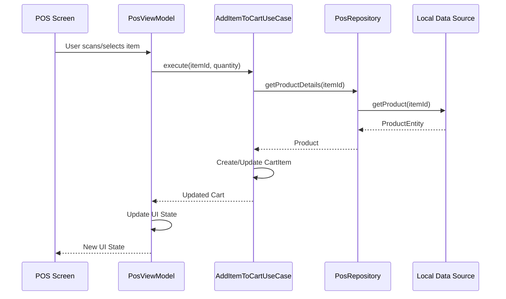

# 💰 Point of Sale (POS) Module

## 📋 Overview
The Point of Sale (POS) module is the heart of the Business Management App, providing a comprehensive solution for processing sales transactions. It's designed to be fast, reliable, and user-friendly, supporting both online and offline operations.

## 🎯 Key Features

### 1. Sales Processing
- Quick product lookup by barcode, name, or code
- Support for variable pricing and discounts
- Split payments and partial payments
- Receipt generation and printing
- Return and exchange handling

### 2. Customer Management
- Quick customer lookup and creation
- Customer history and preferences
- Loyalty points management
- Customer notes and tags

### 3. Payment Processing
- Multiple payment methods (Cash, Card, Mobile Money, etc.)
- Split payments across different methods
- Change calculation
- Receipt customization

### 4. Inventory Integration
- Real-time stock updates
- Low stock warnings
- Batch and serial number tracking
- Expiry date management

## 🏗️ Architecture

### Package Structure
```
:features:pos
├── data
│   ├── local
│   │   ├── PosDao.kt
│   │   └── PosDatabase.kt
│   ├── remote
│   │   └── PosApi.kt
│   ├── repository
│   │   └── PosRepositoryImpl.kt
│   └── model
│       ├── PosItemEntity.kt
│       ├── PosTransactionEntity.kt
│       └── PosPaymentEntity.kt
├── domain
│   ├── model
│   │   ├── PosItem.kt
│   │   ├── PosTransaction.kt
│   │   └── PosPayment.kt
│   ├── repository
│   │   └── PosRepository.kt
│   └── usecase
│       ├── ProcessSaleUseCase.kt
│       ├── AddItemToCartUseCase.kt
│       └── ProcessPaymentUseCase.kt
└── presentation
    ├── screen
    │   ├── PosScreen.kt
    │   ├── PaymentScreen.kt
    │   └── ReceiptScreen.kt
    ├── component
    │   ├── ProductSearchBar.kt
    │   ├── CartItemList.kt
    │   └── PaymentMethodSelector.kt
    └── viewmodel
        ├── PosViewModel.kt
        └── PosUiState.kt
```

### Data Flow

#### 1. Adding Items to Cart


## 🛠 Implementation Details

### 1. Data Layer

#### Room Entities
```kotlin
@Entity(tableName = "pos_transactions")
data class PosTransactionEntity(
    @PrimaryKey(autoGenerate = true)
    val transactionId: Long = 0,
    val customerId: Long?,
    val employeeId: Long,
    val branchId: Long,
    val subtotal: Double,
    val tax: Double,
    val discount: Double,
    val total: Double,
    val paymentStatus: String,
    val createdAt: Long = System.currentTimeMillis(),
    val updatedAt: Long = System.currentTimeMillis()
)

@Entity(
    tableName = "pos_transaction_items",
    foreignKeys = [
        ForeignKey(
            entity = PosTransactionEntity::class,
            parentColumns = ["transactionId"],
            childColumns = ["transactionId"],
            onDelete = ForeignKey.CASCADE
        )
    ]
)
data class PosTransactionItemEntity(
    @PrimaryKey(autoGenerate = true)
    val id: Long = 0,
    val transactionId: Long,
    val productId: Long,
    val quantity: Int,
    val unitPrice: Double,
    val discount: Double,
    val tax: Double,
    val total: Double
)
```

### 2. Domain Layer

#### Use Cases
```kotlin
class ProcessSaleUseCase @Inject constructor(
    private val posRepository: PosRepository,
    private val inventoryRepository: InventoryRepository
) {
    suspend operator fun invoke(transaction: PosTransaction): Result<PosTransaction> {
        return try {
            // Validate stock availability
            val outOfStockItems = transaction.items.filter { item ->
                val currentStock = inventoryRepository.getCurrentStock(item.productId)
                currentStock < item.quantity
            }
            
            if (outOfStockItems.isNotEmpty()) {
                return Result.failure(InsufficientStockException(outOfStockItems))
            }
            
            // Process the transaction
            val result = posRepository.saveTransaction(transaction)
            
            // Update inventory
            transaction.items.forEach { item ->
                inventoryRepository.updateStock(
                    productId = item.productId,
                    quantityChange = -item.quantity,
                    referenceId = transaction.transactionId,
                    referenceType = "SALE"
                )
            }
            
            Result.success(result)
        } catch (e: Exception) {
            Result.failure(e)
        }
    }
}
```

### 3. Presentation Layer

#### ViewModel
```kotlin
@HiltViewModel
class PosViewModel @Inject constructor(
    private val addItemToCartUseCase: AddItemToCartUseCase,
    private val processSaleUseCase: ProcessSaleUseCase
) : ViewModel() {
    
    private val _uiState = MutableStateFlow<PosUiState>(PosUiState.Empty)
    val uiState: StateFlow<PosUiState> = _uiState.asStateFlow()
    
    private val _cartItems = MutableStateFlow<List<CartItem>>(emptyList())
    val cartItems: StateFlow<List<CartItem>> = _cartItems.asStateFlow()
    
    fun onEvent(event: PosEvent) {
        when (event) {
            is PosEvent.AddItem -> addItemToCart(event.productId, event.quantity)
            is PosEvent.RemoveItem -> removeItemFromCart(event.itemId)
            is PosEvent.ProcessPayment -> processPayment(event.paymentDetails)
            // Handle other events...
        }
    }
    
    private fun addItemToCart(productId: Long, quantity: Int) {
        viewModelScope.launch {
            _uiState.value = PosUiState.Loading
            try {
                val result = addItemToCartUseCase(productId, quantity)
                _cartItems.update { result }
                _uiState.value = PosUiState.Success
            } catch (e: Exception) {
                _uiState.value = PosUiState.Error(e.message ?: "Unknown error")
            }
        }
    }
    
    // Other ViewModel methods...
}
```

## 🧪 Testing

### Unit Tests
```kotlin
@ExperimentalCoroutinesApi
class ProcessSaleUseCaseTest {
    
    @get:Rule
    val coroutineRule = MainCoroutineRule()
    
    private lateinit var useCase: ProcessSaleUseCase
    private val posRepository = mockk<PosRepository>()
    private val inventoryRepository = mockk<InventoryRepository>()
    
    @Before
    fun setup() {
        useCase = ProcessSaleUseCase(posRepository, inventoryRepository)
    }
    
    @Test
    fun `process sale with sufficient stock should succeed`() = runTest {
        // Given
        val transaction = createTestTransaction()
        every { inventoryRepository.getCurrentStock(any()) } returns 10
        coEvery { posRepository.saveTransaction(any()) } returns transaction
        
        // When
        val result = useCase(transaction)
        
        // Then
        assertTrue(result.isSuccess)
        assertEquals(transaction, result.getOrNull())
        coVerify(exactly = transaction.items.size) {
            inventoryRepository.updateStock(any(), any(), any(), any())
        }
    }
    
    // More test cases...
}
```

## 📱 UI Components

### POS Screen
```kotlin
@Composable
fun PosScreen(
    viewModel: PosViewModel = hiltViewModel(),
    modifier: Modifier = Modifier
) {
    val uiState by viewModel.uiState.collectAsState()
    val cartItems by viewModel.cartItems.collectAsState()
    
    Column(
        modifier = modifier
            .fillMaxSize()
            .padding(16.dp)
    ) {
        // Product search and selection
        ProductSearchBar(
            onSearch = { query ->
                // Handle search
            },
            onBarcodeScanned = { barcode ->
                viewModel.onEvent(PosEvent.ScanBarcode(barcode))
            }
        )
        
        Spacer(modifier = Modifier.height(16.dp))
        
        // Product grid/list
        ProductGrid(
            products = emptyList(), // Load from repository
            onProductClick = { product ->
                viewModel.onEvent(PosEvent.AddItem(product.id, 1))
            }
        )
        
        // Cart summary
        CartSummary(
            items = cartItems,
            onQuantityChange = { itemId, quantity ->
                viewModel.onEvent(PosEvent.UpdateQuantity(itemId, quantity))
            },
            onRemoveItem = { itemId ->
                viewModel.onEvent(PosEvent.RemoveItem(itemId))
            },
            onCheckout = {
                viewModel.onEvent(PosEvent.ProceedToPayment)
            }
        )
        
        // Handle loading and error states
        when (uiState) {
            is PosUiState.Loading -> {
                CircularProgressIndicator()
            }
            is PosUiState.Error -> {
                val error = (uiState as PosUiState.Error).message
                Text("Error: $error", color = MaterialTheme.colors.error)
            }
            else -> {}
        }
    }
}
```

## 🔄 State Management

### UI State
```kotlin
sealed class PosUiState {
    object Empty : PosUiState()
    object Loading : PosUiState()
    object Success : PosUiState()
    data class Error(val message: String) : PosUiState()
}

sealed class PosEvent {
    data class AddItem(val productId: Long, val quantity: Int) : PosEvent()
    data class UpdateQuantity(val itemId: Long, val quantity: Int) : PosEvent()
    data class RemoveItem(val itemId: Long) : PosEvent()
    object ProceedToPayment : PosEvent()
    data class ProcessPayment(val paymentDetails: PaymentDetails) : PosEvent()
    data class ScanBarcode(val barcode: String) : PosEvent()
}
```

## 🔄 Offline Support

### Offline Queue
```kotlin
class OfflineTransactionQueue @Inject constructor(
    private val networkMonitor: NetworkMonitor,
    private val posRepository: PosRepository
) {
    private val pendingTransactions = mutableListOf<PosTransaction>()
    private val scope = CoroutineScope(Dispatchers.IO + SupervisorJob())
    
    init {
        observeNetworkStatus()
    }
    
    fun addTransaction(transaction: PosTransaction) {
        scope.launch {
            if (networkMonitor.isOnline()) {
                processTransaction(transaction)
            } else {
                pendingTransactions.add(transaction)
                // Save to local storage for persistence
                posRepository.savePendingTransaction(transaction)
            }
        }
    }
    
    private fun observeNetworkStatus() {
        networkMonitor.isOnline
            .distinctUntilChanged()
            .onEach { isOnline ->
                if (isOnline) {
                    processPendingTransactions()
                }
            }
            .launchIn(scope)
    }
    
    private suspend fun processPendingTransactions() {
        val pending = posRepository.getPendingTransactions()
        pending.forEach { transaction ->
            processTransaction(transaction)
        }
    }
    
    private suspend fun processTransaction(transaction: PosTransaction) {
        try {
            posRepository.syncTransaction(transaction)
            // Remove from pending if successful
            pendingTransactions.remove(transaction)
            posRepository.removePendingTransaction(transaction.transactionId)
        } catch (e: Exception) {
            // Handle error, retry logic
        }
    }
}
```

## 🔒 Security Considerations

### Data Protection
- Encrypt sensitive data at rest using Android's EncryptedSharedPreferences
- Secure API communication with TLS 1.3
- Implement certificate pinning
- Obfuscate code with R8/ProGuard

### Payment Security
- Never store full payment card details
- Comply with PCI DSS standards
- Use tokenization for payment processing
- Implement secure key management

## 📊 Performance Optimization

### Database Optimization
- Use Room with appropriate indices
- Implement pagination for transaction history
- Use Flow for reactive updates

### UI Performance
- Use LazyColumn/LazyRow for lists
- Implement content descriptions for accessibility
- Optimize image loading with Coil
- Use rememberSaveable for configuration changes

## 🌐 Localization

### Supported Languages
- English (en)
- Arabic (ar)

### Implementation
- Use string resources with placeholders
- Support RTL layouts
- Format numbers, dates, and currencies according to locale

## 📱 Platform-Specific Features

### Android
- WorkManager for background sync
- Biometric authentication
- Print framework integration
- Barcode scanning with ML Kit

## 🔄 Integration Points

### Internal Modules
- Inventory: Stock updates
- Customers: Customer data and history
- Employees: User authentication and permissions
- Reports: Sales analytics

### External Services
- Payment gateways
- Tax calculation services
- E-commerce platforms
- Accounting software

## 📝 Best Practices

### Code Organization
- Follow clean architecture principles
- Keep UI components small and focused
- Use sealed classes for state management
- Implement proper error handling

### Testing
- Write unit tests for business logic
- Implement UI tests for critical flows
- Use test doubles for dependencies
- Test edge cases and error conditions

## 🚀 Future Enhancements

### Planned Features
- Split bill functionality
- Table management for restaurants
- Advanced discount engine
- Multi-currency support
- Offline receipt printing

### Technical Improvements
- Migrate to MVI pattern
- Implement GraphQL API
- Add more comprehensive analytics
- Enhance offline capabilities
