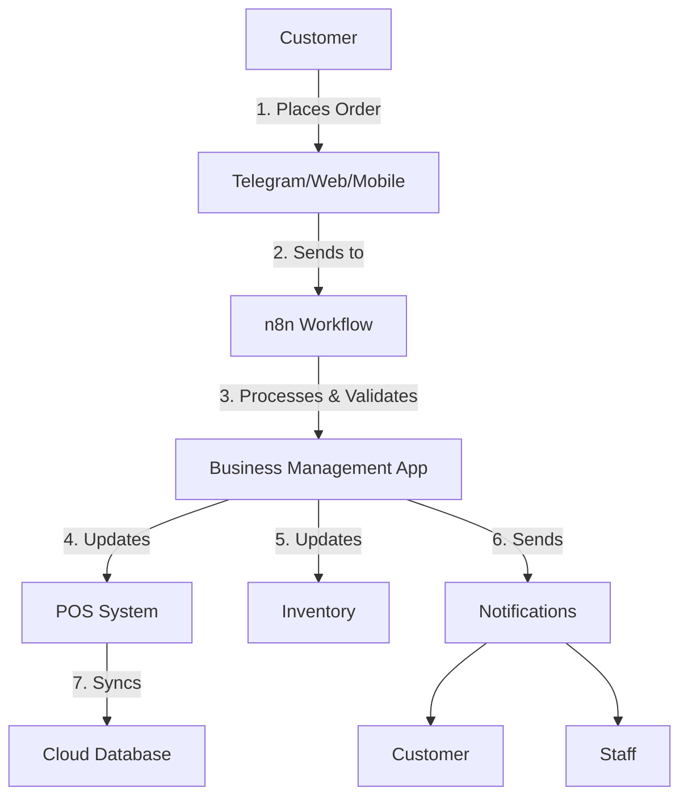
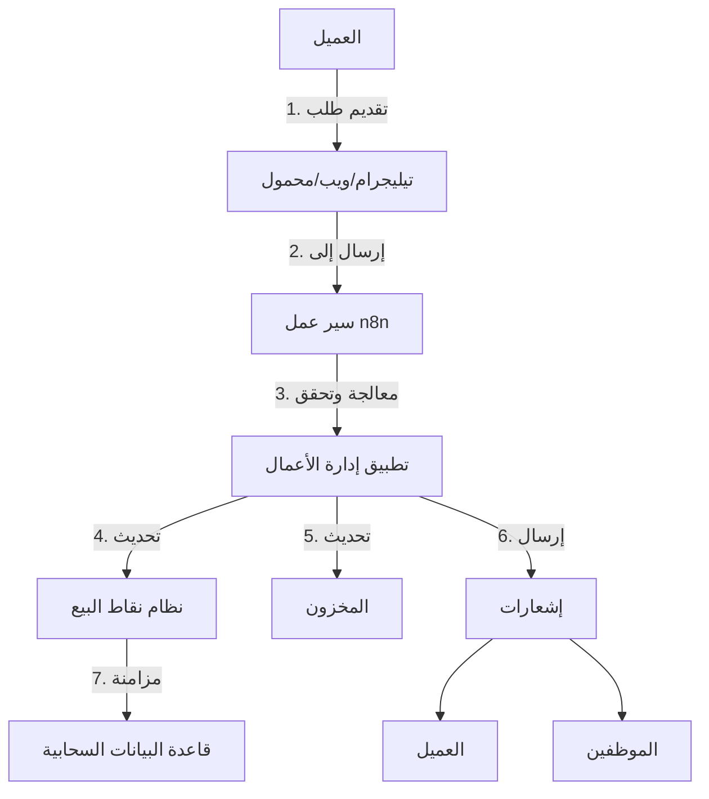

# 🛒 Online Orders System

<div dir="rtl">

# 🛒 نظام الطلبات أونلاين

</div>

## 📋 Overview | نظرة عامة

The Online Orders system enables customers to place orders remotely through multiple channels, with seamless integration into the main POS system. It supports real-time order tracking, automated notifications, and works in both online and offline modes.

<div dir="rtl">

## 📋 نظرة عامة

يتيح نظام الطلبات أونلاين للعملاء تقديم طلباتهم عن بُعد من خلال قنوات متعددة، مع تكامل سلس مع نظام نقاط البيع الرئيسي. يدعم النظام تتبع الطلبات في الوقت الفعلي وإشعارات آلية ويعمل في وضع الاتصال بالإنترنت وخارجه.

</div>

## 🎯 Key Features | الميزات الرئيسية

### 1. Multi-Channel Order Management
- **Telegram Bot** integration for order placement
- **Web Portal** for customers and businesses
- **Mobile App** integration
- **Phone Orders** manual entry

### 2. Order Processing
- Real-time order status updates
- Automated order confirmation
- Payment processing integration
- Order history and tracking

### 3. Integration
- **n8n Workflow Automation**
- **Telegram Bot API**
- **POS System Sync**
- **Inventory Management**

### 4. Notifications
- Order confirmation
- Status updates
- Delivery tracking
- Payment receipts

<div dir="rtl">

## 🎯 الميزات الرئيسية

### 1. إدارة الطلبات متعددة القنوات
- تكامل مع **بوت تيليجرام** لتلقي الطلبات
- **بوابة ويب** للعملاء وأصحاب الأعمال
- تكامل مع **التطبيق المحمول**
- إدخال يدوي للطلبات الهاتفية

### 2. معالجة الطلبات
- تحديثات حالة الطلب في الوقت الفعلي
- تأكيد الطلب آليًا
- تكامل مع أنظمة الدفع
- سجل الطلبات والتتبع

### 3. التكامل
- أتمتة سير العمل باستخدام **n8n**
- **واجهة برمجة تطبيقات بوت تيليجرام**
- مزامنة مع **نظام نقاط البيع**
- إدارة المخزون

### 4. الإشعارات
- تأكيد الطلب
- تحديثات الحالة
- تتبع التوصيل
- إيصالات الدفع

</div>

## 🏗️ Architecture | البنية المعمارية

### System Components


### Data Flow
1. Customer places order via Telegram/Web/Mobile
2. n8n workflow processes the order
3. Order is validated and stored in local database
4. POS system is updated in real-time
5. Inventory is adjusted accordingly
6. Notifications are sent to relevant parties
7. Data is synced to cloud when online

<div dir="rtl">

## 🏗️ البنية المعمارية

### مكونات النظام


### تدفق البيانات
1. يقدم العميل طلبًا عبر تيليجرام/الويب/المحمول
2. تتم معالجة الطلب عبر سير عمل n8n
3. يتم التحقق من الطلب وتخزينه في قاعدة البيانات المحلية
4. يتم تحديث نظام نقاط البيع في الوقت الفعلي
5. يتم تعديل المخزون وفقًا لذلك
6. يتم إرسال إشعارات للأطراف المعنية
7. تتم مزامنة البيانات مع السحابة عند الاتصال بالإنترنت

</div>

## 🛠 Implementation | التنفيذ

### 1. Database Schema

#### Order Entity
```kotlin
@Entity(tableName = "online_orders")
data class OnlineOrder(
    @PrimaryKey(autoGenerate = true)
    val orderId: Long = 0,
    val customerId: Long?,
    val customerName: String,
    val customerPhone: String,
    val customerAddress: String,
    val branchId: Long,
    val status: OrderStatus,
    val orderType: OrderType,
    val paymentMethod: PaymentMethod,
    val paymentStatus: PaymentStatus,
    val subtotal: Double,
    val tax: Double,
    val deliveryFee: Double,
    val discount: Double,
    val total: Double,
    val notes: String?,
    val source: OrderSource,
    val createdAt: Long = System.currentTimeMillis(),
    val updatedAt: Long = System.currentTimeMillis(),
    val isSynced: Boolean = false,
    val syncError: String? = null
)

enum class OrderStatus {
    PENDING, CONFIRMED, PREPARING, READY_FOR_PICKUP, OUT_FOR_DELIVERY, 
    DELIVERED, CANCELLED, REFUNDED
}

enum class OrderType {
    DELIVERY, PICKUP, DINE_IN
}

enum class OrderSource {
    TELEGRAM, WEB, MOBILE_APP, PHONE, WALK_IN
}
```

### 2. n8n Workflow Integration

#### Webhook Configuration
```typescript
// Sample n8n webhook configuration
const webhook = {
  httpMethod: 'POST',
  path: '/api/orders/webhook',
  responseMode: 'onReceived',
  responseData: 'First binary item',
  options: {
    cors: {
      origin: '*',
      methods: ['GET', 'POST', 'PUT', 'DELETE'],
      allowedHeaders: ['Content-Type', 'Authorization']
    }
  }
};
```

#### Order Processing Workflow
1. **Webhook Trigger**: Receives order data from Telegram/Web
2. **Data Validation**: Validates required fields
3. **Customer Lookup**: Checks for existing customer or creates new
4. **Inventory Check**: Verifies product availability
5. **Order Creation**: Creates order in the system
6. **Notification**: Sends confirmation to customer and staff
7. **POS Integration**: Updates POS system

### 3. Telegram Bot Integration

#### Bot Commands
```kotlin
// Telegram bot command handlers
val commandHandlers = mapOf(
    "/start" to { chatId, _ -> 
        sendWelcomeMessage(chatId) 
    },
    "/menu" to { chatId, _ -> 
        sendMainMenu(chatId) 
    },
    "/order" to { chatId, _ -> 
        startOrderProcess(chatId) 
    },
    "/status" to { chatId, orderId -> 
        sendOrderStatus(chatId, orderId) 
    },
    "/help" to { chatId, _ -> 
        sendHelpMessage(chatId) 
    }
)
```

#### Inline Keyboard Example
```kotlin
fun createOrderKeyboard(): InlineKeyboardMarkup {
    return InlineKeyboardMarkup().apply {
        addRow(
            InlineKeyboardButton("🛍 View Menu").callbackData("view_menu"),
            InlineKeyboardButton("📦 My Orders").callbackData("my_orders")
        )
        addRow(
            InlineKeyboardButton("🛒 Cart (0)").callbackData("view_cart")
        )
    }
}
```

### 4. API Endpoints

#### Order Endpoints
```kotlin
@Path("/api/orders")
class OrderResource @Inject constructor(
    private val orderService: OrderService,
    private val authManager: AuthManager
) {
    
    @POST
    @Path("/webhook")
    @Consumes(MediaType.APPLICATION_JSON)
    @Produces(MediaType.APPLICATION_JSON)
    suspend fun handleWebhook(
        @HeaderParam("X-Webhook-Signature") signature: String?,
        payload: WebhookPayload
    ): Response<ApiResponse<OrderResponse>> {
        // Verify webhook signature
        if (!verifySignature(signature, payload)) {
            return Response.error(ErrorResponse.UNAUTHORIZED)
        }
        
        return try {
            val order = orderService.processWebhookOrder(payload)
            Response.success(ApiResponse.success(order.toOrderResponse()))
        } catch (e: Exception) {
            Response.error(ErrorResponse.fromException(e))
        }
    }
    
    @GET
    @Path("/{orderId}")
    @Produces(MediaType.APPLICATION_JSON)
    suspend fun getOrder(
        @PathParam("orderId") orderId: Long,
        @HeaderParam("Authorization") authHeader: String?
    ): Response<ApiResponse<OrderResponse>> {
        return try {
            val userId = authManager.authenticate(authHeader)
            val order = orderService.getOrderById(orderId, userId)
            Response.success(ApiResponse.success(order.toOrderResponse()))
        } catch (e: Exception) {
            Response.error(ErrorResponse.fromException(e))
        }
    }
    
    @PUT
    @Path("/{orderId}/status")
    @Consumes(MediaType.APPLICATION_JSON)
    @Produces(MediaType.APPLICATION_JSON)
    suspend fun updateOrderStatus(
        @PathParam("orderId") orderId: Long,
        @HeaderParam("Authorization") authHeader: String?,
        @Valid request: UpdateStatusRequest
    ): Response<ApiResponse<OrderResponse>> {
        return try {
            val userId = authManager.authenticate(authHeader)
            val order = orderService.updateOrderStatus(orderId, request.status, userId)
            Response.success(ApiResponse.success(order.toOrderResponse()))
        } catch (e: Exception) {
            Response.error(ErrorResponse.fromException(e))
        }
    }
}
```

## 🔄 Offline Support | دعم وضع عدم الاتصال

The system is designed to work offline with the following features:

### 1. Local Database
- All orders are stored locally first
- Sync status is tracked for each order
- Failed syncs are queued for retry

### 2. Sync Mechanism
```kotlin
class OrderSyncWorker(
    context: Context,
    workerParams: WorkerParameters,
    private val orderRepository: OrderRepository,
    private val syncService: SyncService
) : CoroutineWorker(context, workerParams) {

    override suspend fun doWork(): Result {
        return try {
            // Get unsynced orders
            val unsyncedOrders = orderRepository.getUnsyncedOrders()
            
            if (unsyncedOrders.isNotEmpty()) {
                // Try to sync each order
                unsyncedOrders.forEach { order ->
                    try {
                        syncService.syncOrder(order)
                        orderRepository.markAsSynced(order.orderId)
                    } catch (e: Exception) {
                        orderRepository.markSyncFailed(order.orderId, e.message)
                        // Log error but continue with next order
                    }
                }
            }
            
            Result.success()
        } catch (e: Exception) {
            // Retry later
            Result.retry()
        }
    }
    
    companion object {
        private const val SYNC_WORKER_TAG = "order_sync_worker"
        
        fun enqueue(context: Context) {
            val workRequest = PeriodicWorkRequestBuilder<OrderSyncWorker>(
                repeatInterval = 15,
                repeatIntervalTimeUnit = TimeUnit.MINUTES,
                flexTimeInterval = 5,
                flexTimeIntervalUnit = TimeUnit.MINUTES
            )
            .addTag(SYNC_WORKER_TAG)
            .setBackoffCriteria(
                BackoffPolicy.LINEAR,
                workRequestTimeUnit = TimeUnit.MINUTES,
                duration = 5
            )
            .build()
            
            WorkManager.getInstance(context).enqueueUniquePeriodicWork(
                SYNC_WORKER_TAG,
                ExistingPeriodicWorkPolicy.REPLACE,
                workRequest
            )
        }
    }
}
```

## 🔒 Security | الأمان

### 1. Webhook Security
- HMAC signature verification
- IP whitelisting
- Rate limiting
- Request validation

### 2. Data Protection
- End-to-end encryption for sensitive data
- Secure storage of API keys
- Regular security audits
- GDPR compliance

## 📱 User Experience | تجربة المستخدم

### 1. Order Flow
1. **Browse Menu**: Customers can view available items
2. **Customize Order**: Add special instructions or modifications
3. **Review Order**: See order summary before confirming
4. **Payment**: Multiple payment options
5. **Confirmation**: Order details and estimated time
6. **Tracking**: Real-time order status updates

### 2. Admin Dashboard
- Order management
- Customer communication
- Analytics and reports
- Menu management
- Staff assignments

## 🧪 Testing | الاختبار

### 1. Unit Tests
```kotlin
@ExperimentalCoroutinesApi
@HiltAndroidTest
class OrderProcessingTest {
    
    @get:Rule
    val hiltRule = HiltAndroidRule(this)
    
    @get:Rule
    val coroutineRule = MainCoroutineRule()
    
    @Inject
    lateinit var orderRepository: OrderRepository
    
    @Inject
    lateinit var orderProcessor: OrderProcessor
    
    @Before
    fun setup() {
        hiltRule.inject()
    }
    
    @Test
    fun `process valid order successfully`() = runTest {
        // Given
        val order = createTestOrder()
        
        // When
        val result = orderProcessor.processOrder(order)
        
        // Then
        assertTrue(result.isSuccess)
        assertEquals(OrderStatus.CONFIRMED, result.getOrNull()?.status)
    }
    
    @Test
    fun `reject order with invalid customer`() = runTest {
        // Given
        val order = createTestOrder().copy(customerId = -1)
        
        // When
        val result = orderProcessor.processOrder(order)
        
        // Then
        assertTrue(result.isFailure)
        assertTrue(result.exceptionOrNull() is CustomerNotFoundException)
    }
    
    // More test cases...
}
```

### 2. Integration Tests
```kotlin
@HiltAndroidTest
@UninstallModules(NetworkModule::class, DatabaseModule::class)
class OrderIntegrationTest {
    
    @get:Rule
    val hiltRule = HiltAndroidRule(this)
    
    @get:Rule
    val instantTaskExecutorRule = InstantTaskExecutorRule()
    
    @Inject
    lateinit var orderService: OrderService
    
    @Inject
    lateinit var database: AppDatabase
    
    @Before
    fun setup() {
        // Setup test database
        val context = ApplicationProvider.getApplicationContext<Context>()
        database = Room.inMemoryDatabaseBuilder(context, AppDatabase::class.java)
            .allowMainThreadQueries()
            .build()
            
        // Setup test dependencies
        hiltRule.inject()
    }
    
    @After
    fun tearDown() {
        database.close()
    }
    
    @Test
    fun `create and retrieve order`() = runTest {
        // Given
        val order = createTestOrder()
        
        // When
        val orderId = orderService.createOrder(order)
        val retrievedOrder = orderService.getOrderById(orderId)
        
        // Then
        assertNotNull(retrievedOrder)
        assertEquals(order.customerId, retrievedOrder.customerId)
        assertEquals(OrderStatus.PENDING, retrievedOrder.status)
    }
}
```

## 🚀 Deployment | النشر

### 1. Prerequisites
- n8n server
- Telegram bot token
- Database server
- Web server

### 2. Configuration
```properties
# Application configuration
app.telegram.bot-token=your_bot_token
app.telegram.webhook-url=https://your-domain.com/webhook
app.n8n.webhook-secret=your_webhook_secret
app.database.url=jdbc:postgresql://localhost:5432/business_db
app.database.username=user
app.database.password=password

# Security
app.security.jwt.secret=your_jwt_secret
app.security.jwt.expiration=86400000

# Notifications
app.notifications.enabled=true
app.notifications.email.enabled=true
app.notifications.sms.enabled=true
app.notifications.telegram.enabled=true
```

## 📝 Conclusion | الخاتمة

The Online Orders system provides a robust solution for managing orders from multiple channels with seamless integration into your existing POS system. With features like real-time updates, offline support, and secure payment processing, it enhances both customer experience and operational efficiency.

<div dir="rtl">

## 📝 الخاتمة

يوفر نظام الطلبات أونلاين حلاً قويًا لإدارة الطلبات من قنوات متعددة مع تكامل سلس مع نظام نقاط البيع الحالي. مع ميزات مثل التحديثات في الوقت الفعلي ودعم وضع عدم الاتصال ومعالجة الدفع الآمن، فإنه يعزز تجربة العملاء وكفاءة التشغيل.

</div>

## 📚 Related Documents | المستندات ذات الصلة

1. [POS Module Documentation](./01-pos.md)
2. [Inventory Management](./02-inventory.md)
3. [Customer Management](./03-customers.md)
4. [n8n Integration Guide](../integration/01-n8n-integration.md)
5. [Telegram Bot API Reference](https://core.telegram.org/bots/api)

## 🙋 Support | الدعم

For support, please contact our development team or open an issue in the repository.

<div dir="rtl">

## 🙋 الدعم

للحصول على الدعم، يرجى التواصل مع فريق التطوير أو فتح مشكلة في المستودع.

</div>
