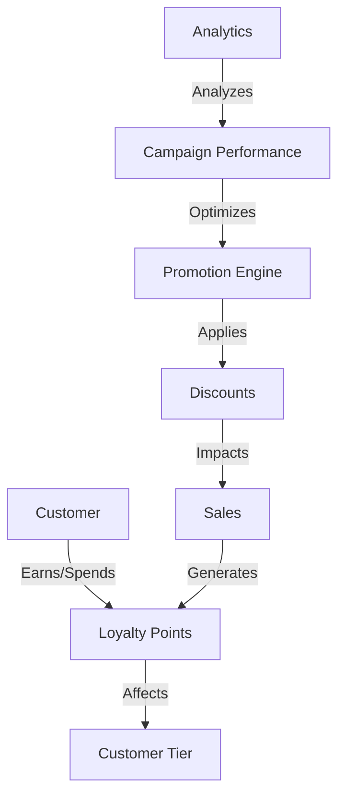
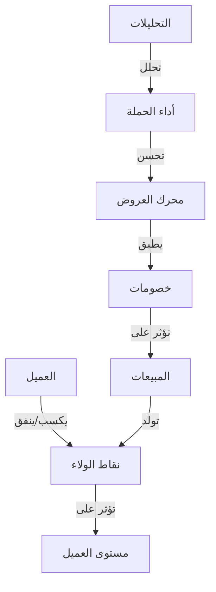

# 🏆 Loyalty & Discounts System

<div dir="rtl">

# 🏆 نظام الولاء والتخفيضات

</div>

## 📋 Overview | نظرة عامة

The Loyalty & Discounts system is designed to enhance customer engagement and boost sales through various reward mechanisms and promotional offers. It includes a points-based loyalty program, dynamic discount rules, and promotional campaigns.

<div dir="rtl">

## 📋 نظرة عامة

صُمم نظام الولاء والتخفيضات لتعزيز مشاركة العملاء وزيادة المبيعات من خلال آليات مكافآت مختلفة وعروض ترويجية. يتضمن برنامج ولاء يعتمد على النقاط وقواعد خصم ديناميكية وحملات ترويجية.

</div>

## 🎯 Key Features | الميزات الرئيسية

### 1. Loyalty Program
- **Points Earning**: Customers earn points for purchases
- **Tiered Membership**: Multiple membership levels (e.g., Silver, Gold, Platinum)
- **Point Redemption**: Convert points to discounts or free items
- **Birthday Rewards**: Special offers on customer birthdays
- **Referral Program**: Reward for referring new customers

### 2. Discount System
- **Percentage-based Discounts**
- **Fixed Amount Discounts**
- **Buy X Get Y Free**
- **Bulk Purchase Discounts**
- **Time-based Promotions**

### 3. Campaign Management
- **Targeted Promotions**
- **Seasonal Sales**
- **Flash Sales**
- **Coupon Codes**
- **Bundle Offers**

### 4. Analytics & Reporting
- **Redemption Tracking**
- **Customer Engagement Metrics**
- **ROI Analysis**
- **Promotion Performance**

<div dir="rtl">

## 🎯 الميزات الرئيسية

### 1. برنامج الولاء
- **كسب النقاط**: يحصل العملاء على نقاط مقابل المشتريات
- **مستويات العضوية**: مستويات متعددة (مثل الفضي، الذهبي، البلاتيني)
- **استبدال النقاط**: تحويل النقاط إلى خصومات أو عناصر مجانية
- **مكافآت أعياد الميلاد**: عروض خاصة في أعياد ميلاد العملاء
- **برنامج الإحالة**: مكافآت لإحالة عملاء جدد

### 2. نظام الخصومات
- **خصومات بنسبة مئوية**
- **خصومات مبلغ ثابت**
- **اشتري واحصل على آخر مجانًا**
- **خصومات الشراء بالجملة**
- **عروض لفترة محدودة**

### 3. إدارة الحملات
- **عروض مستهدفة**
- **تخفيضات موسمية**
- **عروض خاطفة**
- **أكواد كوبونات**
- **عروض المجموعات**

### 4. التحليلات والتقارير
- **تتبع عمليات الاستبدال**
- **مقاييس تفاعل العملاء**
- **تحليل العائد على الاستثمار**
- **أداء العروض الترويجية**

</div>

## 🏗️ Architecture | البنية المعمارية

### System Components


### Data Flow
1. Customer makes a purchase
2. System calculates points based on purchase amount
3. Points are added to customer's loyalty account
4. Customer tier is updated if threshold is met
5. Available discounts are applied to future purchases
6. Campaign performance is tracked and analyzed

<div dir="rtl">

## 🏗️ البنية المعمارية

### مكونات النظام


### تدفق البيانات
1. يقوم العميل بعملية شراء
2. يحسب النظام النقاط بناءً على مبلغ الشراء
3. تُضاف النقاط إلى حساب ولاء العميل
4. يتم تحديث مستوى العميل إذا تم الوصول إلى العتبة المطلوبة
5. يتم تطبيق الخصومات المتاحة على المشتريات المستقبلية
6. يتم تتبع وتحليل أداء الحملات

</div>

## 🛠 Implementation | التنفيذ

### 1. Database Schema

#### Loyalty Program
```kotlin
@Entity(tableName = "loyalty_programs")
data class LoyaltyProgram(
    @PrimaryKey(autoGenerate = true)
    val programId: Long = 0,
    val name: String,
    val description: String?,
    val isActive: Boolean = true,
    val pointsPerCurrency: Double = 1.0, // Points per 1 currency unit
    val pointsExpiryDays: Int? = null, // Null means never expire
    val minPurchaseAmount: Double = 0.0,
    val createdAt: Long = System.currentTimeMillis(),
    val updatedAt: Long = System.currentTimeMillis()
)

@Entity(tableName = "loyalty_tiers")
data class LoyaltyTier(
    @PrimaryKey(autoGenerate = true)
    val tierId: Long = 0,
    val programId: Long,
    val name: String,
    val description: String?,
    val minPoints: Long,
    val benefits: List<LoyaltyBenefit>,
    val isActive: Boolean = true,
    val createdAt: Long = System.currentTimeMillis()
)

data class LoyaltyBenefit(
    val type: BenefitType,
    val value: Double,
    val description: String
)

enum class BenefitType {
    POINTS_MULTIPLIER,    // Earn X times more points
    DISCOUNT_PERCENTAGE,  // X% discount on purchases
    DISCOUNT_AMOUNT,     // Fixed amount discount
    FREE_SHIPPING,       // Free shipping
    BIRTHDAY_REWARD,     // Special reward on birthday
    EARLY_ACCESS,        // Early access to sales
    EXCLUSIVE_OFFERS     // Exclusive member offers
}
```

### 2. Discount Rules Engine

#### Rule Definition
```kotlin
interface DiscountRule {
    val ruleId: String
    val name: String
    val description: String?
    val isActive: Boolean
    val priority: Int
    val validFrom: Long?
    val validTo: Long?
    val appliesTo: DiscountAppliesTo
    
    fun isApplicable(context: DiscountContext): Boolean
    fun calculateDiscount(context: DiscountContext): DiscountResult
}

data class DiscountContext(
    val customer: Customer?,
    val items: List<OrderItem>,
    val orderTotal: Double,
    val orderDate: Long = System.currentTimeMillis(),
    val appliedCoupons: List<String> = emptyList()
)

data class DiscountResult(
    val discountAmount: Double,
    val description: String,
    val appliedRule: DiscountRule,
    val affectedItems: List<OrderItem> = emptyList()
)

enum class DiscountAppliesTo {
    ENTIRE_ORDER,
    CHEAPEST_ITEM,
    MOST_EXPENSIVE_ITEM,
    SPECIFIC_CATEGORY,
    SPECIFIC_PRODUCT,
    CUSTOM_SELECTION
}
```

#### Example Rules
```kotlin
// Percentage discount for loyalty members
class LoyaltyTierDiscount(
    override val ruleId: String = "loyalty_tier_discount",
    override val name: String = "Loyalty Tier Discount",
    override val description: String = "Discount based on customer loyalty tier",
    override val isActive: Boolean = true,
    override val priority: Int = 10,
    private val tierDiscounts: Map<String, Double> = mapOf(
        "GOLD" to 0.10,   // 10% off for Gold members
        "PLATINUM" to 0.15 // 15% off for Platinum members
    )
) : DiscountRule {
    
    override val validFrom: Long? = null
    override val validTo: Long? = null
    override val appliesTo: DiscountAppliesTo = DiscountAppliesTo.ENTIRE_ORDER
    
    override fun isApplicable(context: DiscountContext): Boolean {
        val customer = context.customer ?: return false
        val loyaltyTier = customer.loyaltyTier ?: return false
        return tierDiscounts.containsKey(loyaltyTier)
    }
    
    override fun calculateDiscount(context: DiscountContext): DiscountResult {
        val loyaltyTier = context.customer?.loyaltyTier ?: return DiscountResult.ZERO
        val discountRate = tierDiscounts[loyaltyTier] ?: return DiscountResult.ZERO
        
        val discountAmount = context.orderTotal * discountRate
        
        return DiscountResult(
            discountAmount = discountAmount,
            description = "${discountRate * 100}% ${loyaltyTier.capitalize()} Member Discount",
            appliedRule = this,
            affectedItems = context.items
        )
    }
}

// Buy X Get Y Free
class BuyXGetYFree(
    override val ruleId: String,
    override val name: String,
    override val description: String?,
    override val isActive: Boolean,
    override val priority: Int,
    override val validFrom: Long?,
    override val validTo: Long?,
    val buyQuantity: Int,
    val getQuantity: Int,
    val appliesTo: DiscountAppliesTo,
    val productIds: List<Long>? = null,
    val categoryIds: List<Long>? = null
) : DiscountRule {
    
    override fun isApplicable(context: DiscountContext): Boolean {
        // Check if the promotion is active
        val now = System.currentTimeMillis()
        if (validFrom != null && now < validFrom) return false
        if (validTo != null && now > validTo) return false
        
        // Check if the rule applies to any items in the cart
        return when (appliesTo) {
            DiscountAppliesTo.ENTIRE_ORDER -> true
            DiscountAppliesTo.SPECIFIC_PRODUCT -> 
                context.items.any { item -> productIds?.contains(item.productId) == true }
            DiscountAppliesTo.SPECIFIC_CATEGORY -> 
                context.items.any { item -> categoryIds?.contains(item.categoryId) == true }
            else -> false
        }
    }
    
    override fun calculateDiscount(context: DiscountContext): DiscountResult {
        val applicableItems = when (appliesTo) {
            DiscountAppliesTo.ENTIRE_ORDER -> context.items
            DiscountAppliesTo.SPECIFIC_PRODUCT -> 
                context.items.filter { productIds?.contains(it.productId) == true }
            DiscountAppliesTo.SPECIFIC_CATEGORY -> 
                context.items.filter { categoryIds?.contains(it.categoryId) == true }
            else -> return DiscountResult.ZERO
        }
        
        // Group items by product to handle quantities
        val itemGroups = applicableItems.groupBy { it.productId }
        var totalDiscount = 0.0
        val affectedItems = mutableListOf<OrderItem>()
        
        for ((_, items) in itemGroups) {
            val totalQuantity = items.sumOf { it.quantity }
            val freeItems = (totalQuantity / (buyQuantity + getQuantity)) * getQuantity
            
            if (freeItems > 0) {
                val itemPrice = items.first().price
                totalDiscount += freeItems * itemPrice
                affectedItems.addAll(items.take(freeItems.toInt()))
            }
        }
        
        return if (totalDiscount > 0) {
            DiscountResult(
                discountAmount = totalDiscount,
                description = "Buy $buyQuantity Get $getQuantity Free",
                appliedRule = this,
                affectedItems = affectedItems
            )
        } else {
            DiscountResult.ZERO
        }
    }
}
```

### 3. Loyalty Points Calculation

```kotlin
class LoyaltyPointsCalculator {
    
    fun calculateEarnedPoints(
        order: Order,
        customer: Customer?,
        loyaltyProgram: LoyaltyProgram
    ): Int {
        if (!loyaltyProgram.isActive) return 0
        if (order.total < loyaltyProgram.minPurchaseAmount) return 0
        
        val basePoints = (order.subtotal * loyaltyProgram.pointsPerCurrency).toInt()
        
        // Apply tier multiplier if applicable
        val multiplier = customer?.loyaltyTier?.let { tier ->
            loyaltyProgram.tiers.find { it.tierId == tier.tierId }?.benefits
                ?.find { it.type == BenefitType.POINTS_MULTIPLIER }
                ?.value ?: 1.0
        } ?: 1.0
        
        return (basePoints * multiplier).toInt()
    }
    
    fun applyPointsRedemption(
        customer: Customer,
        pointsToRedeem: Int,
        orderTotal: Double
    ): RedemptionResult {
        if (customer.loyaltyPoints < pointsToRedeem) {
            return RedemptionResult.Error("Insufficient points")
        }
        
        val pointValue = calculatePointValue(customer)
        val discountAmount = pointsToRedeem * pointValue
        
        // Cap the discount at order total
        val actualDiscount = minOf(discountAmount, orderTotal)
        val pointsUsed = (actualDiscount / pointValue).toInt()
        
        return RedemptionResult.Success(
            pointsUsed = pointsUsed,
            discountAmount = actualDiscount,
            remainingPoints = customer.loyaltyPoints - pointsUsed
        )
    }
    
    private fun calculatePointValue(customer: Customer): Double {
        // Could be based on customer tier or other factors
        return 0.01 // 1 point = $0.01 by default
    }
    
    sealed class RedemptionResult {
        data class Success(
            val pointsUsed: Int,
            val discountAmount: Double,
            val remainingPoints: Int
        ) : RedemptionResult()
        
        data class Error(val message: String) : RedemptionResult()
    }
}
```

## 🧪 Testing | الاختبار

### 1. Unit Tests for Discount Rules
```kotlin
@ExperimentalCoroutinesApi
class DiscountRuleTest {
    
    private lateinit var loyaltyTierDiscount: LoyaltyTierDiscount
    private lateinit var buyXGetYFree: BuyXGetYFree
    private lateinit var testProducts: List<Product>
    
    @Before
    fun setup() {
        loyaltyTierDiscount = LoyaltyTierDiscount()
        
        buyXGetYFree = BuyXGetYFree(
            ruleId = "test_buy1_get1",
            name = "Buy 1 Get 1 Free",
            description = "Buy 1 item, get 1 free",
            isActive = true,
            priority = 5,
            validFrom = null,
            validTo = null,
            buyQuantity = 1,
            getQuantity = 1,
            appliesTo = DiscountAppliesTo.SPECIFIC_PRODUCT,
            productIds = listOf(1L, 2L)
        )
        
        testProducts = listOf(
            Product(id = 1, name = "Test Product 1", price = 10.0, categoryId = 1),
            Product(id = 2, name = "Test Product 2", price = 20.0, categoryId = 1),
            Product(id = 3, name = "Test Product 3", price = 30.0, categoryId = 2)
        )
    }
    
    @Test
    fun `loyalty tier discount applies to eligible customers`() {
        val goldCustomer = Customer(
            id = 1,
            name = "Gold Member",
            loyaltyTier = "GOLD",
            loyaltyPoints = 1000
        )
        
        val context = createTestContext(goldCustomer)
        
        assertTrue(loyaltyTierDiscount.isApplicable(context))
        
        val result = loyaltyTierDiscount.calculateDiscount(context)
        
        assertEquals(10.0, result.discountAmount) // 10% of 100.0
        assertEquals("10.0% Gold Member Discount", result.description)
    }
    
    @Test
    fun `buy 1 get 1 free calculates correct discount`() {
        val items = listOf(
            OrderItem(productId = 1, quantity = 2, unitPrice = 10.0, name = "Test Product 1"),
            OrderItem(productId = 3, quantity = 1, unitPrice = 30.0, name = "Test Product 3")
        )
        
        val context = createTestContext(items = items)
        
        assertTrue(buyXGetYFree.isApplicable(context))
        
        val result = buyXGetYFree.calculateDiscount(context)
        
        assertEquals(10.0, result.discountAmount) // 1 free item worth 10.0
        assertEquals(1, result.affectedItems.size)
    }
    
    private fun createTestContext(
        customer: Customer? = null,
        items: List<OrderItem> = listOf(
            OrderItem(productId = 1, quantity = 1, unitPrice = 10.0, name = "Test Product 1"),
            OrderItem(productId = 2, quantity = 2, unitPrice = 20.0, name = "Test Product 2")
        )
    ): DiscountContext {
        return DiscountContext(
            customer = customer,
            items = items,
            orderTotal = items.sumOf { it.unitPrice * it.quantity }
        )
    }
}
```

### 2. Integration Tests
```kotlin
@HiltAndroidTest
class LoyaltyIntegrationTest {
    
    @get:Rule
    val hiltRule = HiltAndroidRule(this)
    
    @Inject
    lateinit var loyaltyRepository: LoyaltyRepository
    
    @Inject
    lateinit var database: AppDatabase
    
    @Before
    fun setup() {
        hiltRule.inject()
    }
    
    @After
    fun cleanup() {
        database.close()
    }
    
    @Test
    fun `customer earns points on purchase`() = runTest {
        // Given
        val customer = Customer(
            id = 1,
            name = "Test Customer",
            loyaltyPoints = 100
        )
        
        val order = Order(
            id = "ORDER-123",
            customerId = customer.id,
            subtotal = 100.0,
            tax = 10.0,
            total = 110.0,
            status = OrderStatus.COMPLETED
        )
        
        val program = LoyaltyProgram(
            programId = 1,
            name = "Standard Program",
            pointsPerCurrency = 1.0,
            minPurchaseAmount = 0.0
        )
        
        // When
        val pointsEarned = loyaltyRepository.calculatePointsEarned(order, customer, program)
        
        // Then
        assertEquals(100, pointsEarned) // 100 * 1.0 points per currency
    }
    
    @Test
    fun `points redemption applies correct discount`() = runTest {
        // Given
        val customer = Customer(
            id = 1,
            name = "Test Customer",
            loyaltyPoints = 1000
        )
        
        // When
        val result = loyaltyRepository.redeemPoints(customer, 500, 200.0)
        
        // Then
        assertTrue(result is RedemptionResult.Success)
        val success = result as RedemptionResult.Success
        assertEquals(500, success.pointsUsed)
        assertEquals(5.0, success.discountAmount) // 500 * 0.01
        assertEquals(500, success.remainingPoints)
    }
}
```

## 🚀 Deployment | النشر

### 1. Configuration
```yaml
# app-config.yaml
loyalty:
  points:
    enabled: true
    pointsPerCurrency: 1.0
    minPurchaseAmount: 0.0
    expirationDays: 365
    
discounts:
  rules:
    - type: loyalty_tier
      enabled: true
      priority: 10
      tiers:
        - name: SILVER
          minPoints: 0
          discountPercentage: 5.0
        - name: GOLD
          minPoints: 1000
          discountPercentage: 10.0
        - name: PLATINUM
          minPoints: 5000
          discountPercentage: 15.0
    
    - type: buy_x_get_y
      enabled: true
      priority: 5
      name: "Buy 1 Get 1 Free"
      description: "Buy one item, get one free"
      buyQuantity: 1
      getQuantity: 1
      appliesTo: specific_products
      productIds: [1, 2, 3]
      validFrom: null
      validTo: null
```

### 2. Feature Flags
```kotlin
object FeatureFlags {
    // Enable/disable loyalty program
    const val LOYALTY_PROGRAM_ENABLED = true
    
    // Enable/disable specific discount types
    const val DISCOUNT_PERCENTAGE_ENABLED = true
    const val DISCOUNT_AMOUNT_ENABLED = true
    const val BUY_X_GET_Y_ENABLED = true
    
    // Maximum discount that can be applied as percentage of order total
    const val MAX_DISCOUNT_PERCENTAGE = 50.0
    
    // Maximum points that can be redeemed in a single transaction
    const val MAX_POINTS_REDEMPTION = 10000
}
```

## 📝 Conclusion | الخاتمة

The Loyalty & Discounts system provides a flexible and powerful way to engage customers and drive sales. With support for multiple discount types, tiered loyalty programs, and comprehensive analytics, it helps businesses build long-term customer relationships while maximizing revenue.

<div dir="rtl">

## 📝 الخاتمة

يوفر نظام الولاء والخصومات طريقة مرنة وقوية لإشراك العملاء وزيادة المبيعات. مع دعم أنواع متعددة من الخصومات وبرامج الولاء المتدرجة والتحليلات الشاملة، فهو يساعد الشركات على بناء علاقات طويلة الأمد مع العملاء مع تعظيم الإيرادات.

</div>

## 📚 Related Documents | المستندات ذات الصلة

1. [Customer Management](./03-customers.md)
2. [POS System](./01-pos.md)
3. [Inventory Management](./02-inventory.md)
4. [Analytics & Reporting](../analytics/01-overview.md)

## 🙋 Support | الدعم

For support, please contact our development team or open an issue in the repository.

<div dir="rtl">

## 🙋 الدعم

للحصول على الدعم، يرجى التواصل مع فريق التطوير أو فتح مشكلة في المستودع.

</div>
