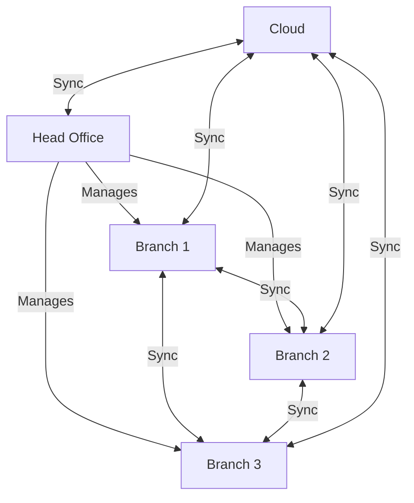
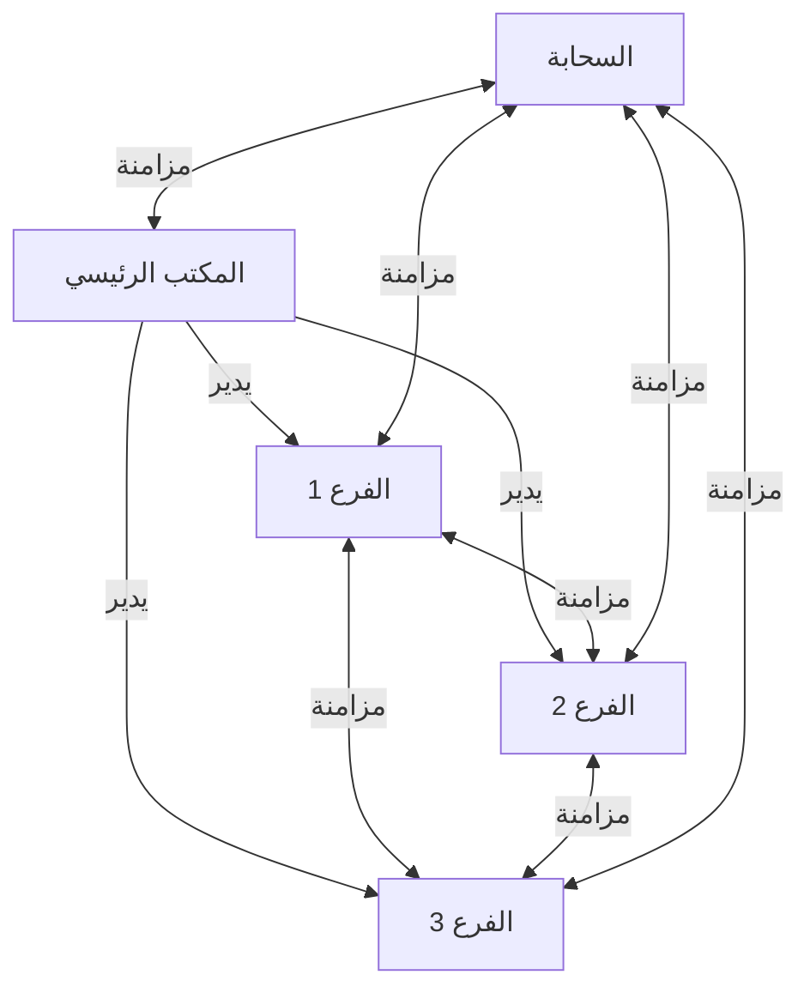

# 🏢 Branch Management System

<div dir="rtl">

# 🏢 نظام إدارة الفروع

</div>

## 📋 Overview | نظرة عامة

The Branch Management system enables businesses to manage multiple physical locations (branches) from a single application. It supports inventory management, user permissions, sales tracking, and reporting across all branches while maintaining data isolation and security.

<div dir="rtl">

## 📋 نظرة عامة

يسمح نظام إدارة الفروع للشركات بإدارة مواقع متعددة (فروع) من تطبيق واحد. يدعم إدارة المخزون، أذونات المستخدمين، تتبع المبيعات، وإعداد التقارير عبر جميع الفروع مع الحفاظ على عزل البيانات والأمان.

</div>

## 🎯 Key Features | الميزات الرئيسية

### 1. Multi-Branch Operations
- **Centralized Management**: Control all branches from a single dashboard
- **Branch-Specific Inventory**: Track stock levels per branch
- **Inter-Branch Transfers**: Move inventory between locations
- **Consolidated Reporting**: View reports across all branches

### 2. User & Permission Management
- **Role-Based Access Control**: Define permissions by role and branch
- **Branch-Specific Users**: Restrict access to assigned branches
- **Audit Logs**: Track all branch activities

### 3. Financial Management
- **Branch-Specific Pricing**: Set different prices per branch
- **Revenue Tracking**: Monitor sales and expenses per location
- **Profitability Analysis**: Compare performance across branches

### 4. Inventory Management
- **Stock Transfers**: Move items between branches
- **Stock Requests**: Request inventory from other branches
- **Low Stock Alerts**: Get notified when inventory is low

<div dir="rtl">

## 🎯 الميزات الرئيسية

### 1. عمليات الفروع المتعددة
- **إدارة مركزية**: التحكم في جميع الفروع من لوحة تحكم واحدة
- **مخزون خاص بكل فرع**: تتبع مستويات المخزون لكل فرع
- **تحويلات بين الفروع**: نقل المخزون بين المواقع
- **تقارير موحدة**: عرض التقارير عبر جميع الفروع

### 2. إدارة المستخدمين والصلاحيات
- **التحكم في الوصول القائم على الأدوار**: تحديد الصلاحيات حسب الدور والفرع
- **مستخدمون محددون لكل فرع**: تقييد الوصول إلى الفروع المخصصة
- **سجلات التدقيق**: تتبع جميع أنشطة الفروع

### 3. الإدارة المالية
- **تسعير خاص بكل فرع**: تعيين أسعار مختلفة لكل فرع
- **تتبع الإيرادات**: مراقبة المبيعات والمصروفات لكل موقع
- **تحليل الربحية**: مقارنة الأداء بين الفروع

### 4. إدارة المخزون
- **تحويلات المخزون**: نقل العناصر بين الفروع
- **طلبات المخزون**: طلب مخزون من فروع أخرى
- **تنبيهات المخزون المنخفض**: تلقي إشعارات عند انخفاض المخزون

</div>

## 🏗️ Architecture | البنية المعمارية

### System Components


### Data Flow
1. Each branch maintains its own local database
2. Changes are synced to the cloud when online
3. Head office can access data from all branches
4. Branch managers can only access their branch data
5. Inventory transfers are tracked and synchronized

<div dir="rtl">

## 🏗️ البنية المعمارية

### مكونات النظام


### تدفق البيانات
1. يحتفظ كل فرع بقاعدة بياناته المحلية
2. تتم مزامنة التغييرات مع السحابة عند الاتصال بالإنترنت
3. يمكن للمكتب الرئيسي الوصول إلى بيانات جميع الفروع
4. يمكن لمديري الفروع الوصول إلى بيانات فرعهم فقط
5. يتم تتبع تحويلات المخزون ومزامنتها

</div>

## 🛠 Implementation | التنفيذ

### 1. Database Schema

#### Branch Entity
```kotlin
@Entity(tableName = "branches")
data class Branch(
    @PrimaryKey(autoGenerate = true)
    val branchId: Long = 0,
    val name: String,
    val code: String, // Unique branch code
    val address: String,
    val phone: String?,
    val email: String?,
    val managerId: Long?, // Reference to employee
    val isActive: Boolean = true,
    val createdAt: Long = System.currentTimeMillis(),
    val updatedAt: Long = System.currentTimeMillis(),
    val settings: BranchSettings = BranchSettings(),
    val isSynced: Boolean = false
)

data class BranchSettings(
    val timeZone: String = "UTC",
    val currency: String = "USD",
    val taxSettings: TaxSettings = TaxSettings(),
    val receiptSettings: ReceiptSettings = ReceiptSettings(),
    val inventorySettings: InventorySettings = InventorySettings()
)

data class TaxSettings(
    val taxInclusive: Boolean = true,
    val taxRates: List<TaxRate> = listOf(
        TaxRate(name = "VAT", rate = 0.15, isActive = true)
    )
)

data class ReceiptSettings(
    val header: String = "Thank you for shopping!",
    val footer: String = "Please visit us again!",
    val showTaxDetails: Boolean = true,
    val showQrCode: Boolean = true
)

data class InventorySettings(
    val allowNegativeInventory: Boolean = false,
    val lowStockThreshold: Int = 5,
    val autoReorderPoint: Boolean = true
)
```

### 2. Branch-Aware Repository

```kotlin
abstract class BranchAwareRepository<T>(
    private val database: AppDatabase,
    private val branchId: Long
) {
    
    protected abstract fun getDao(): BaseDao<T>
    
    suspend fun getAll(): List<T> = withContext(Dispatchers.IO) {
        getDao().getAllForBranch(branchId)
    }
    
    suspend fun getById(id: Long): T? = withContext(Dispatchers.IO) {
        getDao().getByIdForBranch(id, branchId)
    }
    
    suspend fun insert(item: T): Long = withContext(Dispatchers.IO) {
        // Set branch ID if not set
        if (item is BranchAware) {
            (item as? BranchAware)?.branchId = branchId
        }
        getDao().insert(item)
    }
    
    suspend fun update(item: T) = withContext(Dispatchers.IO) {
        // Verify branch ownership before update
        if (item is BranchAware && item.branchId != branchId) {
            throw UnauthorizedAccessException("Not authorized to update this resource")
        }
        getDao().update(item)
    }
    
    suspend fun delete(item: T) = withContext(Dispatchers.IO) {
        // Verify branch ownership before delete
        if (item is BranchAware && item.branchId != branchId) {
            throw UnauthorizedAccessException("Not authorized to delete this resource")
        }
        getDao().delete(item)
    }
}

interface BranchAware {
    var branchId: Long
}

class BranchAwareProductRepository(
    database: AppDatabase,
    branchId: Long
) : BranchAwareRepository<Product>(database, branchId) {
    
    override fun getDao() = database.productDao()
    
    suspend fun search(query: String): List<Product> = withContext(Dispatchers.IO) {
        database.productDao().searchForBranch("%$query%", branchId)
    }
}
```

### 3. Branch Selection & Context

```kotlin
class BranchManager @Inject constructor(
    private val branchDao: BranchDao,
    private val userDao: UserDao,
    private val sharedPrefs: SharedPreferences
) {
    
    private var _currentBranch: Branch? = null
    val currentBranch: Branch
        get() = _currentBranch ?: throw IllegalStateException("No branch selected")
    
    suspend fun setCurrentBranch(branchId: Long) {
        val branch = branchDao.getById(branchId) ?: throw BranchNotFoundException()
        _currentBranch = branch
        sharedPrefs.edit().putLong(PREF_CURRENT_BRANCH_ID, branchId).apply()
    }
    
    suspend fun getAvailableBranches(userId: Long): List<Branch> {
        val user = userDao.getById(userId) ?: return emptyList()
        return if (user.isAdmin) {
            branchDao.getAll()
        } else {
            branchDao.getBranchesForUser(userId)
        }
    }
    
    companion object {
        private const val PREF_CURRENT_BRANCH_ID = "current_branch_id"
    }
}

@HiltViewModel
class BranchSelectionViewModel @Inject constructor(
    private val branchManager: BranchManager,
    private val userManager: UserManager
) : ViewModel() {
    
    private val _branches = MutableStateFlow<List<Branch>>(emptyList())
    val branches: StateFlow<List<Branch>> = _branches
    
    private val _selectedBranch = MutableStateFlow<Branch?>(null)
    val selectedBranch: StateFlow<Branch?> = _selectedBranch
    
    init {
        viewModelScope.launch {
            val userId = userManager.currentUser?.id ?: return@launch
            _branches.value = branchManager.getAvailableBranches(userId)
            _selectedBranch.value = _branches.value.firstOrNull()
        }
    }
    
    fun selectBranch(branch: Branch) {
        _selectedBranch.value = branch
    }
    
    suspend fun confirmSelection() {
        val branch = _selectedBranch.value ?: return
        branchManager.setCurrentBranch(branch.branchId)
    }
}
```

### 4. Branch-Aware Data Access

```kotlin
@Dao
interface ProductDao {
    
    @Query("SELECT * FROM products WHERE branchId = :branchId AND isActive = 1")
    suspend fun getAllForBranch(branchId: Long): List<Product>
    
    @Query("SELECT * FROM products WHERE productId = :id AND branchId = :branchId")
    suspend fun getByIdForBranch(id: Long, branchId: Long): Product?
    
    @Query("""
        SELECT * FROM products 
        WHERE (name LIKE :query OR barcode = :query OR sku = :query)
        AND branchId = :branchId
        AND isActive = 1
        LIMIT 50
    """)
    suspend fun searchForBranch(query: String, branchId: Long): List<Product>
    
    @Insert(onConflict = OnConflictStrategy.REPLACE)
    suspend fun insert(product: Product): Long
    
    @Update
    suspend fun update(product: Product)
    
    @Delete
    suspend fun delete(product: Product)
    
    // For inter-branch operations
    @Transaction
    suspend fun transferStock(
        fromBranchId: Long,
        toBranchId: Long,
        productId: Long,
        quantity: Int,
        notes: String? = null
    ) {
        // 1. Check if product exists in source branch
        val sourceProduct = getByIdForBranch(productId, fromBranchId)
            ?: throw ProductNotFoundException()
            
        if (sourceProduct.quantity < quantity) {
            throw InsufficientStockException()
        }
        
        // 2. Update source branch inventory
        update(sourceProduct.copy(quantity = sourceProduct.quantity - quantity))
        
        // 3. Update or create in destination branch
        val destProduct = getByIdForBranch(productId, toBranchId)?.let {
            it.copy(quantity = it.quantity + quantity)
        } ?: sourceProduct.copy(
            branchId = toBranchId,
            quantity = quantity,
            productId = 0 // Will generate new ID
        )
        
        insert(destProduct)
        
        // 4. Log the transfer
        logStockTransfer(
            StockTransfer(
                fromBranchId = fromBranchId,
                toBranchId = toBranchId,
                productId = productId,
                quantity = quantity,
                notes = notes,
                createdAt = System.currentTimeMillis()
            )
        )
    }
}
```

## 🧪 Testing | الاختبار

### 1. Unit Tests

```kotlin
@ExperimentalCoroutinesApi
@HiltAndroidTest
class BranchManagerTest {
    
    @get:Rule
    val hiltRule = HiltAndroidRule(this)
    
    @Inject
    lateinit var database: AppDatabase
    
    @Inject
    lateinit var branchManager: BranchManager
    
    @Before
    fun setup() {
        hiltRule.inject()
    }
    
    @After
    fun cleanup() {
        database.close()
    }
    
    @Test
    fun `set current branch should update shared preferences`() = runTest {
        // Given
        val testBranch = Branch(
            branchId = 1,
            name = "Test Branch",
            code = "TB001",
            address = "123 Test St"
        )
        
        // When
        branchManager.setCurrentBranch(testBranch.branchId)
        
        // Then
        val currentBranch = branchManager.currentBranch
        assertEquals(testBranch.branchId, currentBranch.branchId)
    }
    
    @Test
    fun `admin user should see all branches`() = runTest {
        // Given
        val adminUser = User(
            userId = 1,
            username = "admin",
            isAdmin = true
        )
        
        val branches = listOf(
            Branch(branchId = 1, name = "Branch 1", code = "B1"),
            Branch(branchId = 2, name = "Branch 2", code = "B2"),
            Branch(branchId = 3, name = "Branch 3", code = "B3")
        )
        
        // When
        database.branchDao().insertAll(branches)
        val availableBranches = branchManager.getAvailableBranches(adminUser.userId)
        
        // Then
        assertEquals(branches.size, availableBranches.size)
    }
}
```

### 2. Integration Tests

```kotlin
@HiltAndroidTest
class BranchAwareRepositoryTest {
    
    @get:Rule
    val hiltRule = HiltAndroidRule(this)
    
    @Inject
    lateinit var database: AppDatabase
    
    private lateinit var productRepository: BranchAwareProductRepository
    private val testBranchId = 1L
    
    @Before
    fun setup() {
        hiltRule.inject()
        productRepository = BranchAwareProductRepository(database, testBranchId)
    }
    
    @After
    fun cleanup() {
        database.close()
    }
    
    @Test
    fun `products should be filtered by branch`() = runTest {
        // Given
        val branch1Product = Product(
            productId = 1,
            name = "Test Product 1",
            branchId = testBranchId,
            quantity = 10
        )
        
        val branch2Product = Product(
            productId = 2,
            name = "Test Product 2",
            branchId = testBranchId + 1,
            quantity = 5
        )
        
        // When
        database.productDao().insertAll(listOf(branch1Product, branch2Product))
        val products = productRepository.getAll()
        
        // Then
        assertEquals(1, products.size)
        assertEquals(branch1Product.productId, products[0].productId)
    }
    
    @Test
    fun `should not allow updating other branch products`() = runTest {
        // Given
        val otherBranchProduct = Product(
            productId = 1,
            name = "Other Branch Product",
            branchId = testBranchId + 1,
            quantity = 10
        )
        
        // When/Then
        assertFailsWith<UnauthorizedAccessException> {
            runBlocking {
                productRepository.update(otherBranchProduct)
            }
        }
    }
}
```

## 🚀 Deployment | النشر

### 1. Database Migrations

```kotlin
// Add branch_id to existing tables
val MIGRATION_1_2 = object : Migration(1, 2) {
    override fun migrate(database: SupportSQLiteDatabase) {
        // Add branch_id column to products
        database.execSQL("ALTER TABLE products ADD COLUMN branchId INTEGER NOT NULL DEFAULT 1")
        
        // Create branches table
        database.execSQL("""
            CREATE TABLE IF NOT EXISTS branches (
                branchId INTEGER PRIMARY KEY AUTOINCREMENT NOT NULL,
                name TEXT NOT NULL,
                code TEXT NOT NULL,
                address TEXT,
                phone TEXT,
                email TEXT,
                managerId INTEGER,
                isActive INTEGER NOT NULL DEFAULT 1,
                createdAt INTEGER NOT NULL,
                updatedAt INTEGER NOT NULL,
                settings TEXT NOT NULL,
                isSynced INTEGER NOT NULL DEFAULT 0
            )
        """.trimIndent())
        
        // Add foreign key constraint
        database.execSQL("""
            CREATE INDEX IF NOT EXISTS index_products_branchId 
            ON products (branchId)
        """.trimIndent())
    }
}

// Add to database builder
Room.databaseBuilder(
    context.applicationContext,
    AppDatabase::class.java,
    "business_management.db"
).addMigrations(MIGRATION_1_2)
 .build()
```

### 2. Configuration

```yaml
# app-config.yaml
branch:
  defaultBranchId: 1
  allowInterBranchTransfers: true
  requireManagerApproval: true
  maxStockTransferQty: 1000
  
  sync:
    enabled: true
    interval: 300 # seconds
    retryAttempts: 3
    
  notifications:
    lowStock: true
    stockTransfer: true
    newBranch: true
```

## 📝 Conclusion | الخاتمة

The Branch Management system provides a robust solution for businesses operating across multiple locations. With features like branch-specific inventory, user permissions, and inter-branch transfers, it enables efficient management of distributed operations while maintaining data security and integrity.

<div dir="rtl">

## 📝 الخاتمة

يوفر نظام إدارة الفروع حلاً قويًا للشركات التي تعمل عبر مواقع متعددة. مع ميزات مثل المخزون الخاص بكل فرع، أذونات المستخدمين، والتحويلات بين الفروع، فإنه يمكن من إدارة العمليات الموزعة بكفاءة مع الحفاظ على أمان وسلامة البيانات.

</div>

## 📚 Related Documents | المستندات ذات الصلة

1. [User Management](../security/03-user-management.md)
2. [Inventory Management](./02-inventory.md)
3. [Role-Based Access Control](../security/02-rbac.md)
4. [Cloud Sync](../architecture/05-cloud-sync.md)

## 🙋 Support | الدعم

For support, please contact our development team or open an issue in the repository.

<div dir="rtl">

## 🙋 الدعم

للحصول على الدعم، يرجى التواصل مع فريق التطوير أو فتح مشكلة في المستودع.

</div>
