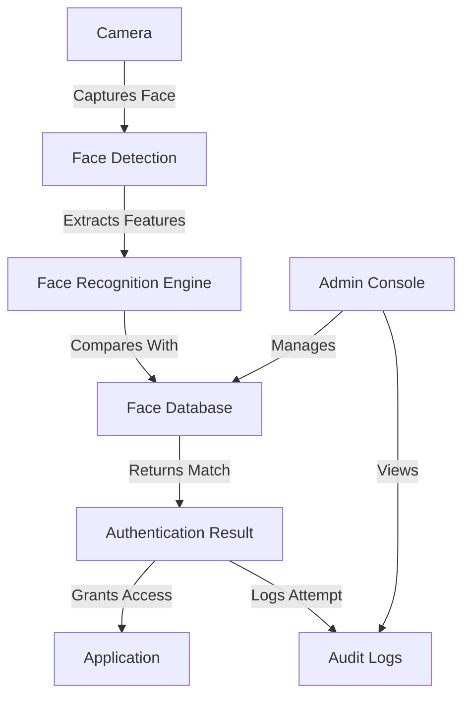
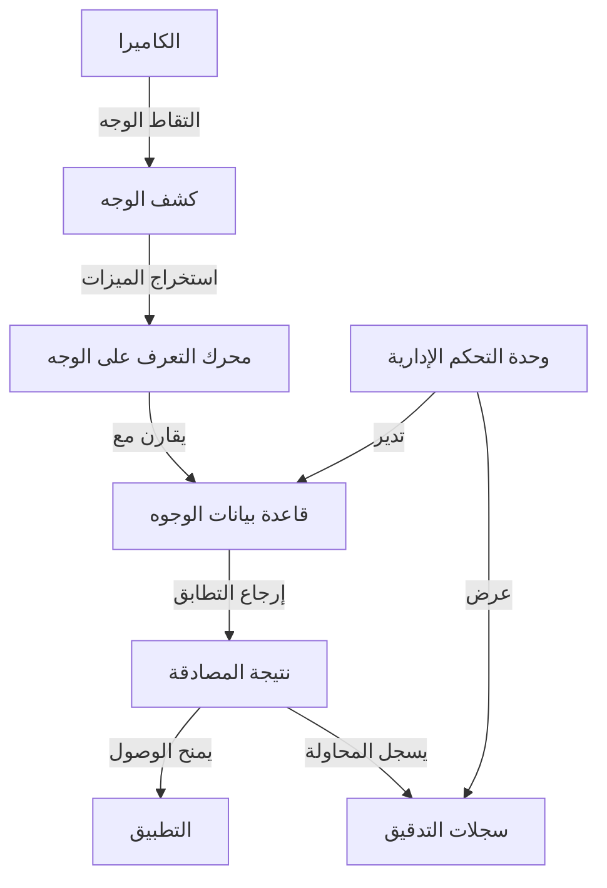

# 👤 Face Recognition System

<div dir="rtl">

# 👤 نظام التعرف على الوجوه

</div>

## 📋 Overview | نظرة عامة

The Face Recognition system provides secure and convenient user authentication and identification using facial recognition technology. It enables touchless login, employee attendance tracking, and enhanced security features.

<div dir="rtl">

## 📋 نظرة عامة

يوفر نظام التعرف على الوجوه مصادقة وتحديد هوية المستخدمين بطريقة آمنة ومريحة باستخدام تقنية التعرف على الوجوه. يتيح تسجيل الدخول بدون لمس، وتتبع حضور الموظفين، وميزات أمان محسنة.

</div>

## 🎯 Key Features | الميزات الرئيسية

### 1. User Authentication
- **Face Login**: Secure login using facial recognition
- **Liveness Detection**: Prevents spoofing with photo/video
- **Multi-factor Authentication**: Combine with PIN or password
- **Fast Recognition**: Sub-second authentication

### 2. Employee Management
- **Attendance Tracking**: Automatic check-in/out
- **Access Control**: Restrict areas based on permissions
- **Time & Attendance**: Accurate work hour calculation
- **Visitor Management**: Register and track visitors

### 3. Security Features
- **Anti-Spoofing**: Detects printed photos and videos
- **Encrypted Storage**: Secure face template storage
- **Privacy Controls**: User consent and data protection
- **Audit Logs**: Track all access attempts

### 4. Integration
- **POS Integration**: For employee authentication
- **Time Clock**: For attendance tracking
- **Security Systems**: For access control
- **HR Systems**: For employee management

<div dir="rtl">

## 🎯 المميزات الرئيسية

### 1. مصادقة المستخدم
- **تسجيل الدخول بالوجه**: تسجيل دخول آمن باستخدام التعرف على الوجه
- **كشف الحيوية**: يمنع الاحتيال باستخدام الصور أو الفيديوهات
- **مصادقة متعددة العوامل**: دمج مع رقم سري أو كلمة مرور
- **تعرف سريع**: مصادقة في أقل من ثانية

### 2. إدارة الموظفين
- **تتبع الحضور**: تسجيل الحضور والانصراف تلقائيًا
- **التحكم في الوصول**: تقييد المناطق بناءً على الصلاحيات
- **الوقت والحضور**: حساب ساعات العمل بدقة
- **إدارة الزوار**: تسجيل وتتبع الزوار

### 3. ميزات الأمان
- **مكافحة الاحتيال**: يكشف الصور المطبوعة ومقاطع الفيديو
- **تخزين مشفر**: تخزين آمن لقوالب الوجوه
- **ضوابط الخصوصية**: موافقة المستخدم وحماية البيانات
- **سجلات التدقيق**: تتبع جميع محاولات الوصول

### 4. التكامل
- **التكامل مع نقاط البيع**: لمصادقة الموظفين
- **ساعة الوقت**: لتتبع الحضور
- **أنظمة الأمان**: للتحكم في الوصول
- **أنظمة الموارد البشرية**: لإدارة الموظفين

</div>

## 🏗️ Architecture | البنية المعمارية

### System Components


### Data Flow
1. Camera captures face image
2. System detects and aligns face
3. Extracts facial features (faceprint)
4. Compares with stored faceprints
5. Returns authentication result
6. Logs the access attempt
7. Grants or denies access

<div dir="rtl">

## 🏗️ البنية المعمارية

### مكونات النظام


### تدفق البيانات
1. تلتقط الكاميرا صورة الوجه
2. يكتشف النظام ويحاذي الوجه
3. يستخرج ميزات الوجه (بصمة الوجه)
4. يقارن مع بصمات الوجه المخزنة
5. يُرجع نتيجة المصادقة
6. يسجل محاولة الوصول
7. يمنح أو يرفض الوصول

</div>

## 🛠 Implementation | التنفيذ

### 1. Face Detection & Recognition

#### Using ML Kit for Face Detection
```kotlin
class FaceDetectionProcessor(
    private val context: Context,
    private val onFaceDetected: (List<Face>) -> Unit
) : VisionProcessorBase<List<Face>>(context) {
    
    private val faceDetector: FaceDetector
    
    init {
        val options = FaceDetectorOptions.Builder()
            .setPerformanceMode(FaceDetectorOptions.PERFORMANCE_MODE_ACCURATE)
            .setLandmarkMode(FaceDetectorOptions.LANDMARK_MODE_ALL)
            .setClassificationMode(FaceDetectorOptions.CLASSIFICATION_MODE_ALL)
            .enableTracking()
            .build()
            
        faceDetector = FaceDetection.getClient(options)
    }
    
    override fun detectInImage(image: InputImage): Task<List<Face>> {
        return faceDetector.process(image)
            .addOnSuccessListener { faces ->
                onFaceDetected(faces)
            }
            .addOnFailureListener { e ->
                Log.e(TAG, "Face detection failed", e)
            }
    }
    
    override fun stop() {
        try {
            faceDetector.close()
        } catch (e: IOException) {
            Log.e(TAG, "Error closing face detector", e)
        }
    }
    
    companion object {
        private const val TAG = "FaceDetectionProcessor"
    }
}
```

### 2. Face Recognition

#### Face Embedding Extraction
```kotlin
class FaceRecognitionProcessor(
    private val context: Context,
    private val onFaceRecognized: (String?, Float) -> Unit
) : VisionProcessorBase<FaceRecognitionResult>(context) {
    
    private val faceNetModel: FaceNetModel
    private val faceDatabase: FaceDatabase
    
    init {
        faceNetModel = FaceNetModel(context)
        faceDatabase = FaceDatabase.getInstance(context)
    }
    
    override fun detectInImage(image: InputImage): Task<FaceRecognitionResult> {
        val task = TaskCompletionSource<FaceRecognitionResult>()
        
        // First detect faces
        val faceDetector = FaceDetection.getClient(
            FaceDetectorOptions.Builder()
                .setPerformanceMode(FaceDetectorOptions.PERFORMANCE_MODE_FAST)
                .build()
        )
        
        faceDetector.process(image)
            .addOnSuccessListener { faces ->
                if (faces.isEmpty()) {
                    task.setResult(FaceRecognitionResult(emptyList()))
                    return@addOnSuccessListener
                }
                
                // Process each face
                val recognitions = faces.map { face ->
                    // Extract face embedding
                    val embedding = faceNetModel.getFaceEmbedding(image, face)
                    
                    // Find closest match in database
                    val (userId, confidence) = findClosestMatch(embedding)
                    
                    Recognition(
                        face = face,
                        embedding = embedding,
                        userId = userId,
                        confidence = confidence
                    )
                }
                
                task.setResult(FaceRecognitionResult(recognitions))
            }
            .addOnFailureListener { e ->
                task.setException(e)
            }
            
        return task.task
    }
    
    private fun findClosestMatch(embedding: FloatArray): Pair<String?, Float> {
        var minDistance = Float.MAX_VALUE
        var matchedUserId: String? = null
        
        faceDatabase.getAllFaces().forEach { (userId, storedEmbedding) ->
            val distance = calculateCosineDistance(embedding, storedEmbedding)
            if (distance < minDistance && distance < SIMILARITY_THRESHOLD) {
                minDistance = distance
                matchedUserId = userId
            }
        }
        
        // Convert distance to confidence (0-1)
        val confidence = 1 - (minDistance / 2.0f)
        return matchedUserId to confidence.coerceIn(0f, 1f)
    }
    
    private fun calculateCosineDistance(embedding1: FloatArray, embedding2: FloatArray): Float {
        require(embedding1.size == embedding2.size) { "Embeddings must have the same length" }
        
        var dotProduct = 0.0f
        var norm1 = 0.0f
        var norm2 = 0.0f
        
        for (i in embedding1.indices) {
            dotProduct += embedding1[i] * embedding2[i]
            norm1 += embedding1[i] * embedding1[i]
            norm2 += embedding2[i] * embedding2[i]
        }
        
        val similarity = dotProduct / (sqrt(norm1) * sqrt(norm2))
        return 1 - similarity // Convert to distance
    }
    
    data class Recognition(
        val face: Face,
        val embedding: FloatArray,
        val userId: String?,
        val confidence: Float
    ) {
        override fun equals(other: Any?): Boolean {
            if (this === other) return true
            if (javaClass != other?.javaClass) return false
            other as Recognition
            if (userId != other.userId) return false
            return true
        }
        
        override fun hashCode(): Int {
            return userId?.hashCode() ?: 0
        }
    }
    
    data class FaceRecognitionResult(
        val recognitions: List<Recognition>
    )
    
    companion object {
        private const val TAG = "FaceRecognition"
        private const val SIMILARITY_THRESHOLD = 0.6f // Adjust based on testing
    }
}
```

### 3. Face Database

#### Room Database for Face Storage
```kotlin
@Database(entities = [FaceEntity::class], version = 1, exportSchema = false)
@TypeConverters(Converters::class)
abstract class FaceDatabase : RoomDatabase() {
    
    abstract fun faceDao(): FaceDao
    
    companion object {
        @Volatile
        private var INSTANCE: FaceDatabase? = null
        
        fun getInstance(context: Context): FaceDatabase {
            return INSTANCE ?: synchronized(this) {
                val instance = Room.databaseBuilder(
                    context.applicationContext,
                    FaceDatabase::class.java,
                    "face_database"
                )
                .fallbackToDestructiveMigration()
                .build()
                
                INSTANCE = instance
                instance
            }
        }
    }
}

@Entity(tableName = "faces")
data class FaceEntity(
    @PrimaryKey
    val userId: String,
    val name: String,
    val embedding: FloatArray,
    val imageUri: String?,
    val createdAt: Long = System.currentTimeMillis(),
    val updatedAt: Long = System.currentTimeMillis()
) {
    override fun equals(other: Any?): Boolean {
        if (this === other) return true
        if (javaClass != other?.javaClass) return false

        other as FaceEntity

        if (userId != other.userId) return false
        if (name != other.name) return false
        if (!embedding.contentEquals(other.embedding)) return false
        if (imageUri != other.imageUri) return false
        if (createdAt != other.createdAt) return false
        if (updatedAt != other.updatedAt) return false

        return true
    }

    override fun hashCode(): Int {
        var result = userId.hashCode()
        result = 31 * result + name.hashCode()
        result = 31 * result + embedding.contentHashCode()
        result = 31 * result + (imageUri?.hashCode() ?: 0)
        result = 31 * result + createdAt.hashCode()
        result = 31 * result + updatedAt.hashCode()
        return result
    }
}

@Dao
interface FaceDao {
    
    @Insert(onConflict = OnConflictStrategy.REPLACE)
    suspend fun insert(face: FaceEntity)
    
    @Update
    suspend fun update(face: FaceEntity)
    
    @Delete
    suspend fun delete(face: FaceEntity)
    
    @Query("SELECT * FROM faces WHERE userId = :userId")
    suspend fun getById(userId: String): FaceEntity?
    
    @Query("SELECT * FROM faces")
    suspend fun getAll(): List<FaceEntity>
    
    @Query("DELETE FROM faces WHERE userId = :userId")
    suspend fun deleteById(userId: String)
}

class Converters {
    @TypeConverter
    fun fromFloatArray(value: FloatArray): String {
        return value.joinToString(",")
    }
    
    @TypeConverter
    fun toFloatArray(value: String): FloatArray {
        return if (value.isEmpty()) {
            floatArrayOf()
        } else {
            value.split(",").map { it.toFloat() }.toFloatArray()
        }
    }
}
```

### 4. Camera Preview & Face Detection UI

#### CameraX Implementation
```kotlin
class FaceDetectionActivity : AppCompatActivity() {
    
    private lateinit var cameraProvider: ProcessCameraProvider
    private lateinit var preview: Preview
    private lateinit var imageAnalyzer: ImageAnalysis
    private lateinit var camera: Camera
    private lateinit var binding: ActivityFaceDetectionBinding
    
    private val executor = Executors.newSingleThreadExecutor()
    private val faceDetectionProcessor = FaceDetectionProcessor(this) { faces ->
        runOnUiThread {
            binding.faceOverlay.setFaces(faces)
        }
    }
    
    override fun onCreate(savedInstanceState: Bundle?) {
        super.onCreate(savedInstanceState)
        binding = ActivityFaceDetectionBinding.inflate(layoutInflater)
        setContentView(binding.root)
        
        // Request camera permissions
        if (allPermissionsGranted()) {
            startCamera()
        } else {
            ActivityCompat.requestPermissions(
                this,
                REQUIRED_PERMISSIONS,
                REQUEST_CODE_PERMISSIONS
            )
        }
    }
    
    private fun startCamera() {
        val cameraProviderFuture = ProcessCameraProvider.getInstance(this)
        
        cameraProviderFuture.addListener({
            // Camera provider is now guaranteed to be available
            cameraProvider = cameraProviderFuture.get()
            
            // Set up the preview use case
            preview = Preview.Builder()
                .setTargetAspectRatio(AspectRatio.RATIO_16_9)
                .setTargetRotation(binding.viewFinder.display.rotation)
                .build()
                
            // Set up the image analysis use case
            imageAnalyzer = ImageAnalysis.Builder()
                .setBackpressureStrategy(ImageAnalysis.STRATEGY_KEEP_ONLY_LATEST)
                .setOutputImageFormat(ImageAnalysis.OUTPUT_IMAGE_FORMAT_YUV_420_888)
                .setTargetAspectRatio(AspectRatio.RATIO_16_9)
                .setTargetRotation(binding.viewFinder.display.rotation)
                .build()
                .also { analysis ->
                    analysis.setAnalyzer(executor, faceDetectionProcessor)
                }
            
            // Select front camera
            val cameraSelector = CameraSelector.DEFAULT_FRONT_CAMERA
            
            try {
                // Unbind use cases before rebinding
                cameraProvider.unbindAll()
                
                // Bind use cases to camera
                camera = cameraProvider.bindToLifecycle(
                    this,
                    cameraSelector,
                    preview,
                    imageAnalyzer
                )
                
                // Attach the preview to the view
                preview.setSurfaceProvider(binding.viewFinder.surfaceProvider)
                
            } catch(exc: Exception) {
                Log.e(TAG, "Use case binding failed", exc)
            }
            
        }, ContextCompat.getMainExecutor(this))
    }
    
    private fun allPermissionsGranted() = REQUIRED_PERMISSIONS.all {
        ContextCompat.checkSelfPermission(baseContext, it) == PackageManager.PERMISSION_GRANTED
    }
    
    override fun onRequestPermissionsResult(
        requestCode: Int,
        permissions: Array<out String>,
        grantResults: IntArray
    ) {
        super.onRequestPermissionsResult(requestCode, permissions, grantResults)
        if (requestCode == REQUEST_CODE_PERMISSIONS) {
            if (allPermissionsGranted()) {
                startCamera()
            } else {
                Toast.makeText(this, "Permissions not granted.", Toast.LENGTH_SHORT).show()
                finish()
            }
        }
    }
    
    override fun onDestroy() {
        super.onDestroy()
        executor.shutdown()
    }
    
    companion object {
        private const val TAG = "FaceDetection"
        private const val REQUEST_CODE_PERMISSIONS = 10
        private val REQUIRED_PERMISSIONS = arrayOf(
            Manifest.permission.CAMERA,
            Manifest.permission.WRITE_EXTERNAL_STORAGE
        )
    }
}
```

## 🧪 Testing | الاختبار

### 1. Unit Tests

```kotlin
@RunWith(AndroidJUnit4::class)
class FaceRecognitionTest {
    
    @get:Rule
    val instantTaskExecutorRule = InstantTaskExecutorRule()
    
    private lateinit var faceDatabase: FaceDatabase
    private lateinit var faceDao: FaceDao
    
    @Before
    fun setup() {
        val context = ApplicationProvider.getApplicationContext<Context>()
        faceDatabase = Room.inMemoryDatabaseBuilder(
            context, FaceDatabase::class.java
        ).allowMainThreadQueries().build()
        faceDao = faceDatabase.faceDao()
    }
    
    @After
    fun cleanup() {
        faceDatabase.close()
    }
    
    @Test
    fun `test face embedding storage and retrieval`() = runBlocking {
        // Given
        val testEmbedding = FloatArray(128) { 0.1f }
        val faceEntity = FaceEntity(
            userId = "user1",
            name = "Test User",
            embedding = testEmbedding,
            imageUri = null
        )
        
        // When
        faceDao.insert(faceEntity)
        val retrieved = faceDao.getById("user1")
        
        // Then
        assertNotNull(retrieved)
        assertEquals("Test User", retrieved?.name)
        assertTrue(testEmbedding.contentEquals(retrieved?.embedding ?: floatArrayOf()))
    }
    
    @Test
    fun `test face similarity calculation`() {
        // Two identical embeddings should have distance ~0
        val embedding1 = FloatArray(3) { 0.5f }
        val embedding2 = FloatArray(3) { 0.5f }
        
        val distance = FaceRecognitionProcessor(mock(), { _, _ -> }).calculateCosineDistance(
            embedding1, embedding2
        )
        
        assertEquals(0f, distance, 0.01f)
        
        // Test with opposite vectors (should have distance ~2.0)
        val embedding3 = FloatArray(3) { 1f }
        val embedding4 = FloatArray(3) { -1f }
        
        val distance2 = FaceRecognitionProcessor(mock(), { _, _ -> }).calculateCosineDistance(
            embedding3, embedding4
        )
        
        assertEquals(2.0f, distance2, 0.01f)
    }
}
```

### 2. Instrumentation Tests

```kotlin
@RunWith(AndroidJUnit4::class)
class FaceDetectionInstrumentedTest {
    
    @get:Rule
    val activityRule = ActivityScenarioRule(FaceDetectionActivity::class.java)
    
    @Test
    fun testFaceDetection() {
        // Launch the activity
        activityRule.scenario.onActivity { activity ->
            // Simulate camera frame with face
            val bitmap = Bitmap.createBitmap(640, 480, Bitmap.Config.ARGB_8888)
            val canvas = Canvas(bitmap)
            
            // Draw a simple face (simplified for test)
            val paint = Paint().apply {
                color = Color.YELLOW
                style = Paint.Style.FILL
            }
            
            // Draw face oval
            canvas.drawOval(200f, 100f, 400f, 300f, paint)
            
            // Convert to YUV for processing
            val yuvData = convertBitmapToYuv(bitmap)
            val image = ImageProxy.newInstance(
                Size(bitmap.width, bitmap.height),
                ImageFormat.YUV_420_888,
                ImageFormat.YUV_420_888
            )
            
            // Process the image
            val faceDetector = FaceDetection.getClient(
                FaceDetectorOptions.Builder()
                    .setPerformanceMode(FaceDetectorOptions.PERFORMANCE_MODE_ACCURATE)
                    .setLandmarkMode(FaceDetectorOptions.LANDMARK_MODE_ALL)
                    .build()
            )
            
            val inputImage = InputImage.fromBitmap(bitmap, 0)
            
            // Verify face is detected
            faceDetector.process(inputImage)
                .addOnSuccessListener { faces ->
                    assertTrue(faces.isNotEmpty())
                }
                .addOnFailureListener { e ->
                    fail("Face detection failed: ${e.message}")
                }
        }
    }
    
    private fun convertBitmapToYuv(bitmap: Bitmap): ByteArray {
        // Simplified conversion for test
        val yuvSize = (bitmap.width * bitmap.height * 1.5f).toInt()
        return ByteArray(yuvSize)
    }
}
```

## 🚀 Deployment | النشر

### 1. Dependencies

Add to `build.gradle` (app level):

```gradle
dependencies {
    // CameraX
    def camerax_version = "1.3.0"
    implementation "androidx.camera:camera-camera2:$camerax_version"
    implementation "androidx.camera:camera-lifecycle:$camerax_version"
    implementation "androidx.camera:camera-view:$camerax_version"
    
    // ML Kit Face Detection
    implementation 'com.google.mlkit:face-detection:16.1.5'
    
    // TensorFlow Lite for face recognition
    implementation 'org.tensorflow:tensorflow-lite:2.9.0'
    implementation 'org.tensorflow:tensorflow-lite-support:0.4.2'
    
    // Room for face database
    def room_version = "2.5.0"
    implementation "androidx.room:room-runtime:$room_version"
    kapt "androidx.room:room-compiler:$room_version"
    implementation "androidx.room:room-ktx:$room_version"
}
```

### 2. AndroidManifest.xml

```xml
<manifest>
    <!-- Camera permission -->
    <uses-permission android:name="android.permission.CAMERA" />
    <uses-permission android:name="android.permission.WRITE_EXTERNAL_STORAGE" 
        android:maxSdkVersion="32" />
    <uses-permission android:name="android.permission.READ_MEDIA_IMAGES" />
    
    <application>
        <!-- Face detection is not supported on all devices -->
        <uses-feature
            android:name="android.hardware.camera"
            android:required="true" />
        <uses-feature
            android:name="android.hardware.camera.autofocus"
            android:required="false" />
            
        <!-- Face detection model -->
        <meta-data
            android:name="com.google.mlkit.vision.DEPENDENCIES"
            android:value="face" />
    </application>
</manifest>
```

### 3. Configuration

In `app/src/main/res/values/config.xml`:

```xml
<resources>
    <!-- Face detection settings -->
    <bool name="face_detection_enabled">true</bool>
    <bool name="face_recognition_enabled">true</bool>
    
    <!-- Recognition thresholds -->
    <fraction name="face_recognition_threshold">60%</fraction>
    <integer name="face_detection_interval">500</integer> <!-- ms -->
    
    <!-- Security settings -->
    <bool name="require_liveness_detection">true</bool>
    <bool name="enable_anti_spoofing">true</bool>
</resources>
```

## 📝 Conclusion | الخاتمة

The Face Recognition system provides a secure and convenient way to authenticate users and track attendance. With features like liveness detection, anti-spoofing, and fast recognition, it offers a balance between security and user experience. The modular architecture allows for easy integration with existing systems and future enhancements.

<div dir="rtl">

## 📝 الخاتمة

يوفر نظام التعرف على الوجوه طريقة آمنة ومريحة لمصادقة المستخدمين وتتبع الحضور. مع ميزات مثل كشف الحيوية، ومكافحة الاحتيال، والتعرف السريع، فإنه يوفر توازنًا بين الأمان وتجربة المستخدم. تتيح البنية المعيارية تكاملاً سهلاً مع الأنظمة الحالية والتحسينات المستقبلية.

</div>

## 📚 Related Documents | المستندات ذات الصلة

1. [User Authentication](../security/01-authentication.md)
2. [Employee Management](./04-employees.md)
3. [Security Best Practices](../security/04-best-practices.md)
4. [Performance Optimization](../development/03-performance.md)

## 🙋 Support | الدعم

For support, please contact our development team or open an issue in the repository.

<div dir="rtl">

## 🙋 الدعم

للحصول على الدعم، يرجى التواصل مع فريق التطوير أو فتح مشكلة في المستودع.

</div>
