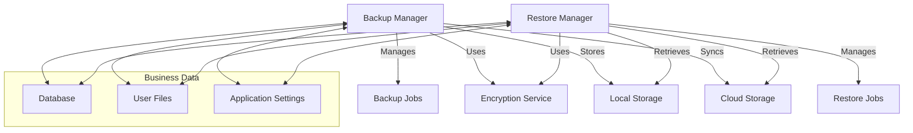
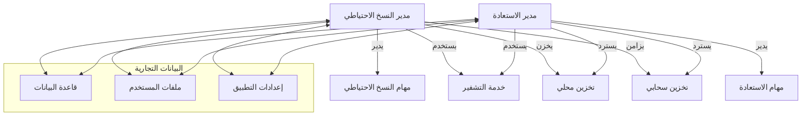

# 💾 Backup & Restore System

<div dir="rtl">

# 💾 نظام النسخ الاحتياطي والاستعادة

</div>

## 📋 Overview | نظرة عامة

The Backup & Restore system provides a robust solution for safeguarding your business data against loss or corruption. It enables scheduled and on-demand backups of critical business data, with options for local storage, cloud storage, or both. The system ensures data integrity and security during the backup and restore processes.

<div dir="rtl">

## 📋 نظرة عامة

يوفر نظام النسخ الاحتياطي والاستعادة حلاً قويًا لحماية بيانات عملك من الفقدان أو التلف. يتيح إنشاء نسخ احتياطية مجدولة أو عند الطلب للبيانات التجارية الهامة، مع خيارات للتخزين المحلي أو السحابي أو كليهما. يضمن النظام سلامة وأمان البيانات أثناء عمليات النسخ الاحتياطي والاستعادة.

</div>

## 🎯 Key Features | الميزات الرئيسية

### 1. Backup Capabilities
- **Full & Incremental Backups**: Choose between full system backups or incremental backups that only save changes
- **Scheduled Backups**: Automate backups on a daily, weekly, or monthly schedule
- **On-Demand Backups**: Initiate manual backups at any time
- **Selective Backup**: Choose specific data types or modules to back up
- **Encryption**: Secure backups with AES-256 encryption

### 2. Restore Options
- **Point-in-Time Recovery**: Restore data to a specific point in time
- **Selective Restore**: Restore specific data types or modules
- **Preview Before Restore**: Review backup contents before restoring
- **Cross-Version Compatibility**: Restore backups from previous versions of the application

### 3. Storage & Management
- **Local Storage**: Save backups to device storage or external media
- **Cloud Storage**: Integrate with Google Drive, Dropbox, or custom cloud storage
- **Backup Rotation**: Automatically manage backup retention policies
- **Backup Verification**: Verify backup integrity after creation

### 4. Security & Compliance
- **End-to-End Encryption**: All backups are encrypted before leaving the device
- **Password Protection**: Secure backups with passwords
- **Audit Logging**: Track all backup and restore activities
- **Compliance**: Meet regulatory requirements for data protection

<div dir="rtl">

## 🎯 الميزات الرئيسية

### 1. إمكانيات النسخ الاحتياطي
- **نسخ احتياطي كاملة وتزايدية**: اختر بين نسخ احتياطية كاملة للنظام أو نسخ تزايدية تحفظ التغييرات فقط
- **نسخ احتياطي مجدولة**: أتمتة النسخ الاحتياطي يوميًا أو أسبوعيًا أو شهريًا
- **نسخ احتياطي عند الطلب**: بدء نسخ احتياطية يدوية في أي وقت
- **نسخ احتياطي انتقائي**: اختر أنواع بيانات أو وحدات محددة للنسخ الاحتياطي
- **تشفير**: تأمين النسخ الاحتياطية بتشفير AES-256

### 2. خيارات الاستعادة
- **استعادة إلى نقطة زمنية محددة**: استعادة البيانات إلى وقت محدد
- **استعادة انتقائية**: استعادة أنواع بيانات أو وحدات محددة
- **معاينة قبل الاستعادة**: مراجعة محتويات النسخة الاحتياطية قبل الاستعادة
- **توافق بين الإصدارات**: استعادة نسخ احتياطية من إصدارات سابقة من التطبيق

### 3. التخزين والإدارة
- **تخزين محلي**: حفظ النسخ الاحتياطية على وحدة التخزين الداخلية أو وسائط خارجية
- **تخزين سحابي**: التكامل مع Google Drive أو Dropbox أو تخزين سحابي مخصص
- **تدوير النسخ الاحتياطية**: إدارة سياسات الاحتفاظ بالنسخ الاحتياطية تلقائيًا
- **التحقق من النسخ الاحتياطية**: التحقق من سلامة النسخ الاحتياطية بعد إنشائها

### 4. الأمان والامتثال
- **تشفير من طرف إلى طرف**: يتم تشفير جميع النسخ الاحتياطية قبل مغادرتها الجهاز
- **حماية بكلمة مرور**: تأمين النسخ الاحتياطية بكلمات مرور
- **سجل التدقيق**: تتبع جميع أنشطة النسخ الاحتياطي والاستعادة
- **الامتثال**: تلبية المتطلبات التنظيمية لحماية البيانات

</div>

## 🏗️ Architecture | البنية المعمارية

### System Components


### Data Flow
1. **Backup Process**:
   - User initiates backup (manual or scheduled)
   - Backup Manager creates a backup job
   - Data is read from the database and files
   - Data is compressed and encrypted
   - Backup is saved to local storage and/or cloud storage
   - Backup metadata is updated

2. **Restore Process**:
   - User selects a backup to restore
   - Restore Manager verifies backup integrity
   - Data is decrypted and extracted
   - System is prepared for restore (optional: creates a pre-restore backup)
   - Data is restored to the system
   - System is restarted if necessary

<div dir="rtl">

## 🏗️ البنية المعمارية

### مكونات النظام


### تدفق البيانات
1. **عملية النسخ الاحتياطي**:
   - يبدأ المستخدم النسخ الاحتياطي (يدويًا أو مجدولًا)
   - ينشئ مدير النسخ الاحتياطي مهمة نسخ احتياطي
   - يتم قراءة البيانات من قاعدة البيانات والملفات
   - يتم ضغط البيانات وتشفيرها
   - يتم حفظ النسخة الاحتياطية في التخزين المحلي و/أو السحابي
   - يتم تحديث بيانات وصف النسخة الاحتياطية

2. **عملية الاستعادة**:
   - يحدد المستخدم نسخة احتياطية للاستعادة
   - يتحقق مدير الاستعادة من سلامة النسخة الاحتياطية
   - يتم فك تشفير واستخراج البيانات
   - يتم إعداد النظام للاستعادة (اختياري: إنشاء نسخة احتياطية قبل الاستعادة)
   - يتم استعادة البيانات إلى النظام
   - يتم إعادة تشغيل النظام إذا لزم الأمر

</div>

## 🛠 Implementation | التنفيذ

### 1. Database Schema

#### 1.1 Backup Table
```sql
CREATE TABLE backups (
    id TEXT PRIMARY KEY,
    name TEXT NOT NULL,
    description TEXT,
    backup_type TEXT NOT NULL, -- 'FULL' or 'INCREMENTAL'
    status TEXT NOT NULL, -- 'IN_PROGRESS', 'COMPLETED', 'FAILED', 'VERIFIED'
    created_at INTEGER NOT NULL,
    completed_at INTEGER,
    size_bytes INTEGER,
    encryption_key_hash TEXT,
    source_device TEXT,
    app_version TEXT,
    metadata TEXT, -- JSON string with additional metadata
    is_compressed INTEGER NOT NULL DEFAULT 1,
    is_encrypted INTEGER NOT NULL DEFAULT 1,
    storage_locations TEXT, -- JSON array of storage locations
    UNIQUE(id)
);

-- Index for faster lookups
CREATE INDEX idx_backups_created_at ON backups(created_at);
CREATE INDEX idx_backups_status ON backups(status);
```

#### 1.2 Backup Items Table
```sql
CREATE TABLE backup_items (
    id TEXT PRIMARY KEY,
    backup_id TEXT NOT NULL,
    item_type TEXT NOT NULL, -- 'DATABASE', 'FILE', 'SETTINGS', etc.
    item_path TEXT NOT NULL, -- Path or identifier for the item
    status TEXT NOT NULL, -- 'PENDING', 'COMPLETED', 'FAILED', 'VERIFIED'
    size_bytes INTEGER,
    checksum TEXT,
    metadata TEXT, -- JSON string with item-specific metadata
    FOREIGN KEY(backup_id) REFERENCES backups(id) ON DELETE CASCADE,
    UNIQUE(backup_id, item_type, item_path)
);

-- Index for faster lookups
CREATE INDEX idx_backup_items_backup_id ON backup_items(backup_id);
CREATE INDEX idx_backup_items_status ON backup_items(status);
```

### 2. Core Implementation

#### 2.1 Backup Manager
```kotlin
class BackupManager @Inject constructor(
    private val context: Context,
    private val backupDao: BackupDao,
    private val encryptionService: EncryptionService,
    private val storageManager: StorageManager,
    private val workManager: WorkManager,
    @ApplicationScope private val coroutineScope: CoroutineScope
) {
    
    companion object {
        private const val BACKUP_WORKER_TAG = "backup_worker"
        private const val BACKUP_RETRY_COUNT = 3
        
        // Backup types
        const val TYPE_FULL = "FULL"
        const val TYPE_INCREMENTAL = "INCREMENTAL"
        
        // Status values
        const val STATUS_PENDING = "PENDING"
        const val STATUS_IN_PROGRESS = "IN_PROGRESS"
        const val STATUS_COMPLETED = "COMPLETED"
        const val STATUS_FAILED = "FAILED"
        const val STATUS_VERIFIED = "VERIFIED"
    }
    
    // Data classes for backup configuration and results
    data class BackupConfig(
        val name: String,
        val description: String? = null,
        val type: String = TYPE_FULL,
        val compress: Boolean = true,
        val encrypt: Boolean = true,
        val storageLocations: List<String> = emptyList(),
        val includeDatabase: Boolean = true,
        val includeFiles: Boolean = true,
        val includeSettings: Boolean = true,
        val password: String? = null
    )
    
    data class BackupResult(
        val backupId: String,
        val status: String,
        val message: String? = null,
        val itemsProcessed: Int = 0,
        val totalItems: Int = 0,
        val bytesProcessed: Long = 0,
        val totalBytes: Long = 0
    )
    
    // Backup state flow
    private val _backupState = MutableStateFlow<BackupResult?>(null)
    val backupState: StateFlow<BackupResult?> = _backupState.asStateFlow()
    
    // Create a new backup
    suspend fun createBackup(config: BackupConfig): Flow<BackupResult> = flow {
        val backupId = generateBackupId()
        
        // Create backup record in database
        val backup = Backup(
            id = backupId,
            name = config.name,
            description = config.description,
            backupType = config.type,
            status = STATUS_IN_PROGRESS,
            createdAt = System.currentTimeMillis(),
            isCompressed = if (config.compress) 1 else 0,
            isEncrypted = if (config.encrypt) 1 else 0,
            storageLocations = config.storageLocations.joinToString(",")
        )
        
        backupDao.insertBackup(backup)
        
        // Collect backup items based on config
        val backupItems = mutableListOf<BackupItem>()
        
        if (config.includeDatabase) {
            backupItems.addAll(collectDatabaseItems(backupId))
        }
        
        if (config.includeFiles) {
            backupItems.addAll(collectFileItems(backupId))
        }
        
        if (config.includeSettings) {
            backupItems.addAll(collectSettingsItems(backupId))
        }
        
        // Insert backup items
        backupDao.insertBackupItems(backupItems)
        
        // Update backup with total items
        val totalItems = backupItems.size
        val totalBytes = backupItems.sumOf { it.sizeBytes ?: 0L }
        
        backupDao.updateBackup(
            backupId = backupId,
            status = STATUS_IN_PROGRESS,
            sizeBytes = totalBytes
        )
        
        // Process backup items
        var processedItems = 0
        var processedBytes = 0L
        
        for (item in backupItems) {
            try {
                // Update item status to in progress
                backupDao.updateBackupItem(
                    itemId = item.id,
                    status = STATUS_IN_PROGRESS
                )
                
                // Process the item (backup the actual data)
                val result = processBackupItem(item, config)
                
                // Update item status and metadata
                backupDao.updateBackupItem(
                    itemId = item.id,
                    status = if (result.success) STATUS_COMPLETED else STATUS_FAILED,
                    sizeBytes = result.sizeBytes,
                    checksum = result.checksum,
                    metadata = result.metadata
                )
                
                // Update progress
                processedItems++
                processedBytes += result.sizeBytes
                
                // Emit progress
                emit(
                    BackupResult(
                        backupId = backupId,
                        status = STATUS_IN_PROGRESS,
                        itemsProcessed = processedItems,
                        totalItems = totalItems,
                        bytesProcessed = processedBytes,
                        totalBytes = totalBytes
                    )
                )
                
            } catch (e: Exception) {
                // Log error and continue with next item
                Log.e("BackupManager", "Error processing backup item: ${item.id}", e)
                backupDao.updateBackupItem(
                    itemId = item.id,
                    status = STATUS_FAILED,
                    metadata = "Error: ${e.message}"
                )
            }
        }
        
        // Finalize backup
        val finalStatus = if (processedItems == totalItems) STATUS_COMPLETED else STATUS_FAILED
        
        backupDao.updateBackup(
            backupId = backupId,
            status = finalStatus,
            completedAt = System.currentTimeMillis()
        )
        
        // Verify backup if completed successfully
        if (finalStatus == STATUS_COMPLETED && config.verifyAfterBackup) {
            verifyBackup(backupId)
        }
        
        // Emit final result
        emit(
            BackupResult(
                backupId = backupId,
                status = finalStatus,
                message = if (finalStatus == STATUS_COMPLETED) "Backup completed successfully" else "Backup completed with errors",
                itemsProcessed = processedItems,
                totalItems = totalItems,
                bytesProcessed = processedBytes,
                totalBytes = totalBytes
            )
        )
    }.catch { e ->
        // Handle any errors during backup
        Log.e("BackupManager", "Backup failed", e)
        emit(
            BackupResult(
                backupId = backupId,
                status = STATUS_FAILED,
                message = "Backup failed: ${e.message}"
            )
        )
    }
    
    // Schedule a recurring backup
    fun scheduleBackup(
        config: BackupConfig,
        interval: Long, // in hours
        requireCharging: Boolean = true,
        requireWifi: Boolean = true
    ) {
        val constraints = Constraints.Builder()
            .setRequiredNetworkType(if (requireWifi) NetworkType.UNMETERED else NetworkType.CONNECTED)
            .setRequiresCharging(requireCharging)
            .build()
        
        val backupWorkRequest = PeriodicWorkRequestBuilder<BackupWorker>(
            repeatInterval = interval, TimeUnit.HOURS,
            flexTime = 15, TimeUnit.MINUTES // Flex interval for better batching
        )
            .setConstraints(constraints)
            .addTag(BACKUP_WORKER_TAG)
            .setInputData(
                workDataOf(
                    "config" to Gson().toJson(config)
                )
            )
            .build()
        
        workManager.enqueueUniquePeriodicWork(
            "scheduled_backup_${config.name}",
            ExistingPeriodicWorkPolicy.REPLACE,
            backupWorkRequest
        )
    }
    
    // Cancel a scheduled backup
    fun cancelScheduledBackup(name: String) {
        workManager.cancelAllWorkByTag("${BACKUP_WORKER_TAG}_$name")
    }
    
    // Verify a completed backup
    suspend fun verifyBackup(backupId: String): Boolean {
        // Implementation for verifying backup integrity
        // This would check that all files exist, checksums match, etc.
        return true
    }
    
    // Private helper methods
    private suspend fun collectDatabaseItems(backupId: String): List<BackupItem> {
        // Implementation for collecting database items to back up
        return emptyList()
    }
    
    private suspend fun collectFileItems(backupId: String): List<BackupItem> {
        // Implementation for collecting file items to back up
        return emptyList()
    }
    
    private suspend fun collectSettingsItems(backupId: String): List<BackupItem> {
        // Implementation for collecting settings to back up
        return emptyList()
    }
    
    private suspend fun processBackupItem(
        item: BackupItem,
        config: BackupConfig
    ): BackupItemResult {
        // Implementation for processing a single backup item
        return BackupItemResult(success = true, sizeBytes = 0, checksum = "")
    }
    
    private fun generateBackupId(): String {
        return "backup_${System.currentTimeMillis()}_${UUID.randomUUID().toString().take(8)}"
    }
    
    // Data class for backup item processing result
    private data class BackupItemResult(
        val success: Boolean,
        val sizeBytes: Long,
        val checksum: String,
        val metadata: String? = null
    )
}

// Worker class for background backup operations
class BackupWorker(
    context: Context,
    workerParams: WorkerParameters
) : CoroutineWorker(context, workerParams) {
    
    @Inject
    lateinit var backupManager: BackupManager
    
    override suspend fun doWork(): Result {
        val configJson = inputData.getString("config") ?: return Result.failure()
        val config = Gson().fromJson(configJson, BackupManager.BackupConfig::class.java)
        
        return try {
            backupManager.createBackup(config).collect { result ->
                // Update progress or handle intermediate results
                setProgress(workDataOf("progress" to result.itemsProcessed.toFloat() / result.totalItems))
            }
            Result.success()
        } catch (e: Exception) {
            Log.e("BackupWorker", "Backup failed", e)
            Result.failure()
        }
    }
}
```

#### 2.2 Restore Manager
```kotlin
class RestoreManager @Inject constructor(
    private val context: Context,
    private val backupDao: BackupDao,
    private val encryptionService: EncryptionService,
    private val storageManager: StorageManager,
    private val workManager: WorkManager,
    @ApplicationScope private val coroutineScope: CoroutineScope
) {
    
    companion object {
        private const val RESTORE_WORKER_TAG = "restore_worker"
        
        // Status values
        const val STATUS_PENDING = "PENDING"
        const val STATUS_IN_PROGRESS = "IN_PROGRESS"
        const val STATUS_COMPLETED = "COMPLETED"
        const val STATUS_FAILED = "FAILED"
        const val STATUS_VERIFIED = "VERIFIED"
    }
    
    // Data class for restore configuration
    data class RestoreConfig(
        val backupId: String,
        val password: String? = null,
        val restoreDatabase: Boolean = true,
        val restoreFiles: Boolean = true,
        val restoreSettings: Boolean = true,
        val createPreRestoreBackup: Boolean = true,
        val conflictResolution: ConflictResolution = ConflictResolution.SKIP
    ) {
        enum class ConflictResolution {
            SKIP,       // Skip restoring items that already exist
            OVERWRITE,  // Overwrite existing items
            RENAME      // Rename restored items with a suffix
        }
    }
    
    // Data class for restore results
    data class RestoreResult(
        val restoreId: String,
        val backupId: String,
        val status: String,
        val message: String? = null,
        val itemsProcessed: Int = 0,
        val totalItems: Int = 0,
        val bytesProcessed: Long = 0,
        val totalBytes: Long = 0
    )
    
    // Restore state flow
    private val _restoreState = MutableStateFlow<RestoreResult?>(null)
    val restoreState: StateFlow<RestoreResult?> = _restoreState.asStateFlow()
    
    // Restore a backup
    suspend fun restoreBackup(config: RestoreConfig): Flow<RestoreResult> = flow {
        val restoreId = generateRestoreId()
        val backup = backupDao.getBackupById(config.backupId) ?: throw IllegalStateException("Backup not found")
        
        // Create a pre-restore backup if requested
        var preRestoreBackupId: String? = null
        if (config.createPreRestoreBackup) {
            preRestoreBackupId = createPreRestoreBackup()
        }
        
        try {
            // Get backup items based on config
            val backupItems = backupDao.getBackupItems(backup.id).filter { item ->
                when (item.itemType) {
                    "DATABASE" -> config.restoreDatabase
                    "FILE" -> config.restoreFiles
                    "SETTINGS" -> config.restoreSettings
                    else -> false
                }
            }
            
            val totalItems = backupItems.size
            val totalBytes = backupItems.sumOf { it.sizeBytes ?: 0L }
            
            // Emit initial progress
            emit(
                RestoreResult(
                    restoreId = restoreId,
                    backupId = backup.id,
                    status = STATUS_IN_PROGRESS,
                    itemsProcessed = 0,
                    totalItems = totalItems,
                    bytesProcessed = 0,
                    totalBytes = totalBytes
                )
            )
            
            // Process restore items
            var processedItems = 0
            var processedBytes = 0L
            
            for (item in backupItems) {
                try {
                    // Process the restore item
                    val result = processRestoreItem(item, config)
                    
                    // Update progress
                    processedItems++
                    processedBytes += result.bytesRestored
                    
                    // Emit progress
                    emit(
                        RestoreResult(
                            restoreId = restoreId,
                            backupId = backup.id,
                            status = STATUS_IN_PROGRESS,
                            itemsProcessed = processedItems,
                            totalItems = totalItems,
                            bytesProcessed = processedBytes,
                            totalBytes = totalBytes
                        )
                    )
                    
                } catch (e: Exception) {
                    // Log error and continue with next item
                    Log.e("RestoreManager", "Error processing restore item: ${item.id}", e)
                }
            }
            
            // Finalize restore
            val finalStatus = if (processedItems == totalItems) STATUS_COMPLETED else STATUS_FAILED
            
            // Emit final result
            emit(
                RestoreResult(
                    restoreId = restoreId,
                    backupId = backup.id,
                    status = finalStatus,
                    message = if (finalStatus == STATUS_COMPLETED) "Restore completed successfully" else "Restore completed with errors",
                    itemsProcessed = processedItems,
                    totalItems = totalItems,
                    bytesProcessed = processedBytes,
                    totalBytes = totalBytes
                )
            )
            
        } catch (e: Exception) {
            // Restore failed, restore from pre-restore backup if available
            if (preRestoreBackupId != null) {
                try {
                    restoreBackup(RestoreConfig(preRestoreBackupId, createPreRestoreBackup = false))
                } catch (re: Exception) {
                    Log.e("RestoreManager", "Failed to restore from pre-restore backup", re)
                }
            }
            
            throw e
        }
    }.catch { e ->
        // Handle any errors during restore
        Log.e("RestoreManager", "Restore failed", e)
        emit(
            RestoreResult(
                restoreId = restoreId,
                backupId = config.backupId,
                status = STATUS_FAILED,
                message = "Restore failed: ${e.message}"
            )
        )
    }
    
    // Create a pre-restore backup
    private suspend fun createPreRestoreBackup(): String {
        // Implementation for creating a pre-restore backup
        return "pre_restore_${System.currentTimeMillis()}"
    }
    
    // Process a single restore item
    private suspend fun processRestoreItem(
        item: BackupItem,
        config: RestoreConfig
    ): RestoreItemResult {
        // Implementation for processing a single restore item
        return RestoreItemResult(success = true, bytesRestored = 0)
    }
    
    private fun generateRestoreId(): String {
        return "restore_${System.currentTimeMillis()}_${UUID.randomUUID().toString().take(8)}"
    }
    
    // Data class for restore item processing result
    private data class RestoreItemResult(
        val success: Boolean,
        val bytesRestored: Long,
        val message: String? = null
    )
}
```

### 3. UI Components

#### 3.1 Backup Screen
```kotlin
@Composable
fun BackupScreen(
    viewModel: BackupViewModel = hiltViewModel()
) {
    val uiState by viewModel.uiState.collectAsState()
    val context = LocalContext.current
    
    Scaffold(
        topBar = {
            TopAppBar(
                title = { Text(stringResource(R.string.backup_title)) },
                actions = {
                    IconButton(onClick = { viewModel.onEvent(BackupEvent.Refresh) }) {
                        Icon(Icons.Default.Refresh, contentDescription = stringResource(R.string.refresh))
                    }
                }
            )
        },
        floatingActionButton = {
            FloatingActionButton(
                onClick = { viewModel.onEvent(BackupEvent.ShowCreateBackupDialog) },
                modifier = Modifier.padding(16.dp)
            ) {
                Icon(Icons.Default.Backup, contentDescription = stringResource(R.string.create_backup))
            }
        }
    ) { padding ->
        when (val state = uiState) {
            is BackupUiState.Loading -> {
                Box(
                    modifier = Modifier
                        .fillMaxSize()
                        .padding(padding),
                    contentAlignment = Alignment.Center
                ) {
                    CircularProgressIndicator()
                }
            }
            is BackupUiState.Success -> {
                if (state.backups.isEmpty()) {
                    EmptyState(
                        message = stringResource(R.string.no_backups_found),
                        modifier = Modifier.padding(padding)
                    )
                } else {
                    BackupList(
                        backups = state.backups,
                        onBackupClick = { backup ->
                            viewModel.onEvent(BackupEvent.ShowBackupDetails(backup))
                        },
                        onDeleteClick = { backup ->
                            viewModel.onEvent(BackupEvent.DeleteBackup(backup.id))
                        },
                        onRestoreClick = { backup ->
                            viewModel.onEvent(BackupEvent.ShowRestoreDialog(backup))
                        },
                        modifier = Modifier.padding(padding)
                    )
                }
            }
            is BackupUiState.Error -> {
                ErrorState(
                    message = state.message,
                    onRetry = { viewModel.onEvent(BackupEvent.Refresh) },
                    modifier = Modifier.padding(padding)
                )
            }
        }
    }
    
    // Show dialogs based on state
    when (val dialogState = uiState.dialogState) {
        is BackupDialogState.CreateBackup -> {
            CreateBackupDialog(
                onDismiss = { viewModel.onEvent(BackupEvent.DismissDialog) },
                onCreate = { name, description, type, storageLocations ->
                    viewModel.onEvent(
                        BackupEvent.CreateBackup(
                            name = name,
                            description = description,
                            type = type,
                            storageLocations = storageLocations
                        )
                    )
                },
                modifier = Modifier.padding(16.dp)
            )
        }
        is BackupDialogState.BackupDetails -> {
            BackupDetailsDialog(
                backup = dialogState.backup,
                onDismiss = { viewModel.onEvent(BackupEvent.DismissDialog) },
                onDelete = {
                    viewModel.onEvent(BackupEvent.DeleteBackup(dialogState.backup.id))
                    viewModel.onEvent(BackupEvent.DismissDialog)
                },
                onRestore = {
                    viewModel.onEvent(BackupEvent.ShowRestoreDialog(dialogState.backup))
                }
            )
        }
        is BackupDialogState.RestoreBackup -> {
            RestoreBackupDialog(
                backup = dialogState.backup,
                onDismiss = { viewModel.onEvent(BackupEvent.DismissDialog) },
                onRestore = { options ->
                    viewModel.onEvent(
                        BackupEvent.RestoreBackup(
                            backupId = dialogState.backup.id,
                            options = options
                        )
                    )
                }
            )
        }
        is BackupDialogState.None -> { /* No dialog to show */ }
    }
    
    // Show progress for ongoing operations
    if (uiState.isLoading) {
        FullScreenLoading(
            message = when (uiState.loadingMessage) {
                null -> stringResource(R.string.loading)
                else -> stringResource(uiState.loadingMessage)
            }
        )
    }
    
    // Show error message if any
    uiState.errorMessage?.let { message ->
        val errorMessage = stringResource(message)
        LaunchedEffect(Unit) {
            Toast.makeText(context, errorMessage, Toast.LENGTH_LONG).show()
            viewModel.onEvent(BackupEvent.ClearError)
        }
    }
}

@Composable
private fun BackupList(
    backups: List<Backup>,
    onBackupClick: (Backup) -> Unit,
    onDeleteClick: (Backup) -> Unit,
    onRestoreClick: (Backup) -> Unit,
    modifier: Modifier = Modifier
) {
    LazyColumn(modifier = modifier.fillMaxSize()) {
        items(backups) { backup ->
            BackupItem(
                backup = backup,
                onClick = { onBackupClick(backup) },
                onDelete = { onDeleteClick(backup) },
                onRestore = { onRestoreClick(backup) },
                modifier = Modifier.fillParentMaxWidth()
            )
            Divider()
        }
    }
}

@Composable
private fun BackupItem(
    backup: Backup,
    onClick: () -> Unit,
    onDelete: () -> Unit,
    onRestore: () -> Unit,
    modifier: Modifier = Modifier
) {
    Card(
        onClick = onClick,
        modifier = modifier.padding(8.dp)
    ) {
        Column(
            modifier = Modifier
                .fillMaxWidth()
                .padding(16.dp)
        ) {
            Row(
                verticalAlignment = Alignment.CenterVertically,
                modifier = Modifier.fillMaxWidth()
            ) {
                Icon(
                    imageVector = when (backup.backupType) {
                        "FULL" -> Icons.Default.Storage
                        else -> Icons.Default.ChangeHistory
                    },
                    contentDescription = null,
                    tint = MaterialTheme.colors.primary,
                    modifier = Modifier.size(24.dp)
                )
                
                Spacer(modifier = Modifier.width(16.dp))
                
                Column(modifier = Modifier.weight(1f)) {
                    Text(
                        text = backup.name,
                        style = MaterialTheme.typography.subtitle1,
                        fontWeight = FontWeight.Bold
                    )
                    
                    Text(
                        text = formatDate(backup.createdAt),
                        style = MaterialTheme.typography.caption,
                        color = MaterialTheme.colors.onSurface.copy(alpha = 0.6f)
                    )
                    
                    Text(
                        text = formatFileSize(backup.sizeBytes ?: 0),
                        style = MaterialTheme.typography.caption,
                        color = MaterialTheme.colors.onSurface.copy(alpha = 0.6f)
                    )
                }
                
                IconButton(onClick = onRestore) {
                    Icon(
                        imageVector = Icons.Default.Restore,
                        contentDescription = stringResource(R.string.restore),
                        tint = MaterialTheme.colors.primary
                    )
                }
                
                IconButton(onClick = onDelete) {
                    Icon(
                        imageVector = Icons.Default.Delete,
                        contentDescription = stringResource(R.string.delete),
                        tint = MaterialTheme.colors.error
                    )
                }
            }
        }
    }
}
```

## 🧪 Testing | الاختبار

### 1. Unit Tests

#### 1.1 BackupManager Test
```kotlin
@HiltAndroidTest
@RunWith(AndroidJUnit4::class)
class BackupManagerTest {
    
    @get:Rule
    var hiltRule = HiltAndroidRule(this)
    
    @Inject
    lateinit var context: Context
    
    @Inject
    lateinit var backupManager: BackupManager
    
    @Inject
    lateinit var backupDao: BackupDao
    
    @Before
    fun setup() {
        hiltRule.inject()
        
        // Clear any existing backups
        runBlocking {
            backupDao.deleteAllBackups()
        }
    }
    
    @Test
    fun createBackup_shouldCreateBackupRecord() = runBlocking {
        // Given
        val config = BackupManager.BackupConfig(
            name = "Test Backup",
            description = "Test description",
            type = BackupManager.TYPE_FULL
        )
        
        // When
        backupManager.createBackup(config).collect()
        
        // Then
        val backups = backupDao.getAllBackups()
        assertEquals(1, backups.size)
        assertEquals("Test Backup", backups[0].name)
        assertEquals("Test description", backups[0].description)
        assertEquals(BackupManager.STATUS_COMPLETED, backups[0].status)
    }
    
    @Test
    fun createBackup_withInvalidConfig_shouldFail() = runBlocking {
        // Given
        val config = BackupManager.BackupConfig(
            name = "", // Invalid: empty name
            type = "INVALID_TYPE" // Invalid type
        )
        
        // When/Then
        try {
            backupManager.createBackup(config).collect()
            fail("Expected exception")
        } catch (e: Exception) {
            // Expected
        }
    }
    
    @Test
    fun scheduleBackup_shouldScheduleWork() {
        // Given
        val config = BackupManager.BackupConfig(
            name = "Scheduled Backup",
            type = BackupManager.TYPE_FULL
        )
        
        // When
        backupManager.scheduleBackup(
            config = config,
            interval = 24, // 24 hours
            requireCharging = true,
            requireWifi = true
        )
        
        // Then: Verify work is scheduled
        val workInfos = WorkManager.getInstance(context)
            .getWorkInfosByTag("backup_worker_Scheduled Backup")
            .get()
        
        assertFalse(workInfos.isNullOrEmpty())
        assertEquals(WorkInfo.State.ENQUEUED, workInfos[0].state)
    }
}
```

#### 1.2 RestoreManager Test
```kotlin
@HiltAndroidTest
@RunWith(AndroidJUnit4::class)
class RestoreManagerTest {
    
    @get:Rule
    var hiltRule = HiltAndroidRule(this)
    
    @Inject
    lateinit var context: Context
    
    @Inject
    lateinit var restoreManager: RestoreManager
    
    @Inject
    lateinit var backupDao: BackupDao
    
    private lateinit var testBackup: Backup
    
    @Before
    fun setup() = runBlocking {
        hiltRule.inject()
        
        // Create a test backup
        testBackup = Backup(
            id = "test_backup_${System.currentTimeMillis()}",
            name = "Test Backup",
            backupType = "FULL",
            status = "COMPLETED",
            createdAt = System.currentTimeMillis(),
            isCompressed = 1,
            isEncrypted = 1
        )
        
        backupDao.insertBackup(testBackup)
        
        // Add some test backup items
        val items = listOf(
            BackupItem(
                id = "item1",
                backupId = testBackup.id,
                itemType = "DATABASE",
                itemPath = "database.db",
                status = "COMPLETED",
                sizeBytes = 1024,
                checksum = "abc123"
            ),
            BackupItem(
                id = "item2",
                backupId = testBackup.id,
                itemType = "FILE",
                itemPath = "files/documents/report.pdf",
                status = "COMPLETED",
                sizeBytes = 2048,
                checksum = "def456"
            )
        )
        
        backupDao.insertBackupItems(items)
    }
    
    @Test
    fun restoreBackup_shouldProcessAllItems() = runBlocking {
        // Given
        val config = RestoreManager.RestoreConfig(
            backupId = testBackup.id,
            restoreDatabase = true,
            restoreFiles = true
        )
        
        // When
        val results = mutableListOf<RestoreManager.RestoreResult>()
        restoreManager.restoreBackup(config).collect { result ->
            results.add(result)
        }
        
        // Then
        val finalResult = results.last()
        assertEquals(RestoreManager.STATUS_COMPLETED, finalResult.status)
        assertEquals(2, finalResult.itemsProcessed)
        assertTrue(finalResult.bytesProcessed > 0)
    }
    
    @Test
    fun restoreBackup_withInvalidId_shouldFail() = runBlocking {
        // Given
        val config = RestoreManager.RestoreConfig(
            backupId = "nonexistent_backup",
            restoreDatabase = true
        )
        
        // When/Then
        try {
            restoreManager.restoreBackup(config).collect()
            fail("Expected exception")
        } catch (e: Exception) {
            // Expected
            assertTrue(e is IllegalStateException)
        }
    }
}
```

### 2. Instrumented Tests

#### 2.1 Backup Instrumented Test
```kotlin
@RunWith(AndroidJUnit4::class)
@HiltAndroidTest
class BackupInstrumentedTest {
    
    @get:Rule
    var hiltRule = HiltAndroidRule(this)
    
    @Inject
    lateinit var context: Context
    
    @Inject
    lateinit var backupManager: BackupManager
    
    @Inject
    lateinit var database: AppDatabase
    
    @Before
    fun setup() {
        hiltRule.inject()
        
        // Clear any existing data
        runBlocking {
            database.clearAllTables()
        }
    }
    
    @Test
    fun testBackupAndRestore() = runBlocking {
        // Given: Create some test data
        val testData = listOf(
            Product(id = 1, name = "Test Product 1", price = 9.99, stock = 10),
            Product(id = 2, name = "Test Product 2", price = 19.99, stock = 5)
        )
        
        database.productDao().insertAll(testData)
        
        // When: Create a backup
        val config = BackupManager.BackupConfig(
            name = "Test Backup",
            type = BackupManager.TYPE_FULL,
            includeDatabase = true
        )
        
        var backupId = ""
        backupManager.createBackup(config).collect { result ->
            if (result.status == BackupManager.STATUS_COMPLETED) {
                backupId = result.backupId
            }
        }
        
        assertTrue(backupId.isNotBlank())
        
        // When: Clear the database
        database.clearAllTables()
        
        // Then: Verify data is gone
        var products = database.productDao().getAll()
        assertTrue(products.isEmpty())
        
        // When: Restore from backup
        val restoreConfig = RestoreManager.RestoreConfig(
            backupId = backupId,
            restoreDatabase = true
        )
        
        restoreManager.restoreBackup(restoreConfig).collect()
        
        // Then: Verify data is restored
        products = database.productDao().getAll()
        assertEquals(2, products.size)
        assertTrue(products.any { it.name == "Test Product 1" })
        assertTrue(products.any { it.name == "Test Product 2" })
    }
}
```

## 🚀 Deployment | النشر

### 1. Configuration

#### 1.1 Backup Configuration
Add to `app/src/main/res/values/config.xml`:

```xml
<resources>
    <!-- Backup settings -->
    <bool name="backup_enabled">true</bool>
    <bool name="backup_encryption_enabled">true</bool>
    <bool name="backup_compression_enabled">true</bool>
    
    <!-- Default backup schedule (in hours) -->
    <integer name="default_backup_interval">24</integer>
    
    <!-- Maximum number of local backups to keep -->
    <integer name="max_local_backups">30</integer>
    
    <!-- Maximum backup size in MB -->
    <integer name="max_backup_size_mb">1024</integer>
    
    <!-- Backup file extension -->
    <string name="backup_file_extension">.bkp</string>
    
    <!-- Backup folder name -->
    <string name="backup_folder_name">BusinessBackups</string>
</resources>
```

#### 1.2 AndroidManifest.xml
Add required permissions:

```xml
<manifest>
    <!-- Required for local storage access -->
    <uses-permission android:name="android.permission.READ_EXTERNAL_STORAGE" />
    <uses-permission android:name="android.permission.WRITE_EXTERNAL_STORAGE"
        android:maxSdkVersion="28" />
    
    <!-- Required for network operations -->
    <uses-permission android:name="android.permission.INTERNET" />
    <uses-permission android:name="android.permission.ACCESS_NETWORK_STATE" />
    
    <!-- Required for backup to external storage on Android 10+ -->
    <application
        android:requestLegacyExternalStorage="true"
        ...>
        
        <!-- Backup service -->
        <service
            android:name=".backup.BackupService"
            android:enabled="true"
            android:exported="false" />
            
        <!-- Restore receiver -->
        <receiver
            android:name=".backup.RestoreReceiver"
            android:enabled="true"
            android:exported="false">
            <intent-filter>
                <action android:name="${applicationId}.action.RESTORE_COMPLETE" />
            </intent-filter>
        </receiver>
    </application>
</manifest>
```

### 2. Dependencies

Add to `app/build.gradle`:

```gradle
dependencies {
    // Room database
    implementation "androidx.room:room-runtime:2.4.3"
    implementation "androidx.room:room-ktx:2.4.3"
    kapt "androidx.room:room-compiler:2.4.3"
    
    // WorkManager for background tasks
    implementation "androidx.work:work-runtime-ktx:2.8.0"
    
    // Encryption
    implementation "androidx.security:security-crypto:1.1.0-alpha06"
    implementation "net.zetetic:android-database-sqlcipher:4.5.0"
    
    // Compression
    implementation "org.apache.commons:commons-compress:1.21"
    
    // Cloud storage
    implementation "com.google.android.gms:play-services-drive:17.0.0"
    implementation "com.dropbox.core:dropbox-core-sdk:5.4.4"
    
    // Testing
    testImplementation 'junit:junit:4.13.2'
    androidTestImplementation 'androidx.test.ext:junit:1.1.5'
    androidTestImplementation 'androidx.test.espresso:espresso-core:3.5.1'
    androidTestImplementation 'androidx.work:work-testing:2.8.0'
}
```

### 3. Backup Service

#### 3.1 BackupService.kt
```kotlin
class BackupService : Service() {
    
    private val serviceJob = SupervisorJob()
    private val serviceScope = CoroutineScope(Dispatchers.IO + serviceJob)
    
    @Inject
    lateinit var backupManager: BackupManager
    
    override fun onCreate() {
        super.onCreate()
        (application as BusinessApp).appComponent.inject(this)
    }
    
    override fun onStartCommand(intent: Intent?, flags: Int, startId: Int): Int {
        when (intent?.action) {
            ACTION_START_BACKUP -> {
                val name = intent.getStringExtra(EXTRA_BACKUP_NAME) ?: "Manual Backup"
                val description = intent.getStringExtra(EXTRA_BACKUP_DESCRIPTION)
                val type = intent.getStringExtra(EXTRA_BACKUP_TYPE) ?: BackupManager.TYPE_FULL
                
                startBackup(name, description, type)
            }
            
            ACTION_CANCEL_BACKUP -> {
                cancelBackup()
            }
        }
        
        return START_STICKY
    }
    
    private fun startBackup(name: String, description: String?, type: String) {
        val config = BackupManager.BackupConfig(
            name = name,
            description = description,
            type = type,
            compress = true,
            encrypt = true
        )
        
        serviceScope.launch {
            try {
                // Notify backup started
                sendBroadcast(Intent(ACTION_BACKUP_STARTED))
                
                // Start backup
                backupManager.createBackup(config).collect { result ->
                    // Forward progress updates
                    val progressIntent = Intent(ACTION_BACKUP_PROGRESS).apply {
                        putExtra(EXTRA_BACKUP_ID, result.backupId)
                        putExtra(EXTRA_ITEMS_PROCESSED, result.itemsProcessed)
                        putExtra(EXTRA_TOTAL_ITEMS, result.totalItems)
                        putExtra(EXTRA_BYTES_PROCESSED, result.bytesProcessed)
                        putExtra(EXTRA_TOTAL_BYTES, result.totalBytes)
                    }
                    
                    sendBroadcast(progressIntent)
                    
                    // Update notification
                    updateNotification(
                        progress = (result.itemsProcessed.toFloat() / result.totalItems).coerceIn(0f, 1f),
                        status = result.status,
                        message = result.message
                    )
                }
                
                // Notify backup completed
                sendBroadcast(Intent(ACTION_BACKUP_COMPLETED))
                
            } catch (e: Exception) {
                // Notify backup failed
                val errorIntent = Intent(ACTION_BACKUP_FAILED).apply {
                    putExtra(EXTRA_ERROR_MESSAGE, e.message)
                }
                
                sendBroadcast(errorIntent)
                
            } finally {
                // Stop the service when done
                stopSelf()
            }
        }
    }
    
    private fun cancelBackup() {
        serviceJob.cancel()
        stopSelf()
    }
    
    private fun updateNotification(progress: Float, status: String, message: String?) {
        val notification = NotificationCompat.Builder(this, BACKUP_CHANNEL_ID)
            .setContentTitle(getString(R.string.backup_in_progress))
            .setContentText(message ?: getString(R.string.backing_up_data))
            .setSmallIcon(R.drawable.ic_backup)
            .setOngoing(true)
            .setProgress(100, (progress * 100).toInt(), false)
            .build()
            
        startForeground(NOTIFICATION_ID_BACKUP, notification)
    }
    
    override fun onBind(intent: Intent?): IBinder? = null
    
    override fun onDestroy() {
        super.onDestroy()
        serviceJob.cancel()
    }
    
    companion object {
        // Actions
        const val ACTION_START_BACKUP = "ACTION_START_BACKUP"
        const val ACTION_CANCEL_BACKUP = "ACTION_CANCEL_BACKUP"
        const val ACTION_BACKUP_STARTED = "ACTION_BACKUP_STARTED"
        const val ACTION_BACKUP_PROGRESS = "ACTION_BACKUP_PROGRESS"
        const val ACTION_BACKUP_COMPLETED = "ACTION_BACKUP_COMPLETED"
        const val ACTION_BACKUP_FAILED = "ACTION_BACKUP_FAILED"
        
        // Extras
        const val EXTRA_BACKUP_NAME = "EXTRA_BACKUP_NAME"
        const val EXTRA_BACKUP_DESCRIPTION = "EXTRA_BACKUP_DESCRIPTION"
        const val EXTRA_BACKUP_TYPE = "EXTRA_BACKUP_TYPE"
        const val EXTRA_BACKUP_ID = "EXTRA_BACKUP_ID"
        const val EXTRA_ITEMS_PROCESSED = "EXTRA_ITEMS_PROCESSED"
        const val EXTRA_TOTAL_ITEMS = "EXTRA_TOTAL_ITEMS"
        const val EXTRA_BYTES_PROCESSED = "EXTRA_BYTES_PROCESSED"
        const val EXTRA_TOTAL_BYTES = "EXTRA_TOTAL_BYTES"
        const val EXTRA_ERROR_MESSAGE = "EXTRA_ERROR_MESSAGE"
        
        // Notification
        private const val NOTIFICATION_ID_BACKUP = 1001
        private const val BACKUP_CHANNEL_ID = "backup_channel"
    }
}
```

## 📝 Conclusion | الخاتمة

The Backup & Restore system provides a comprehensive solution for protecting your business data against loss or corruption. By implementing the architecture and components described in this document, you can ensure that your business data is always safe and can be restored when needed. The system is designed to be flexible, secure, and easy to use, with support for both manual and automated backups.

<div dir="rtl">

## 📝 الخاتمة

يوفر نظام النسخ الاحتياطي والاستعادة حلاً شاملاً لحماية بيانات عملك من الفقدان أو التلف. من خلال تنفيذ البنية المعمارية والمكونات الموضحة في هذا المستند، يمكنك التأكد من أن بيانات عملك آمنة دائمًا ويمكن استعادتها عند الحاجة. تم تصميم النظام ليكون مرنًا وآمنًا وسهل الاستخدام، مع دعم النسخ الاحتياطي اليدوي والآلي.

</div>

## 📚 Related Documents | المستندات ذات الصلة

1. [Database Architecture](../architecture/02-database.md)
2. [Security & Encryption](../security/03-encryption.md)
3. [Cloud Sync](../architecture/05-cloud-sync.md)
4. [User Guide: Backup & Restore](../user-guide/backup-restore.md)

## 🙋 Support | الدعم

For support, please contact our development team or open an issue in the repository.

<div dir="rtl">

## 🙋 الدعم

للحصول على الدعم، يرجى التواصل مع فريق التطوير أو فتح مشكلة في المستودع.

</div>
