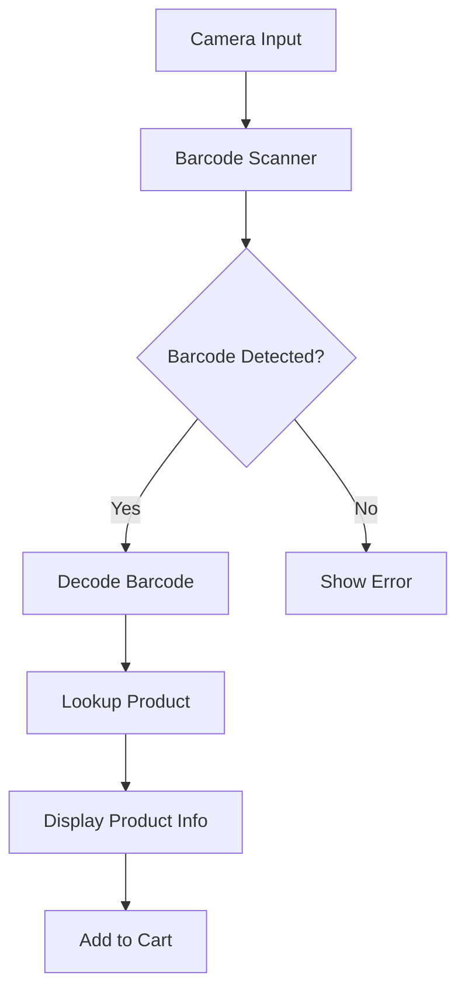
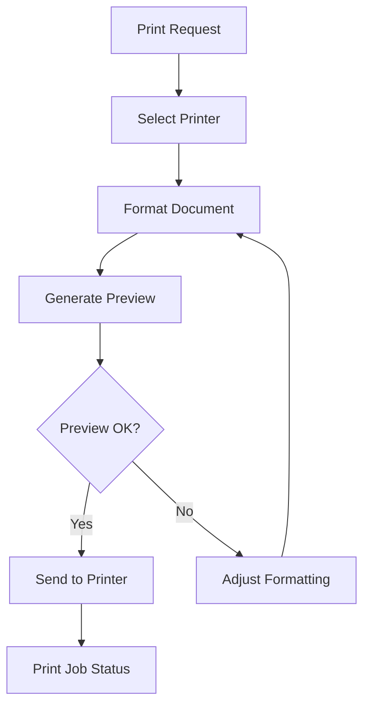

# Printing & Barcode System

## Overview
The Printing & Barcode system provides comprehensive support for barcode scanning, generation, and receipt printing within the Business Management application. This feature is essential for efficient point-of-sale operations and inventory management.

## Key Features

### Barcode Features
- **Barcode Scanning**: Scan product barcodes using the device camera
- **Barcode Generation**: Generate barcodes for products
- **Multiple Barcode Types**: Support for various barcode formats (EAN-13, UPC-A, Code 128, etc.)
- **Offline Support**: Barcode scanning works without internet connection
- **Fast Lookup**: Quick product search by barcode

### Printing Features
- **Receipt Printing**: Print receipts for sales transactions
- **Multiple Printer Support**: Compatible with various Bluetooth and network printers
- **Customizable Receipt Templates**: Design and save receipt templates
- **Print Preview**: Preview receipts before printing
- **Bulk Printing**: Print multiple receipts or labels at once

## Architecture

### Barcode System


### Printing System


## Implementation Details

### Barcode Scanning
1. **Camera Integration**
   - Uses CameraX API for camera access
   - Implements ML Kit's barcode scanning capabilities
   - Handles different camera orientations

2. **Barcode Processing**
   - Processes barcodes in real-time
   - Validates barcode formats
   - Caches frequently scanned barcodes for better performance

### Receipt Printing
1. **Printer Connectivity**
   - Supports Bluetooth and network printers
   - Manages printer connections and status
   - Handles printer timeouts and errors

2. **Receipt Generation**
   - Uses templates for consistent formatting
   - Supports text, images, and barcodes on receipts
   - Handles different paper sizes and orientations

## Code Examples

### Barcode Scanning
```kotlin
class BarcodeScannerScreen : ComponentActivity() {
    private val barcodeScanner = BarcodeScanning.getClient()
    private lateinit var cameraExecutor: ExecutorService
    
    override fun onCreate(savedInstanceState: Bundle?) {
        super.onCreate(savedInstanceState)
        cameraExecutor = Executors.newSingleThreadExecutor()
        
        // Setup camera preview and analysis
        val cameraProviderFuture = ProcessCameraProvider.getInstance(this)
        cameraProviderFuture.addListener({
            val cameraProvider = cameraProviderFuture.get()
            bindPreview(cameraProvider)
        }, ContextCompat.getMainExecutor(this))
    }
    
    private fun bindPreview(cameraProvider: ProcessCameraProvider) {
        val preview = Preview.Builder().build()
        val cameraSelector = CameraSelector.DEFAULT_BACK_CAMERA
        
        val imageAnalysis = ImageAnalysis.Builder()
            .setBackpressureStrategy(ImageAnalysis.STRATEGY_KEEP_ONLY_LATEST)
            .build()
            
        imageAnalysis.setAnalyzer(cameraExecutor) { imageProxy ->
            val mediaImage = imageProxy.image
            if (mediaImage != null) {
                val image = InputImage.fromMediaImage(
                    mediaImage,
                    imageProxy.imageInfo.rotationDegrees
                )
                
                barcodeScanner.process(image)
                    .addOnSuccessListener { barcodes ->
                        barcodes.firstOrNull()?.rawValue?.let { barcode ->
                            // Handle detected barcode
                            viewModel.onBarcodeScanned(barcode)
                        }
                    }
                    .addOnCompleteListener {
                        imageProxy.close()
                    }
            }
        }
        
        cameraProvider.unbindAll()
        cameraProvider.bindToLifecycle(
            this, 
            cameraSelector, 
            preview,
            imageAnalysis
        )
    }
}
```

### Receipt Printing
```kotlin
class ReceiptPrinter(private val context: Context) {
    
    fun printReceipt(order: Order, printer: Printer) {
        val receipt = buildReceiptDocument(order)
        val printManager = context.getSystemService(PRINT_SERVICE) as PrintManager
        
        val printAdapter = object : PrintDocumentAdapter() {
            override fun onLayout(
                oldAttributes: PrintAttributes?,
                newAttributes: PrintAttributes,
                cancellationSignal: CancellationSignal,
                callback: LayoutResultCallback,
                extras: Bundle?
            ) {
                if (cancellationSignal.isCanceled) {
                    callback.onLayoutCancelled()
                    return
                }
                
                val builder = PrintDocumentInfo.Builder("receipt.pdf")
                    .setContentType(PrintDocumentInfo.CONTENT_TYPE_DOCUMENT)
                    .setPageCount(1)
                
                callback.onLayoutFinished(builder.build(), true)
            }
            
            override fun onWrite(
                pages: Array<out PageRange>,
                destination: ParcelFileDescriptor,
                cancellationSignal: CancellationSignal,
                callback: WriteResultCallback
            ) {
                try {
                    val fileOutputStream = FileOutputStream(destination.fileDescriptor)
                    // Write receipt content to output stream
                    fileOutputStream.write(receipt.toByteArray())
                    fileOutputStream.close()
                    
                    callback.onWriteFinished(arrayOf(PageRange.ALL_PAGES))
                } catch (e: Exception) {
                    callback.onWriteFailed(e.message)
                }
            }
        }
        
        printManager.print("Receipt", printAdapter, null)
    }
    
    private fun buildReceiptDocument(order: Order): String {
        // Build receipt content
        return """
            ${order.storeName.center(32)}
            ${order.storeAddress.center(32)}
            ${order.storePhone.center(32)}
            ${"".padEnd(32, '-')}
            ${String.format("%-16s%16s", "Date:", order.date)}
            ${String.format("%-16s%16s", "Receipt #:", order.receiptNumber)}
            ${String.format("%-16s%16s", "Cashier:", order.cashierName)}
            ${"".padEnd(32, '-')}
            ${String.format("%-20s%4s%8s", "Item", "Qty", "Total")}
            ${"".padEnd(32, '-')}
            ${order.items.joinToString("\n") { 
                "${it.name.take(18).padEnd(18)} ${it.quantity.toString().padStart(3)} ${String.format("%8.2f", it.totalPrice)}"
            }}
            ${"".padEnd(32, '-')}
            ${String.format("%-24s%8.2f", "Subtotal:", order.subtotal)}
            ${String.format("%-24s%8.2f", "Tax (${order.taxRate}%):", order.tax)}
            ${String.format("%-24s%8.2f", "Total:", order.total)}
            ${"".padEnd(32, '=')}
            ${String.format("%-24s%8.2f", "Cash:", order.cashReceived)}
            ${String.format("%-24s%8.2f", "Change:", order.change)}
            ${"".padEnd(32, '=')}
            ${"Thank you for shopping with us!".center(32)}
            ${"www.example.com".center(32)}
        """.trimIndent()
    }
}
```

## Configuration

### Barcode Scanner Configuration
```xml
<!-- AndroidManifest.xml -->
<uses-feature android:name="android.hardware.camera" />
<uses-permission android:name="android.permission.CAMERA" />

<!-- Add ML Kit Barcode Scanning dependency -->
<application>
    <meta-data
        android:name="com.google.mlkit.vision.DEPENDENCIES"
        android:value="barcode" />
</application>
```

### Printer Configuration
```xml
<!-- AndroidManifest.xml -->
<uses-permission android:name="android.permission.BLUETOOTH" />
<uses-permission android:name="android.permission.BLUETOOTH_ADMIN" />
<uses-permission android:name="android.permission.INTERNET" />
<uses-permission android:name="android.permission.BLUETOOTH_CONNECT" />
<uses-permission android:name="android.permission.BLUETOOTH_SCAN" />
```

## Testing

### Barcode Scanner Tests
1. **Unit Tests**
   - Test barcode format validation
   - Test barcode value extraction
   - Test error handling for invalid barcodes

2. **Instrumented Tests**
   - Test camera initialization
   - Test barcode detection with sample images
   - Test performance with multiple barcodes

### Printer Tests
1. **Unit Tests**
   - Test receipt content generation
   - Test template formatting
   - Test error handling for printer errors

2. **Instrumented Tests**
   - Test printer connectivity
   - Test print job submission
   - Test different paper sizes and orientations

## Dependencies
```gradle
dependencies {
    // Barcode Scanning
    implementation 'com.google.mlkit:barcode-scanning:17.2.0'
    implementation 'androidx.camera:camera-camera2:1.3.0'
    implementation 'androidx.camera:camera-lifecycle:1.3.0'
    implementation 'androidx.camera:camera-view:1.3.0'
    
    // Printing
    implementation 'androidx.print:print:1.1.0'
    
    // Bluetooth Printing
    implementation 'com.github.DantSu:ESCPOS-ThermalPrinter-Android:3.2.0'
}
```

## Security Considerations
- Camera permission handling
- Secure barcode data processing
- Printer connection security
- Data validation for all printed content

## Error Handling
- Handle camera permission denials
- Handle printer connection issues
- Handle paper out/paper jam scenarios
- Network connectivity for cloud printing

## Performance Considerations
- Optimize camera preview frame rate
- Cache frequently used barcodes
- Batch print jobs for better performance
- Memory management for large receipts

## Localization
- Support for RTL languages
- Date, time, and number formatting
- Currency symbols and formatting
- Multi-language receipt templates

## Future Enhancements
- Support for QR code payments
- Cloud print services integration
- Advanced receipt customization
- Barcode batch scanning
- Offline receipt storage and sync

## Troubleshooting

### Common Issues
1. **Barcode not scanning**
   - Ensure good lighting conditions
   - Clean the camera lens
   - Check barcode quality and contrast

2. **Printer not connecting**
   - Verify Bluetooth is enabled
   - Check printer is in range and powered on
   - Restart both devices if needed

3. **Print quality issues**
   - Clean printer head
   - Replace ink/ribbon if needed
   - Adjust print density settings

## Support
For any issues with the Printing & Barcode system, please contact support@example.com with the following information:
- Device model and Android version
- Printer model (if applicable)
- Steps to reproduce the issue
- Screenshots (if applicable)
- Logs from the application
