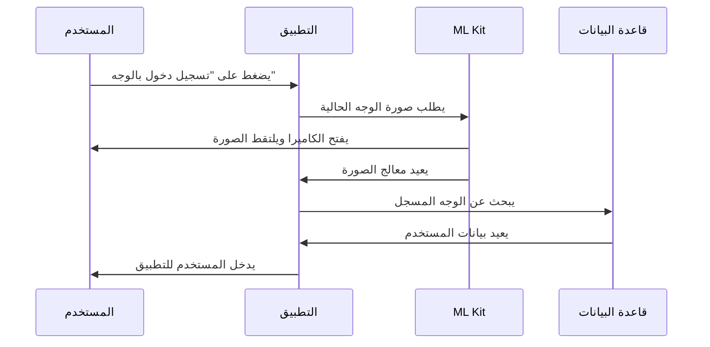
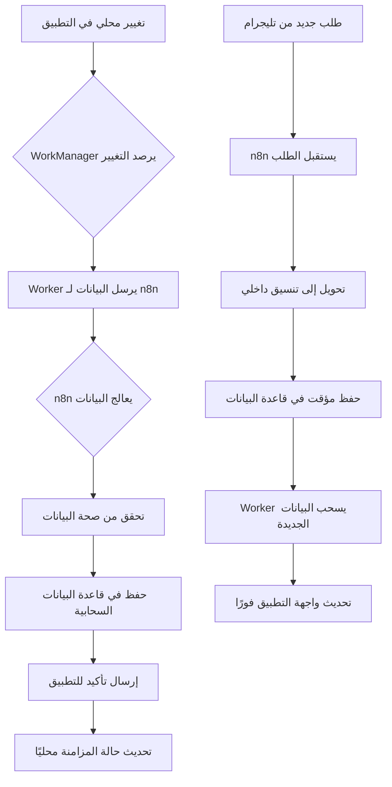

# دليل التفاصيل التقنية والتنفيذ | Technical Implementation Guide

يوفر هذا المستند تفاصيل التنفيذ التقني لتطبيق إدارة المحل التجاري.

This document provides technical implementation details for the Business Management App.

## 🔄 تفاصيل التنفيذ | Implementation Details

### 📱 Online Orders Management UI | واجهة إدارة الطلبات أونلاين

#### 🎨 Order Management Interface
```
┌─────────────────────────────────────────────────┐
│  📋 الطلبات الجديدة (3)  │  🔄 قيد المعالجة (5)   │
├─────────────────────────────────────────────────┤
│ ╔══════════════════════════════════════════════╗ │
│ ║ 🆕 طلب #1234 - محمد أحمد                    ║ │
│ ║ 📞 0551234567  | 📍 الرياض، حي النخيل        ║ │
│ ║ 🛒 3 منتجات - 150 ريال                      ║ │
│ ║ ⏰ قبل 15 دقيقة                             ║ │
│ ║                                              ║ │
│ ║ [✅ قبول] [❌ رفض] [👁️ عرض التفاصيل]         ║ │
│ ╚══════════════════════════════════════════════╝ │
│                                              │
│ ╔══════════════════════════════════════════════╗ │
│ ║ 🔄 طلب #1235 - فاطمة علي                    ║ │
│ ║ 📱 تم الطلب عبر تيليجرام                    ║ │
│ ║ 🛍️ 2 منتج - 89 ريال                         ║ │
│ ╚══════════════════════════════════════════════╝ │
└─────────────────────────────────────────────────┘
```

#### 🎯 Key UI Elements
- **Order Status Colors**:
  - 🟡 **جديد**: أصفر - يتطلب مراجعة
  - 🔵 **قيد المعالجة**: أزرق - تم قبوله
  - 🟢 **مكتمل**: أخضر - تم التسليم
  - 🔴 **ملغي**: أحمر - تم رفضه

- **Quick Actions**:
  - ✅ **قبول تلقائي**: قبول الطلب وإرسال تأكيد
  - 👁️ **عرض التفاصيل**: مراجعة المنتجات والعنوان
  - 📞 **اتصال العميل**: اتصال سريع بالعميل

---

### 🤖 Face Recognition Implementation | تنفيذ بصمة الوجه

#### 🔐 Authentication Flow


#### ⚙️ Registration Process
1. **التقاط الصورة الأولى**: الوجه في إضاءة جيدة
2. **التحقق من الجودة**: التأكد من وضوح الملامح
3. **حفظ النموذج**: تخزين الميزات الوجهية
4. **التشفير**: حماية البيانات محليًا

---

### 🔄 Sync Workflow Diagram | مخطط سير المزامنة

#### ☁️ WorkManager ↔ n8n Integration


#### ⏱️ Sync Timing Strategy
- **فوري**: طلبات العملاء والمدفوعات الحرجة
- **كل 5 دقائق**: تحديث المخزون والأسعار
- **كل ساعة**: تقارير المبيعات والإحصائيات
- **يدوي**: عند طلب المستخدم صراحة

---

### 🔐 Permission Implementation | تطبيق الصلاحيات عمليًا

#### 💻 ViewModel Permission Checks
```kotlin
class OrdersViewModel @Inject constructor(
    private val userSession: UserSession
) : ViewModel() {

    val uiState = MutableStateFlow<OrderUiState>(Loading)

    init {
        loadOrders()
    }

    private fun loadOrders() {
        viewModelScope.launch {
            // ✅ مدير الفرع يرى جميع الطلبات
            if (userSession.role == Role.BRANCH_MANAGER) {
                val orders = getAllOrders()
                uiState.value = OrdersLoaded(orders)
            }
            // ⚠️ البائع يرى طلبات فرعه فقط
            else if (userSession.role == Role.CASHIER) {
                val orders = getBranchOrders(userSession.branchId)
                uiState.value = OrdersLoaded(orders)
            }
            // ❌ الموظف لا يرى الطلبات
            else {
                uiState.value = AccessDenied
            }
        }
    }
}
```

#### 🎨 Compose UI Permission-Based Display
```kotlin
@Composable
fun OrdersScreen(
    viewModel: OrdersViewModel = hiltViewModel(),
    onNavigateToOrderDetail: (String) -> Unit
) {
    val uiState by viewModel.uiState.collectAsState()

    Scaffold(
        topBar = {
            TopAppBar(
                title = { Text("إدارة الطلبات") },
                actions = {
                    // 👑 فقط المدير يرى زر التقارير
                    if (userSession.role == Role.ADMIN) {
                        IconButton(onClick = { /* فتح التقارير */ }) {
                            Icon(Icons.Filled.Analytics, "التقارير")
                        }
                    }
                }
            )
        }
    ) { paddingValues ->
        when (uiState) {
            is OrdersLoaded -> {
                LazyColumn(contentPadding = paddingValues) {
                    items((uiState as OrdersLoaded).orders) { order ->
                        OrderItem(
                            order = order,
                            showActions = userSession.canManageOrders,
                            onAccept = { viewModel.acceptOrder(order.id) },
                            onReject = { viewModel.rejectOrder(order.id) }
                        )
                    }
                }
            }
            AccessDenied -> {
                Text(
                    "ليس لديك صلاحية لعرض الطلبات",
                    modifier = Modifier.padding(16.dp)
                )
            }
        }
    }
}
```

---

### 📊 Advanced Analytics Examples | أمثلة التقارير المتقدمة

#### 📈 Sales Performance Dashboard
```kotlin
@Composable
fun SalesAnalyticsScreen() {
    Column {
        // 📊 رسم بياني للمبيعات الشهرية
        Card(modifier = Modifier.fillMaxWidth().height(200.dp)) {
            Text("مبيعات الشهر الحالي", style = MaterialTheme.typography.h6)
            // استخدام مكتبة Compose Charts
            LineChart(
                data = monthlySalesData,
                colors = listOf(Color.Green, Color.Blue, Color.Red)
            )
        }

        Row {
            // 📊 إحصائيات سريعة
            Card(modifier = Modifier.weight(1f)) {
                Text("إجمالي المبيعات")
                Text("125,500 ريال", style = MaterialTheme.typography.h4)
            }
            Card(modifier = Modifier.weight(1f)) {
                Text("عدد الطلبات")
                Text("342 طلب", style = MaterialTheme.typography.h4)
            }
        }

        // 🏢 مقارنة بين الفروع
        Card(modifier = Modifier.fillMaxWidth()) {
            Text("أداء الفروع", style = MaterialTheme.typography.h6)
            BarChart(
                data = branchPerformance,
                labels = listOf("الفرع الرئيسي", "فرع النخيل", "فرع الملز")
            )
        }
    }
}
```

#### 🎯 Key Analytics Metrics
- **📈 Sales Trends**: اتجاهات المبيعات مع التنبؤ
- **👥 Customer Behavior**: سلوك العملاء والتفضيلات
- **🏪 Branch Comparison**: مقارنة أداء الفروع
- **⏰ Peak Hours**: ساعات الذروة والأوقات المزدحمة
- **📦 Product Performance**: أداء المنتجات والفئات الأكثر مبيعًا

---

## 🔗 الروابط ذات الصلة | Related Documentation

### 📚 الملفات ذات الصلة
- **[دليل البناء والنشر](./deployment/build-process.md)**: عملية بناء التطبيق
- **[دليل إدارة الإصدارات](./deployment/release-management.md)**: إدارة الإصدارات والنشر
- **[دليل إرشادات متاجر التطبيقات](./deployment/app-store-guidelines.md)**: نشر التطبيق في المتاجر
- **[معايير البرمجة](./development/coding-standards.md)**: قواعد ومعايير الكود
- **[دليل الاختبار](./development/testing.md)**: استراتيجيات وأدوات الاختبار
- **[دليل التصحيح والتنقيح](./development/debugging.md)**: حل المشاكل وتصحيح الأخطاء

### 🏗️ الهيكل التقني
هذا المستند يكمل [دليل البناء والنشر](./deployment/build-process.md) ويوضح التفاصيل العملية للتنفيذ التقني للميزات المذكورة في [نظرة عامة على الميزات](./features/overview.md).

### 📖 للمطورين الجدد
ابدأ بقراءة [دليل البدء السريع](./getting-started/quick-start.md) ثم انتقل لهذا المستند لفهم التفاصيل التقنية العملية.
