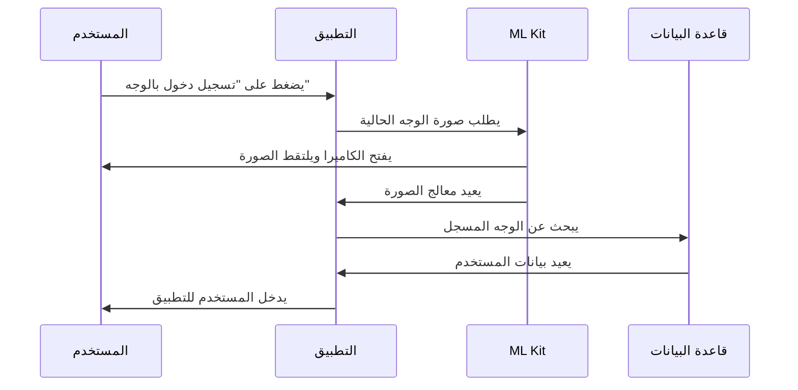
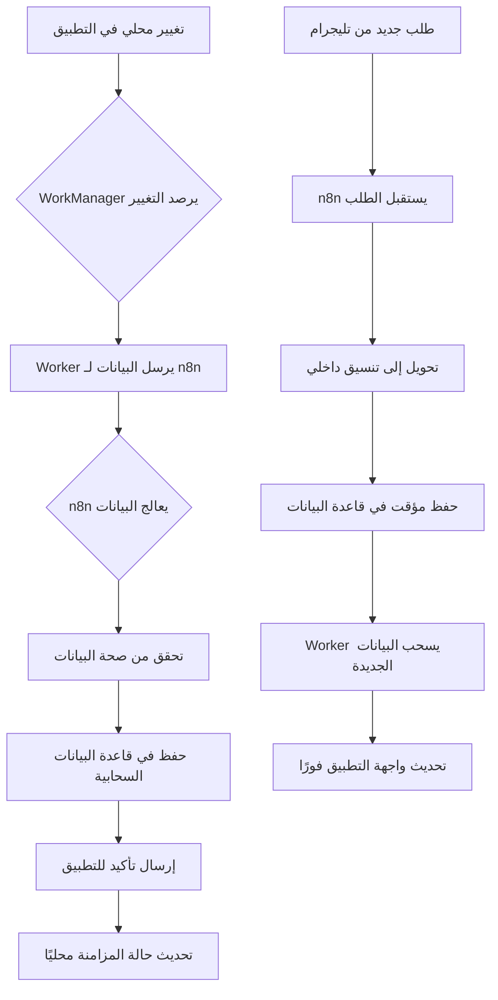

# دليل التفاصيل التقنية والتنفيذ | Technical Implementation Guide

يوفر هذا المستند تفاصيل التنفيذ التقني لتطبيق إدارة المحل التجاري.

This document provides technical implementation details for the Business Management App.

## 🔄 تفاصيل التنفيذ | Implementation Details

### 📱 Online Orders Management UI | واجهة إدارة الطلبات أونلاين

#### 🎨 Order Management Interface
```
┌─────────────────────────────────────────────────┐
│  📋 الطلبات الجديدة (3)  │  🔄 قيد المعالجة (5)   │
├─────────────────────────────────────────────────┤
│ ╔══════════════════════════════════════════════╗ │
│ ║ 🆕 طلب #1234 - محمد أحمد                    ║ │
│ ║ 📞 0551234567  | 📍 الرياض، حي النخيل        ║ │
│ ║ 🛒 3 منتجات - 150 ريال                      ║ │
│ ║ ⏰ قبل 15 دقيقة                             ║ │
│ ║                                              ║ │
│ ║ [✅ قبول] [❌ رفض] [👁️ عرض التفاصيل]         ║ │
│ ╚══════════════════════════════════════════════╝ │
│                                              │
│ ╔══════════════════════════════════════════════╗ │
│ ║ 🔄 طلب #1235 - فاطمة علي                    ║ │
│ ║ 📱 تم الطلب عبر تيليجرام                    ║ │
│ ║ 🛍️ 2 منتج - 89 ريال                         ║ │
│ ╚══════════════════════════════════════════════╝ │
└─────────────────────────────────────────────────┘
```

#### 🎯 Key UI Elements
- **Order Status Colors**:
  - 🟡 **جديد**: أصفر - يتطلب مراجعة
  - 🔵 **قيد المعالجة**: أزرق - تم قبوله
  - 🟢 **مكتمل**: أخضر - تم التسليم
  - 🔴 **ملغي**: أحمر - تم رفضه

- **Quick Actions**:
  - ✅ **قبول تلقائي**: قبول الطلب وإرسال تأكيد
  - 👁️ **عرض التفاصيل**: مراجعة المنتجات والعنوان
  - 📞 **اتصال العميل**: اتصال سريع بالعميل

---

### 🤖 Face Recognition Implementation | تنفيذ بصمة الوجه

#### 🔐 Authentication Flow


#### ⚙️ Registration Process
1. **التقاط الصورة الأولى**: الوجه في إضاءة جيدة
2. **التحقق من الجودة**: التأكد من وضوح الملامح
3. **حفظ النموذج**: تخزين الميزات الوجهية
4. **التشفير**: حماية البيانات محليًا

---

### 🔄 Sync Workflow Diagram | مخطط سير المزامنة

#### ☁️ WorkManager ↔ n8n Integration


#### ⏱️ Sync Timing Strategy
- **فوري**: طلبات العملاء والمدفوعات الحرجة
- **كل 5 دقائق**: تحديث المخزون والأسعار
- **كل ساعة**: تقارير المبيعات والإحصائيات
- **يدوي**: عند طلب المستخدم صراحة

---

### 🔐 Permission Implementation | تطبيق الصلاحيات عمليًا

#### 💻 ViewModel Permission Checks
```kotlin
class OrdersViewModel @Inject constructor(
    private val userSession: UserSession
) : ViewModel() {

    val uiState = MutableStateFlow<OrderUiState>(Loading)

    init {
        loadOrders()
    }

    private fun loadOrders() {
        viewModelScope.launch {
            // ✅ مدير الفرع يرى جميع الطلبات
            if (userSession.role == Role.BRANCH_MANAGER) {
                val orders = getAllOrders()
                uiState.value = OrdersLoaded(orders)
            }
            // ⚠️ البائع يرى طلبات فرعه فقط
            else if (userSession.role == Role.CASHIER) {
                val orders = getBranchOrders(userSession.branchId)
                uiState.value = OrdersLoaded(orders)
            }
            // ❌ الموظف لا يرى الطلبات
            else {
                uiState.value = AccessDenied
            }
        }
    }
}
```

#### 🎨 Compose UI Permission-Based Display
```kotlin
@Composable
fun OrdersScreen(
    viewModel: OrdersViewModel = hiltViewModel(),
    onNavigateToOrderDetail: (String) -> Unit
) {
    val uiState by viewModel.uiState.collectAsState()

    Scaffold(
        topBar = {
            TopAppBar(
                title = { Text("إدارة الطلبات") },
                actions = {
                    // 👑 فقط المدير يرى زر التقارير
                    if (userSession.role == Role.ADMIN) {
                        IconButton(onClick = { /* فتح التقارير */ }) {
                            Icon(Icons.Filled.Analytics, "التقارير")
                        }
                    }
                }
            )
        }
    ) { paddingValues ->
        when (uiState) {
            is OrdersLoaded -> {
                LazyColumn(contentPadding = paddingValues) {
                    items((uiState as OrdersLoaded).orders) { order ->
                        OrderItem(
                            order = order,
                            showActions = userSession.canManageOrders,
                            onAccept = { viewModel.acceptOrder(order.id) },
                            onReject = { viewModel.rejectOrder(order.id) }
                        )
                    }
                }
            }
            AccessDenied -> {
                Text(
                    "ليس لديك صلاحية لعرض الطلبات",
                    modifier = Modifier.padding(16.dp)
                )
            }
        }
    }
}
```

---

### 📊 Advanced Analytics Examples | أمثلة التقارير المتقدمة

#### 📈 Sales Performance Dashboard
```kotlin
@Composable
fun SalesAnalyticsScreen() {
    Column {
        // 📊 رسم بياني للمبيعات الشهرية
        Card(modifier = Modifier.fillMaxWidth().height(200.dp)) {
            Text("مبيعات الشهر الحالي", style = MaterialTheme.typography.h6)
            // استخدام مكتبة Compose Charts
            LineChart(
                data = monthlySalesData,
                colors = listOf(Color.Green, Color.Blue, Color.Red)
            )
        }

        Row {
            // 📊 إحصائيات سريعة
            Card(modifier = Modifier.weight(1f)) {
                Text("إجمالي المبيعات")
                Text("125,500 ريال", style = MaterialTheme.typography.h4)
            }
            Card(modifier = Modifier.weight(1f)) {
                Text("عدد الطلبات")
                Text("342 طلب", style = MaterialTheme.typography.h4)
            }
        }

        // 🏢 مقارنة بين الفروع
        Card(modifier = Modifier.fillMaxWidth()) {
            Text("أداء الفروع", style = MaterialTheme.typography.h6)
            BarChart(
                data = branchPerformance,
                labels = listOf("الفرع الرئيسي", "فرع النخيل", "فرع الملز")
            )
        }
    }
}
```

#### 🎯 Key Analytics Metrics
- **📈 Sales Trends**: اتجاهات المبيعات مع التنبؤ
- **👥 Customer Behavior**: سلوك العملاء والتفضيلات
- **🏪 Branch Comparison**: مقارنة أداء الفروع
- **⏰ Peak Hours**: ساعات الذروة والأوقات المزدحمة
- **📦 Product Performance**: أداء المنتجات والفئات الأكثر مبيعًا

---

## 🔗 الروابط ذات الصلة | Related Documentation

### 📚 الملفات ذات الصلة
- **[دليل البناء والنشر](./deployment/build-process.md)**: عملية بناء التطبيق
- **[دليل إدارة الإصدارات](./deployment/release-management.md)**: إدارة الإصدارات والنشر
- **[دليل إرشادات متاجر التطبيقات](./deployment/app-store-guidelines.md)**: نشر التطبيق في المتاجر
- **[معايير البرمجة](./development/coding-standards.md)**: قواعد ومعايير الكود
- **[دليل الاختبار](./development/testing.md)**: استراتيجيات وأدوات الاختبار
- **[دليل التصحيح والتنقيح](./development/debugging.md)**: حل المشاكل وتصحيح الأخطاء

### 🏗️ الهيكل التقني
هذا المستند يكمل [دليل البناء والنشر](./deployment/build-process.md) ويوضح التفاصيل العملية للتنفيذ التقني للميزات المذكورة في [نظرة عامة على الميزات](./features/overview.md).

### 📖 للمطورين الجدد
ابدأ بقراءة [دليل البدء السريع](./getting-started/quick-start.md) ثم انتقل لهذا المستند لفهم التفاصيل التقنية العملية.

---

# 📚 الدليل التقني الشامل | Technical Implementation Guide

## 🏗️ الهيكل العام | Project Structure

```
app/
├── src/
│   ├── main/
│   │   ├── java/com/yourcompany/businessmanagement/
│   │   │   ├── core/                 # الكلاسات الأساسية المشتركة
│   │   │   │   ├── di/               # حقن التبعيات
│   │   │   │   ├── network/          # شبكة API
│   │   │   │   └── utils/            # أدوات مساعدة
│   │   │   │
│   │   │   ├── data/                 # طبقة البيانات
│   │   │   │   ├── local/           # Room, SharedPrefs
│   │   │   │   ├── remote/          # Retrofit, API
│   │   │   │   └── repository/      # Repository implementations
│   │   │   │
│   │   │   ├── domain/              # طبقة الأعمال
│   │   │   │   ├── model/          # نماذج المجال
│   │   │   │   ├── repository/     # واجهات Repository
│   │   │   │   └── usecase/       # حالات الاستخدام
│   │   │   │
│   │   │   └── presentation/       # واجهة المستخدم
│   │   │       ├── common/        # مكونات مشتركة
│   │   │       ├── feature1/      # ميزة 1
│   │   │       │   ├── ui/       # Compose screens
│   │   │       │   └── viewmodel/
│   │   │       └── ...
│   │   │
│   │   └── res/                   # الموارد
│   │       ├── values/           # النصوص والألوان
│   │       ├── drawable/         # الصور والأيقونات
│   │       └── navigation/       # رسومات التنقل
│   │
│   └── test/                     # اختبارات الوحدة
│   └── androidTest/              # اختبارات واجهة المستخدم
│
└── build.gradle                 # إعدادات المشروع
```

## 🛠️ التبعيات الرئيسية | Main Dependencies

### الطبقة الأساسية
```gradle
// Jetpack Compose
implementation "androidx.compose.ui:ui:1.5.4"
implementation "androidx.compose.material3:material3:1.1.2"
implementation "androidx.activity:activity-compose:1.8.0"

// Coroutines
implementation "org.jetbrains.kotlinx:kotlinx-coroutines-android:1.7.3"
implementation "org.jetbrains.kotlinx:kotlinx-coroutines-core:1.7.3"

// Lifecycle
implementation "androidx.lifecycle:lifecycle-runtime-ktx:2.6.2"
implementation "androidx.lifecycle:lifecycle-viewmodel-compose:2.6.2"

// Hilt
implementation "com.google.dagger:hilt-android:2.48"
kapt "com.google.dagger:hilt-compiler:2.48"
implementation "androidx.hilt:hilt-navigation-compose:1.0.0"
```

### قواعد البيانات
```gradle
// Room
implementation "androidx.room:room-runtime:2.5.2"
implementation "androidx.room:room-ktx:2.5.2"
kapt "androidx.room:room-compiler:2.5.2"

// DataStore
implementation "androidx.datastore:datastore-preferences:1.0.0"
```

### الشبكة
```gradle
// Retrofit
implementation "com.squareup.retrofit2:retrofit:2.9.0"
implementation "com.squareup.retrofit2:converter-gson:2.9.0"
implementation "com.squareup.okhttp3:logging-interceptor:4.11.0"

// Ktor (للشبكات المتقدمة)
implementation "io.ktor:ktor-client-android:2.3.4"
implementation "io.ktor:ktor-client-json:2.3.4"
implementation "io.ktor:ktor-client-serialization:2.3.4"
```

## 🔄 المزامنة والتنفيذ غير المتصل | Sync & Offline Support

### استراتيجية المزامنة
1. **التخزين المحلي أولاً**
   - حفظ جميع البيانات محليًا أولاً
   - محاولة المزامنة مع الخادم
   - وضع علامة على العناصر التي تحتاج إلى مزامنة

2. **طابور المزامنة**
   ```kotlin
   class SyncWorker(
       context: Context,
       params: WorkerParameters
   ) : CoroutineWorker(context, params) {
       override suspend fun doWork(): Result {
           return try {
               // تنفيذ المزامنة
               syncRepository.syncPendingChanges()
               Result.success()
           } catch (e: Exception) {
               Result.retry()
           }
       }
   }
   ```

3. **كشف حالة الاتصال**
   ```kotlin
   class NetworkMonitor @Inject constructor(
       private val context: Context
   ) {
       private val connectivityManager = 
           context.getSystemService(Context.CONNECTIVITY_SERVICE) as ConnectivityManager
   
       val isOnline: StateFlow<Boolean> = callbackFlow {
           val callback = object : ConnectivityManager.NetworkCallback() {
               override fun onAvailable(network: Network) {
                   trySend(true)
               }
               override fun onLost(network: Network) {
                   trySend(false)
               }
           }
           
           val request = NetworkRequest.Builder().build()
           connectivityManager.registerNetworkCallback(request, callback)
           
           // تنظيف
           awaitClose {
               connectivityManager.unregisterNetworkCallback(callback)
           }
       }.stateIn(
           scope = CoroutineScope(Dispatchers.IO),
           started = SharingStarted.WhileSubscribed(5000),
           initialValue = connectivityManager.isDefaultNetworkActive
       )
   }
   ```

## 🔒 الأمان | Security

### 1. تشفير البيانات الحساسة
```kotlin
@Singleton
class SecurityManager @Inject constructor(
    private val context: Context
) {
    private val masterKey = MasterKey.Builder(context)
        .setKeyScheme(MasterKey.KeyScheme.AES256_GCM)
        .build()

    private val sharedPrefs = EncryptedSharedPreferences.create(
        context,
        "secure_prefs",
        masterKey,
        EncryptedSharedPreferences.PrefKeyEncryptionScheme.AES256_SIV,
        EncryptedSharedPreferences.PrefValueEncryptionScheme.AES256_GCM
    )

    // طرق التشفير وفك التشفير
}
```

### 2. حماية البيانات الحساسة
- استخدام `android:usesCleartextTraffic="false"`
- تفعيل `android:networkSecurityConfig`
- استخدام Certificate Pinning

## 📱 واجهة المستخدم | UI/UX

### 1. تصميم سريع الاستجابة
```kotlin
@Composable
fun ResponsiveLayout(
    content: @Composable (PaddingValues) -> Unit
) {
    val configuration = LocalConfiguration.current
    val isTablet = configuration.screenWidthDp >= 600
    
    if (isTablet) {
        // تخطيط الجهاز اللوحي
        Row(
            modifier = Modifier.fillMaxSize()
        ) {
            NavigationRail { /* ... */ }
            content(PaddingValues(16.dp))
        }
    } else {
        // تخطيط الهاتف
        content(PaddingValues(16.dp))
    }
}
```

### 2. دعم السمات
```kotlin
@Composable
fun BusinessManagementApp(
    darkTheme: Boolean = isSystemInDarkTheme(),
    content: @Composable () -> Unit
) {
    val colorScheme = when {
        darkTheme -> DarkColorScheme
        else -> LightColorScheme
    }

    MaterialTheme(
        colorScheme = colorScheme,
        typography = Typography,
        content = content
    )
}
```

## 🧪 الاختبار | Testing

### 1. اختبارات الوحدة
```kotlin
@HiltAndroidTest
class ProductRepositoryTest {
    @get:Rule
    val hiltRule = HiltAndroidRule(this)

    @Inject
    lateinit var productRepository: ProductRepository

    @Before
    fun setup() {
        hiltRule.inject()
    }

    @Test
    fun `when product is added, it should be in the database`() = runTest {
        val product = Product("1", "Test Product", 9.99)
        productRepository.insertProduct(product)
        
        val products = productRepository.getProducts().first()
        assertThat(products).contains(product)
    }
}
```

### 2. اختبارات واجهة المستخدم
```kotlin
@HiltAndroidTest
class ProductListScreenTest {
    @get:Rule
    val hiltRule = HiltAndroidRule(this)

    @get:Rule
    val composeTestRule = createComposeRule()

    @Before
    fun setup() {
        hiltRule.inject()
        composeTestRule.setContent {
            BusinessManagementApp {
                ProductListScreen()
            }
        }
    }

    @Test
    fun whenScreenLoaded_thenShowProducts() {
        composeTestRule
            .onNodeWithTag("product_list")
            .assertIsDisplayed()
    }
}
```

## 🚀 النشر | Deployment

### 1. إصدارات التطبيق
- **تطوير (Development)**: أحدث التغييرات، تشخيص الأخطاء
- **تجريبي (Staging)**: اختبار قبول المستخدم (UAT)
- **إنتاج (Production)**: النسخة النهائية

### 2. الترقية التلقائية
```gradle
android {
    defaultConfig {
        versionCode 1
        versionName "1.0.0"
    }
    
    buildTypes {
        release {
            isMinifyEnabled true
            isShrinkResources true
            proguardFiles getDefaultProguardFile('proguard-android-optimize.txt'), 'proguard-rules.pro'
        }
    }
}

// تحديث تلقائي للإصدار
version = "1.0.${System.getenv("GITHUB_RUN_NUMBER") ?: "0"}"
```

## 🔄 التكامل المستمر/التسليم المستمر (CI/CD)

### 1. إعدادات GitHub Actions
```yaml
name: Build and Deploy

on:
  push:
    branches: [ main ]
  pull_request:
    branches: [ main ]

jobs:
  build:
    runs-on: ubuntu-latest
    steps:
    - uses: actions/checkout@v3
    
    - name: Set up JDK 17
      uses: actions/setup-java@v3
      with:
        java-version: '17'
        distribution: 'temurin'
        
    - name: Grant execute permission for gradlew
      run: chmod +x gradlew
      
    - name: Build with Gradle
      run: ./gradlew build
      
    - name: Run tests
      run: ./gradlew test
      
    - name: Upload APK
      if: github.ref == 'refs/heads/main'
      uses: actions/upload-artifact@v3
      with:
        name: app-release
        path: app/build/outputs/apk/release/app-release.apk
```

## 📊 المراقبة والتسجيل | Monitoring & Logging

### 1. تسجيل الأخطاء
```kotlin
class ErrorLogger @Inject constructor() {
    private val logger = Timber.Forest()
    
    fun logError(throwable: Throwable, message: String? = null) {
        logger.e(throwable, message ?: "An error occurred")
        // إرسال إلى Firebase Crashlytics
        FirebaseCrashlytics.getInstance().recordException(throwable)
    }
}
```

### 2. تحليلات الأحداث
```kotlin
class AnalyticsManager @Inject constructor() {
    fun logEvent(event: AnalyticsEvent) {
        Firebase.analytics.logEvent(event.name) {
            event.params.forEach { (key, value) ->
                param(key, value.toString())
            }
        }
    }
}

sealed class AnalyticsEvent(val name: String, val params: Map<String, Any>) {
    data class ProductAdded(val productId: String) : 
        AnalyticsEvent("product_added", mapOf("product_id" to productId))
    
    data class PurchaseCompleted(val amount: Double, val items: Int) : 
        AnalyticsEvent("purchase_completed", 
            mapOf("amount" to amount, "items" to items))
}
```

## 🔄 التحديثات المستقبلية | Future Updates

### 1. الميزات القادمة
- دفع إلكتروني مدمج
- دعم متعدد العملات
- تقارير مالية متقدمة
- تكامل مع أنظمة المحاسبة

### 2. التحسينات المخطط لها
- تحسين أداء قاعدة البيانات
- تحسين تجربة المستخدم
- دعم المزيد من المنصات

## 📞 الدعم الفني | Support

للحصول على الدعم الفني أو الإبلاغ عن مشاكل:
1. افتح مشكلة جديدة في [مستودع GitHub](https://github.com/yourcompany/businessmanagement/issues)
2. أرسل بريدًا إلكترونيًا إلى [support@yourcompany.com](mailto:support@yourcompany.com)
3. تواصل مع الفريق على [Telegram Support Group](https://t.me/yourcompany_support)

---

آخر تحديث: {{تاريخ التحديث}}
