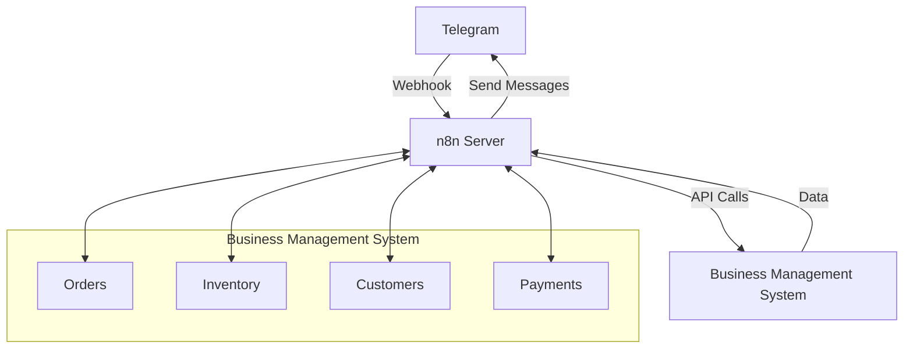
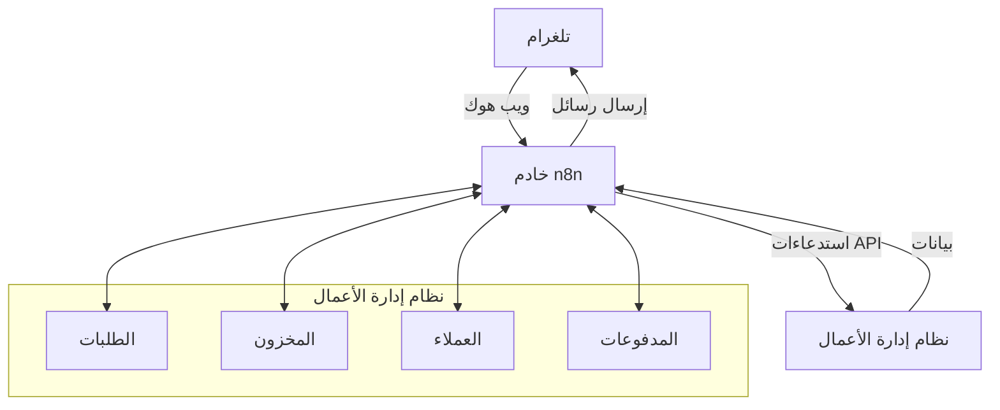
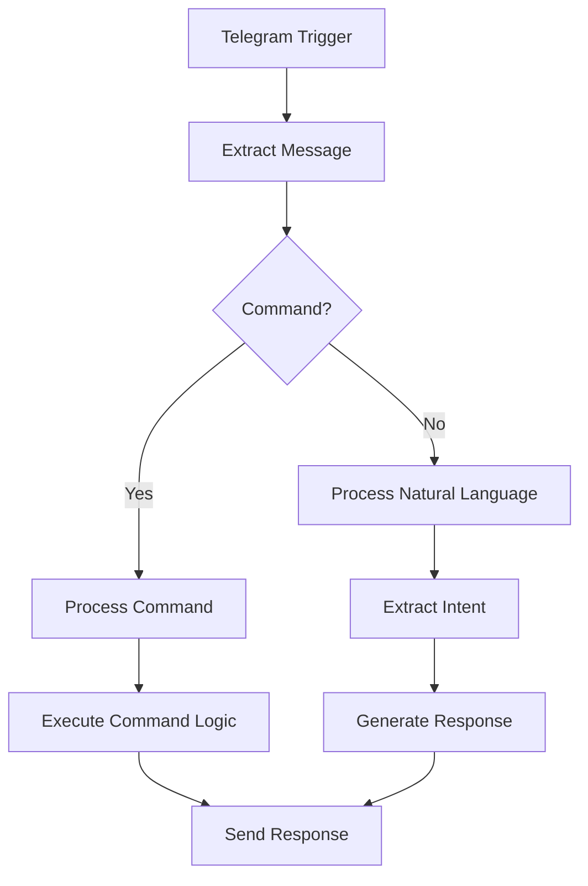
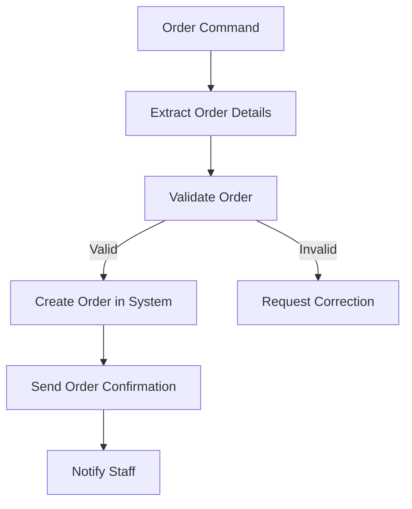

# 🤖 Telegram & n8n Integration

<div dir="rtl">

# 🤖 تكامل تلغرام و n8n

</div>

## 📋 Overview | نظرة عامة

The Telegram & n8n Integration enables seamless communication between your business management system and Telegram messaging platform using n8n as a middleware. This integration allows for real-time notifications, order processing, customer support, and automated workflows triggered by Telegram messages.

<div dir="rtl">

## 📋 نظرة عامة

يتيح تكامل تلغرام وn8n اتصالاً سلسًا بين نظام إدارة الأعمال الخاص بك ومنصة مراسلة تلغرام باستخدام n8n كوسيط. يتيح هذا التكامل إرسال إشعارات فورية، ومعالجة الطلبات، ودعم العملاء، وسير عمل آلي يتم تشغيله برسائل تلغرام.

</div>

## 🎯 Key Features | الميزات الرئيسية

### 1. Telegram Bot Integration
- **Bot Commands**: Custom commands for order tracking, inventory checks, and support
- **Inline Queries**: Quick access to product information and order status
- **Interactive Menus**: User-friendly interfaces with custom keyboards and buttons
- **File Handling**: Support for images, documents, and location sharing

### 2. n8n Workflow Automation
- **Event Triggers**: Respond to Telegram messages, commands, and callbacks
- **Data Processing**: Transform and validate incoming data
- **API Integration**: Connect with internal and external services
- **Conditional Logic**: Create complex workflows based on message content

### 3. Order Management
- **Order Placement**: Customers can place orders via Telegram
- **Order Status Updates**: Real-time order status notifications
- **Payment Processing**: Secure payment links and confirmations
- **Order History**: Access to past orders and receipts

### 4. Customer Support
- **Automated Responses**: Instant replies to common queries
- **Ticket System**: Create support tickets from messages
- **Agent Handoff**: Escalate complex issues to human agents
- **FAQ Integration**: Quick access to help articles

### 5. Notifications & Alerts
- **Stock Alerts**: Notify staff about low inventory
- **Order Confirmations**: Send order confirmations to customers
- **Appointment Reminders**: Automated reminders for bookings
- **Promotional Messages**: Targeted marketing campaigns

<div dir="rtl">

## 🎯 الميزات الرئيسية

### 1. تكامل بوت تلغرام
- **أوامر البوت**: أوامر مخصصة لتتبع الطلبات والتحقق من المخزون والدعم الفني
- **الاستعلامات المضمنة**: وصول سريع لمعلومات المنتج وحالة الطلب
- **قوائم تفاعلية**: واجهات سهلة الاستخدام بلوحات مفاتيح وأزرار مخصصة
- **معالجة الملفات**: دعم الصور والمستندات ومشاركة الموقع

### 2. أتمتة سير العمل باستخدام n8n
- **مشغلات الأحداث**: الرد على رسائل وأوامر واستدعاءات تلغرام
- **معالجة البيانات**: تحويل والتحقق من صحة البيانات الواردة
- **تكامل واجهات برمجة التطبيقات**: الاتصال بالخدمات الداخلية والخارجية
- **منطق شرطي**: إنشاء سير عمل معقدة بناءً على محتوى الرسالة

### 3. إدارة الطلبات
- **تقديم الطلبات**: يمكن للعملاء تقديم طلبات عبر تلغرام
- **تحديثات حالة الطلب**: إشعارات فورية بحالة الطلب
- **معالجة المدفوعات**: روابط دفع آمنة وتأكيدات
- **سجل الطلبات**: الوصول إلى الطلبات السابقة والفواتير

### 4. دعم العملاء
- **ردود تلقائية**: ردود فورية على الاستفسارات الشائعة
- **نظام التذاكر**: إنشاء تذاكر دعم من الرسائل
- **تحويل العميل**: تحويل القضايا المعقدة إلى وكلاء بشريين
- **تكامل الأسئلة الشائعة**: وصول سريع لمقالات المساعدة

### 5. الإشعارات والتنبيهات
- **تنبيهات المخزون**: إخطار الموظفين بانخفاض المخزون
- **تأكيدات الطلبات**: إرسال تأكيدات الطلبات للعملاء
- **تذكيرات المواعيد**: تذكيرات آلية للحجوزات
- **رسائل ترويجية**: حملات تسويقية مستهدفة

</div>

## 🏗️ Architecture | البنية المعمارية

### System Components


### Data Flow
1. User sends a message/command to the Telegram bot
2. Telegram forwards the message to n8n via webhook
3. n8n processes the message and determines the appropriate action
4. n8n makes API calls to the Business Management System
5. System processes the request and returns data to n8n
6. n8n formats the response and sends it back to the user via Telegram

<div dir="rtl">

## 🏗️ البنية المعمارية

### مكونات النظام


### تدفق البيانات
1. يرسل المستخدم رسالة/أمرًا إلى بوت تلغرام
2. يقوم تلغرام بإعادة توجيه الرسالة إلى n8n عبر ويب هوك
3. يقوم n8n بمعالجة الرسالة وتحديد الإجراء المناسب
4. يقوم n8n بإجراء استدعاءات API إلى نظام إدارة الأعمال
5. يعالج النظام الطلب ويرسل البيانات مرة أخرى إلى n8n
6. يقوم n8n بتنسيق الاستجابة وإرسالها مرة أخرى إلى المستخدم عبر تلغرام

</div>

## 🛠 Implementation | التنفيذ

### 1. Telegram Bot Setup

#### 1.1 Create a Telegram Bot
1. Open Telegram and search for `@BotFather`
2. Send `/newbot` and follow the instructions
3. Save the API token provided by BotFather
4. Enable webhook support with your n8n webhook URL

#### 1.2 Configure Bot Commands
```
/setcommands

help - Show help information
order - Place a new order
status - Check order status
support - Contact support
inventory - Check product availability
```

### 2. n8n Setup

#### 2.1 Install n8n
```bash
# Using npm
npm install n8n -g

# Using Docker
docker run -it --rm \
  --name n8n \
  -p 5678:5678 \
  -v ~/.n8n:/home/node/.n8n \
  n8nio/n8n
```

#### 2.2 Configure Environment Variables
```env
# Telegram
TELEGRAM_BOT_TOKEN=your_telegram_bot_token
TELEGRAM_WEBHOOK_URL=https://your-domain.com/webhook/telegram

# Business Management System
API_BASE_URL=https://api.your-business.com/v1
API_KEY=your_api_key

# Security
N8N_ENCRYPTION_KEY=your_encryption_key
WEBHOOK_URL=https://your-n8n-instance.com
```

### 3. Core Workflows

#### 3.1 Message Processing Workflow


#### 3.2 Order Processing Workflow


### 4. Implementation Code

#### 4.1 Telegram Webhook Handler
```typescript
// n8n node script for handling Telegram webhooks
const { Telegram } = require('telegram-bot-api');

const bot = new Telegram({
    token: process.env.TELEGRAM_BOT_TOKEN,
    updates: { enabled: true }
});

// Handle incoming messages
bot.on('message', async (msg) => {
    const chatId = msg.chat.id;
    const text = msg.text || '';
    
    try {
        // Process command
        if (text.startsWith('/')) {
            const [command, ...args] = text.split(' ');
            await handleCommand(chatId, command, args, msg);
        } else {
            // Process natural language
            const response = await processNaturalLanguage(text, msg);
            await bot.sendMessage(chatId, response);
        }
    } catch (error) {
        console.error('Error processing message:', error);
        await bot.sendMessage(chatId, '❌ An error occurred. Please try again later.');
    }
});

// Handle commands
async function handleCommand(chatId, command, args, msg) {
    switch (command.toLowerCase()) {
        case '/start':
            await showWelcomeMessage(chatId, msg.from);
            break;
            
        case '/order':
            await startOrderProcess(chatId, msg.from);
            break;
            
        case '/status':
            await checkOrderStatus(chatId, args[0]);
            break;
            
        case '/help':
            await showHelp(chatId);
            break;
            
        default:
            await bot.sendMessage(chatId, '❌ Unknown command. Type /help for available commands.');
    }
}
```

#### 4.2 Order Processing
```typescript
// Order processing in n8n
async function createOrder(chatId, orderData) {
    try {
        // Validate order data
        const validation = validateOrder(orderData);
        if (!validation.valid) {
            return {
                success: false,
                message: `❌ Validation failed: ${validation.error}`
            };
        }
        
        // Create order in the business system
        const orderResponse = await fetch(`${process.env.API_BASE_URL}/orders`, {
            method: 'POST',
            headers: {
                'Content-Type': 'application/json',
                'Authorization': `Bearer ${process.env.API_KEY}`
            },
            body: JSON.stringify({
                ...orderData,
                source: 'telegram',
                metadata: { chatId }
            })
        });
        
        if (!orderResponse.ok) {
            throw new Error('Failed to create order');
        }
        
        const order = await orderResponse.json();
        
        // Send order confirmation
        await bot.sendMessage(chatId, formatOrderConfirmation(order));
        
        // Notify staff
        await notifyStaffAboutNewOrder(order);
        
        return {
            success: true,
            orderId: order.id,
            message: '✅ Order placed successfully!'
        };
    } catch (error) {
        console.error('Order creation error:', error);
        return {
            success: false,
            message: '❌ Failed to create order. Please try again later.'
        };
    }
}
```

#### 4.3 Natural Language Processing
```typescript
// Natural language processing with n8n
async function processNaturalLanguage(text, msg) {
    // Simple keyword matching (can be replaced with NLP service)
    const lowerText = text.toLowerCase();
    
    if (lowerText.includes('order status') || lowerText.includes('where is my order')) {
        return await handleOrderStatusQuery(msg);
    } 
    
    if (lowerText.includes('contact') || lowerText.includes('support')) {
        return await handleSupportRequest(msg);
    }
    
    if (lowerText.includes('price') || lowerText.includes('how much')) {
        return await handlePriceQuery(text);
    }
    
    // Default response
    return "I'm not sure how to help with that. Type /help for available commands.";
}

// Example: Handle order status query
async function handleOrderStatusQuery(msg) {
    // Extract order number from message or ask for it
    const orderNumber = extractOrderNumber(msg.text);
    
    if (!orderNumber) {
        return 'Please provide your order number so I can check the status for you.';
    }
    
    try {
        const response = await fetch(`${process.env.API_BASE_URL}/orders/${orderNumber}`, {
            headers: {
                'Authorization': `Bearer ${process.env.API_KEY}`
            }
        });
        
        if (!response.ok) {
            return '❌ Order not found. Please check the order number and try again.';
        }
        
        const order = await response.json();
        return formatOrderStatus(order);
    } catch (error) {
        console.error('Error fetching order status:', error);
        return '❌ Unable to fetch order status. Please try again later.';
    }
}
```

### 5. Security Considerations

#### 5.1 Webhook Security
```typescript
// Verify Telegram webhook secret
function verifyTelegramWebhook(req, res, next) {
    const secret = req.headers['x-telegram-bot-api-secret-token'];
    
    if (secret !== process.env.TELEGRAM_WEBHOOK_SECRET) {
        return res.status(401).send('Unauthorized');
    }
    
    next();
}

// Apply to all Telegram webhook routes
app.use('/webhook/telegram', verifyTelegramWebhook, telegramWebhookRouter);
```

#### 5.2 Rate Limiting
```typescript
const rateLimit = require('express-rate-limit');

const telegramLimiter = rateLimit({
    windowMs: 15 * 60 * 1000, // 15 minutes
    max: 100, // limit each IP to 100 requests per windowMs
    message: 'Too many requests from this IP, please try again later.'
});

app.use('/webhook/telegram', telegramLimiter);
```

## 🧪 Testing | الاختبار

### 1. Unit Tests

```typescript
describe('Telegram Bot', () => {
    let bot;
    
    beforeAll(() => {
        // Mock Telegram API
        bot = {
            sendMessage: jest.fn(),
            on: jest.fn()
        };
        
        // Mock process.env
        process.env.TELEGRAM_BOT_TOKEN = 'test_token';
        process.env.API_BASE_URL = 'http://test-api.com';
    });
    
    test('should handle /start command', async () => {
        const mockMessage = {
            chat: { id: 12345 },
            from: { first_name: 'Test' },
            text: '/start'
        };
        
        await handleCommand(mockMessage);
        
        expect(bot.sendMessage).toHaveBeenCalledWith(
            12345,
            expect.stringContaining('Welcome')
        );
    });
    
    test('should validate order data', () => {
        const validOrder = {
            items: [{ id: 1, quantity: 2 }],
            customer: { name: 'Test', phone: '+1234567890' }
        };
        
        const invalidOrder = {
            items: [],
            customer: {}
        };
        
        expect(validateOrder(validOrder).valid).toBe(true);
        expect(validateOrder(invalidOrder).valid).toBe(false);
    });
});
```

### 2. Integration Tests

```typescript
describe('Order Processing', () => {
    let server;
    
    beforeAll(async () => {
        // Start test server
        server = await startTestServer();
    });
    
    afterAll(async () => {
        await server.close();
    });
    
    test('should create an order via Telegram', async () => {
        const orderData = {
            items: [{ id: 1, quantity: 2 }],
            customer: { name: 'Test', phone: '+1234567890' }
        };
        
        const response = await request(server)
            .post('/api/telegram/order')
            .send(orderData);
            
        expect(response.status).toBe(200);
        expect(response.body.success).toBe(true);
        expect(response.body.orderId).toBeDefined();
    });
});
```

## 🚀 Deployment | النشر

### 1. Deployment Options

#### Option 1: Self-hosted n8n
1. Deploy n8n on your own server or cloud provider
2. Set up a reverse proxy (Nginx/Apache) with SSL
3. Configure environment variables
4. Set up PM2 or systemd for process management

#### Option 2: n8n.cloud
1. Sign up for n8n.cloud
2. Connect your GitHub/GitLab repository
3. Configure environment variables in the dashboard
4. Deploy your workflows

### 2. Monitoring and Logging

```bash
# Monitor n8n processes
pm2 monit

# View logs
pm2 logs n8n

# Set up log rotation
pm2 install pm2-logrotate
pm2 set pm2-logrotate:max_size 10M
pm2 set pm2-logrotate:retain 7
```

### 3. Backup and Recovery

```bash
# Backup n8n data
cp -r ~/.n8n ~/n8n-backup-$(date +%Y%m%d)

# Restore from backup
cp -r ~/n8n-backup-20230101/* ~/.n8n/
```

## 📝 Conclusion | الخاتمة

The Telegram & n8n integration provides a powerful way to extend your business management system with messaging capabilities. By following the architecture and implementation details in this document, you can create a robust and scalable solution for handling customer interactions, order processing, and notifications through Telegram.

<div dir="rtl">

## 📝 الخاتمة

يوفر تكامل تلغرام وn8n طريقة قوية لتمكين نظام إدارة الأعمال الخاص بك من إمكانيات المراسلة. باتباع البنية المعمارية وتفاصيل التنفيذ الواردة في هذا المستند، يمكنك إنشاء حل قوي وقابل للتطوير للتعامل مع تفاعلات العملاء ومعالجة الطلبات والإشعارات من خلال تلغرام.

</div>

## 📚 Related Documents | المستندات ذات الصلة

1. [API Documentation](../api/01-overview.md)
2. [Order Management](../features/01-pos.md)
3. [Customer Management](../features/03-customers.md)
4. [Notification System](../architecture/04-notifications.md)

## 🙋 Support | الدعم

For support, please contact our development team or open an issue in the repository.

<div dir="rtl">

## 🙋 الدعم

للحصول على الدعم، يرجى التواصل مع فريق التطوير أو فتح مشكلة في المستودع.

</div>
