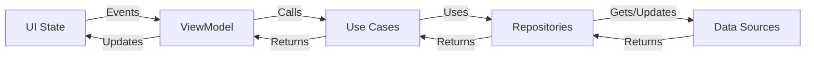

# 🏗️ Application Architecture

## 🧱 Architectural Overview

The Business Management App follows a modern, scalable architecture that combines **Clean Architecture** principles with the **MVVM** (Model-View-ViewModel) pattern. This architecture ensures separation of concerns, testability, and maintainability.

## 🏛️ Architecture Layers

### 1. Presentation Layer (UI)
- **Components**: Activities, Fragments, ViewModels, UI State
- **Responsibilities**:
  - Displaying UI and handling user interactions
  - Managing UI state and navigation
  - Delegating business logic to domain layer
- **Technologies**:
  - Jetpack Compose for UI
  - ViewModel for UI-related data
  - Navigation Component

### 2. Domain Layer (Business Logic)
- **Components**: Use Cases, Domain Models, Repository Interfaces
- **Responsibilities**:
  - Contains business rules and logic
  - Defines repository interfaces
  - Independent of frameworks and UI
- **Key Concepts**:
  - Pure Kotlin modules
  - No Android dependencies
  - Single responsibility principle

### 3. Data Layer (Data Sources)
- **Components**: Repositories, Data Sources, Data Models, Mappers
- **Responsibilities**:
  - Data retrieval and storage
  - Data source abstraction
  - Data model transformation
- **Data Sources**:
  - Local Database (Room)
  - Remote API (Retrofit)
  - Shared Preferences

## 🔄 Data Flow



## 🛠️ Key Architectural Patterns

### 1. Dependency Injection (Hilt)
- Centralized dependency management
- Improved testability
- Reduced boilerplate code

### 2. Unidirectional Data Flow
- Single source of truth
- Predictable state management
- Easier debugging

### 3. Repository Pattern
- Abstract data sources
- Clean separation between data and domain
- Easy to switch data sources

## 📦 Module Structure

```
:app
:core
  :data
  :domain
  :ui
:features
  :pos
  :inventory
  :customers
  :suppliers
  :employees
  :expenses
  :reports
  :settings
```

## 🔗 Dependencies

### Internal Dependencies
- Core modules provide base functionality
- Feature modules depend on core modules
- No circular dependencies allowed

### External Dependencies
- **UI**: Compose, Material Design, Coil
- **Async**: Coroutines, Flow
- **DI**: Hilt
- **Persistence**: Room, DataStore
- **Networking**: Retrofit, OkHttp
- **Testing**: JUnit, MockK, Espresso

## 🚀 Benefits of This Architecture

1. **Separation of Concerns**: Clear boundaries between layers
2. **Testability**: Each component can be tested in isolation
3. **Maintainability**: Easy to update or replace components
4. **Scalability**: New features can be added as independent modules
5. **Team Collaboration**: Multiple teams can work on different features simultaneously

## 🔄 State Management

### UI State
- Immutable data classes
- Sealed classes for different states (Loading, Success, Error, Empty)
- State hoisting for reusable components

### Business Logic State
- Single source of truth
- State reducers for complex state updates
- Side effects handling

## 🧪 Testing Strategy

### Unit Tests
- Domain layer (Use Cases, Domain Models)
- Data layer (Repositories, Mappers)
- ViewModels

### Integration Tests
- Repository implementations
- Data sources integration

### UI Tests
- Screen navigation
- User interactions
- State changes

## 📱 Platform Considerations

### Android Version Support
- Minimum SDK: 21 (Android 5.0)
- Target SDK: Latest stable
- Jetpack Compose first approach

### Device Form Factors
- Phones
- Tablets
- Foldables (future support)

## 🔜 Future Architecture Improvements

1. **Modularization**: Dynamic feature modules
2. **MVI Pattern**: For complex state management
3. **Caching Strategy**: Advanced caching mechanisms
4. **Offline-First**: Enhanced offline support
5. **Analytics**: Comprehensive app analytics

## 📚 Related Documentation

- [Clean Architecture Guide](architecture/01-clean-architecture.md)
- [MVVM Pattern](architecture/02-mvvm-pattern.md)
- [Data Flow](architecture/03-data-flow.md)
- [Dependency Injection](architecture/04-dependency-injection.md)
