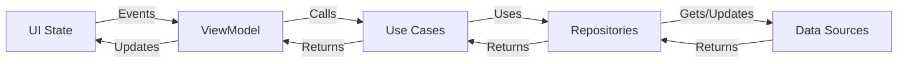

# 🏗️ Application Architecture | الهندسة المعمارية للتطبيق

<div dir="rtl">

# 🏗️ الهندسة المعمارية للتطبيق

</div>

## 🧱 Architectural Overview | نظرة عامة على الهندسة المعمارية

The Business Management App follows a modern, scalable architecture that combines **Clean Architecture** principles with the **MVVM** (Model-View-ViewModel) pattern. This architecture ensures separation of concerns, testability, and maintainability.

<div dir="rtl">

يتبع تطبيق إدارة الأعمال هندسة معمارية عصرية وقابلة للتطوير تجمع بين مبادئ **الهندسة النظيفة** مع نمط **MVVM** (نموذج-عرض-نموذج العرض). تضمن هذه الهندسة الفصل بين الاهتمامات وسهولة الاختبار وسهولة الصيانة.

</div>

## 🏛️ Architecture Layers | طبقات الهندسة المعمارية

### 1. Presentation Layer (UI) | طبقة العرض
- **المكونات**: Activities, Fragments, ViewModels, UI State
  - **Components**: Activities, Fragments, ViewModels, UI State
- **المسؤوليات**:
  - عرض واجهة المستخدم والتعامل مع تفاعلاته
  - إدارة حالة واجهة المستخدم والتنقل
  - تفويض المنطق التجاري لطبقة النطاق
- **التقنيات المستخدمة**:
  - Jetpack Compose لواجهة المستخدم
  - ViewModel لبيانات واجهة المستخدم
  - مكونات التنقل (Navigation Component)

  **Responsibilities**:
  - Displaying UI and handling user interactions
  - Managing UI state and navigation
  - Delegating business logic to domain layer
- **Technologies**:
  - Jetpack Compose for UI
  - ViewModel for UI-related data
  - Navigation Component

### 2. Domain Layer (Business Logic) | طبقة النطاق (المنطق التجاري)
- **المكونات**: حالات الاستخدام، نماذج النطاق، واجهات المستودعات
  - **Components**: Use Cases, Domain Models, Repository Interfaces
- **المسؤوليات**:
  - تحتوي على القواعد والمنطق التجاري
  - تحدد واجهات المستودعات
  - مستقلة عن الأطر وواجهة المستخدم
- **المفاهيم الأساسية**:
  - وحدات Kotlin خالصة
  - لا تعتمد على مكتبات Android
  - مبدأ المسؤولية الفردية

  **Responsibilities**:
  - Contains business rules and logic
  - Defines repository interfaces
  - Independent of frameworks and UI
- **Key Concepts**:
  - Pure Kotlin modules
  - No Android dependencies
  - Single responsibility principle

### 3. Data Layer (Data Sources) | طبقة البيانات (مصادر البيانات)
- **المكونات**: المستودعات، مصادر البيانات، نماذج البيانات، المحولات
  - **Components**: Repositories, Data Sources, Data Models, Mappers
- **المسؤوليات**:
  - استرجاع وتخزين البيانات
  - تجريد مصادر البيانات
  - تحويل نماذج البيانات
- **مصادر البيانات**:
  - قاعدة البيانات المحلية (Room)
  - واجهة برمجة التطبيقات البعيدة (Retrofit)
  - التفضيلات المشتركة

  **Responsibilities**:
  - Data retrieval and storage
  - Data source abstraction
  - Data model transformation
- **Data Sources**:
  - Local Database (Room)
  - Remote API (Retrofit)
  - Shared Preferences

## 🔄 Data Flow | تدفق البيانات



## 🛠️ Key Architectural Patterns | أنماط الهندسة المعمارية الرئيسية

### 1. Dependency Injection (Hilt) | حقن التبعيات (Hilt)
- **إدارة مركزية للتبعيات**
  - Centralized dependency management
- **تحسين قابلية الاختبار**
  - Improved testability
- **تقليل الكود المتكرر**
  - Reduced boilerplate code

### 2. Unidirectional Data Flow | تدفق البيانات أحادي الاتجاه
- **مصدر واحد للحقيقة**
  - Single source of truth
- **إدارة حالة يمكن التنبؤ بها**
  - Predictable state management
- **تصحيح أسهل للأخطاء**
  - Easier debugging

### 3. Repository Pattern | نمط المستودع
- **مصادر بيانات مجردة**
  - Abstract data sources
- **فصل واضح بين البيانات والنطاق**
  - Clean separation between data and domain
- **سهولة تبديل مصادر البيانات**
  - Easy to switch data sources

## 📦 Module Structure | هيكل الوحدات

```
:app
:core
  :data
  :domain
  :ui
:features
  :pos
  :inventory
  :customers
  :suppliers
  :employees
  :expenses
  :reports
  :settings
```

## 🔗 Dependencies | التبعيات

### Internal Dependencies | التبعيات الداخلية
- **توفر الوحدات الأساسية الوظائف الأساسية**
  - Core modules provide base functionality
- **تعتمد وحدات الميزات على الوحدات الأساسية**
  - Feature modules depend on core modules
- **لا يسمح بالتبعيات الدائرية**
  - No circular dependencies allowed

### External Dependencies | التبعيات الخارجية
- **واجهة المستخدم**: Compose, Material Design, Coil
  - **UI**: Compose, Material Design, Coil
- **البرمجة غير المتزامنة**: Coroutines, Flow
  - **Async**: Coroutines, Flow
- **حقن التبعيات**: Hilt
  - **DI**: Hilt
- **تخزين البيانات**: Room, DataStore
  - **Persistence**: Room, DataStore
- **الشبكات**: Retrofit, OkHttp
  - **Networking**: Retrofit, OkHttp
- **الاختبار**: JUnit, MockK, Espresso
  - **Testing**: JUnit, MockK, Espresso

## 🚀 Benefits of This Architecture | مزايا هذه الهندسة المعمارية

1. **فصل الاهتمامات**: حدود واضحة بين الطبقات
   - **Separation of Concerns**: Clear boundaries between layers
2. **قابلية الاختبار**: يمكن اختبار كل مكون على حدة
   - **Testability**: Each component can be tested in isolation
3. **قابلية الصيانة**: سهولة تحديث أو استبدال المكونات
   - **Maintainability**: Easy to update or replace components
4. **قابلية التوسع**: يمكن إضافة ميزات جديدة كوحدات مستقلة
   - **Scalability**: New features can be added as independent modules
5. **تعاون الفريق**: يمكن لفرق متعددة العمل على ميزات مختلفة في نفس الوقت
   - **Team Collaboration**: Multiple teams can work on different features simultaneously

## 🔄 State Management | إدارة الحالة

### UI State | حالة واجهة المستخدم
- **فئات بيانات غير قابلة للتعديل**
  - Immutable data classes
- **فئات مختومة للحالات المختلفة (جاري التحميل، نجاح، خطأ، فارغ)**
  - Sealed classes for different states (Loading, Success, Error, Empty)
- **رفع الحالة للمكونات القابلة لإعادة الاستخدام**
  - State hoisting for reusable components

### Business Logic State | حالة المنطق التجاري
- **مصدر واحد للحقيقة**
  - Single source of truth
- **مختزلات الحالة لتحديثات الحالة المعقدة**
  - State reducers for complex state updates
- **معالجة التأثيرات الجانبية**
  - Side effects handling

## 🧪 Testing Strategy | استراتيجية الاختبار

### Unit Tests | اختبارات الوحدات
- **طبقة النطاق (حالات الاستخدام، نماذج النطاق)**
  - Domain layer (Use Cases, Domain Models)
- **طبقة البيانات (المستودعات، المحولات)**
  - Data layer (Repositories, Mappers)
- **نماذج العرض**
  - ViewModels

### Integration Tests | اختبارات التكامل
- **تطبيقات المستودعات**
  - Repository implementations
- **تكامل مصادر البيانات**
  - Data sources integration

### UI Tests | اختبارات واجهة المستخدم
- **تنقل الشاشات**
  - Screen navigation
- **تفاعلات المستخدم**
  - User interactions
- **تغييرات الحالة**
  - State changes

## 📱 Platform Considerations | اعتبارات المنصة

### Android Version Support | دعم إصدارات أندرويد
- **الحد الأدنى لإصدار SDK: 21 (أندرويد 5.0)**
  - Minimum SDK: 21 (Android 5.0)
- **إصدار SDK المستهدف: أحدث إصدار مستقر**
  - Target SDK: Latest stable
- **نهج Jetpack Compose أولاً**
  - Jetpack Compose first approach

### Device Form Factors | أشكال الأجهزة
- **الهواتف**
  - Phones
- **الأجهزة اللوحية**
  - Tablets
- **الأجهزة القابلة للطي (دعم مستقبلي)**
  - Foldables (future support)

## 🔜 Future Architecture Improvements | تحسينات مستقبلية للهندسة المعمارية

1. **التوحيد القياسي**: وحدات الميزات الديناميكية
   - **Modularization**: Dynamic feature modules
2. **نمط MVI**: لإدارة الحالة المعقدة
   - **MVI Pattern**: For complex state management
3. **استراتيجية التخزين المؤقت**: آليات متقدمة للتخزين المؤقت
   - **Caching Strategy**: Advanced caching mechanisms
4. **التركيز على وضع عدم الاتصال**: دعم محسن للعمل دون اتصال
   - **Offline-First**: Enhanced offline support
5. **التحليلات**: تحليلات شاملة للتطبيق
   - **Analytics**: Comprehensive app analytics

## 📚 Related Documentation | الوثائق ذات الصلة

- [دليل الهندسة النظيفة](architecture/01-clean-architecture.md) | [Clean Architecture Guide](architecture/01-clean-architecture.md)
- [نمط MVVM](architecture/02-mvvm-pattern.md) | [MVVM Pattern](architecture/02-mvvm-pattern.md)
- [تدفق البيانات](architecture/03-data-flow.md) | [Data Flow](architecture/03-data-flow.md)
- [حقن التبعيات](architecture/04-dependency-injection.md) | [Dependency Injection](architecture/04-dependency-injection.md)
