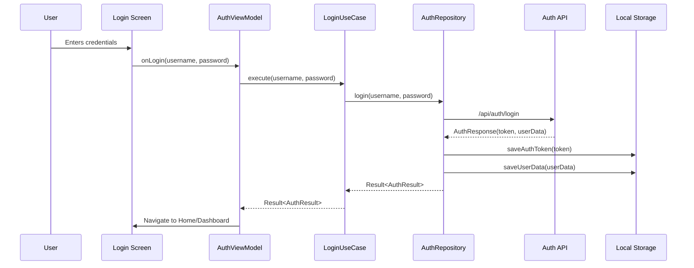

# 🔐 Authentication System

## 📋 Overview
The authentication system provides secure access control to the Business Management App, ensuring that only authorized users can access the system and perform actions based on their roles and permissions.

## 🔑 Authentication Flow

### 1. User Login


### 2. Session Management
- **JWT-based authentication**
- **Refresh token** mechanism for extended sessions
- **Token expiration** handling
- **Automatic token refresh** before expiration
- **Session timeout** after period of inactivity

## 🛡 Security Measures

### 1. Password Security
- **Hashing**: Passwords are hashed using Argon2id
- **Salting**: Unique salt per password
- **Minimum Requirements**:
  - Minimum 8 characters
  - At least one uppercase letter
  - At least one number
  - At least one special character

### 2. Token Security
- **JWT** with strong signing algorithm (RS256)
- **Short-lived access tokens** (15-30 minutes)
- **Secure storage** using EncryptedSharedPreferences
- **Token invalidation** on logout or security events

### 3. Secure Communication
- **TLS 1.3** for all network requests
- **Certificate pinning** to prevent MITM attacks
- **HSTS** (HTTP Strict Transport Security)
- **Secure flag** for cookies

## 🔄 Implementation

### 1. Authentication Repository
```kotlin
class AuthRepositoryImpl @Inject constructor(
    private val authApi: AuthApi,
    private val tokenManager: TokenManager,
    private val userPreferences: UserPreferences,
    private val networkMonitor: NetworkMonitor
) : AuthRepository {
    
    override suspend fun login(username: String, password: String): Result<AuthResult> {
        return try {
            // Validate input
            if (username.isBlank() || password.isBlank()) {
                return Result.failure(AuthenticationException("Username and password are required"))
            }
            
            // Check network connectivity
            if (!networkMonitor.isOnline()) {
                return Result.failure(NetworkException("No internet connection"))
            }
            
            // Make API call
            val response = authApi.login(LoginRequest(username, password))
            
            if (response.isSuccessful) {
                response.body()?.let { authResponse ->
                    // Save tokens
                    tokenManager.saveTokens(
                        accessToken = authResponse.accessToken,
                        refreshToken = authResponse.refreshToken
                    )
                    
                    // Save user data
                    userPreferences.saveUser(authResponse.user)
                    
                    Result.success(AuthResult.Success(authResponse.user))
                } ?: Result.failure(AuthenticationException("Invalid response from server"))
            } else {
                when (response.code()) {
                    401 -> Result.failure(AuthenticationException("Invalid credentials"))
                    in 500..599 -> Result.failure(ServerException("Server error"))
                    else -> Result.failure(AuthenticationException("Login failed"))
                }
            }
        } catch (e: Exception) {
            Result.failure(e)
        }
    }
    
    override suspend fun refreshToken(): Result<TokenRefreshResult> {
        val refreshToken = tokenManager.getRefreshToken()
        if (refreshToken == null) {
            return Result.failure(AuthenticationException("No refresh token available"))
        }
        
        return try {
            val response = authApi.refreshToken(RefreshTokenRequest(refreshToken))
            
            if (response.isSuccessful) {
                response.body()?.let { tokenResponse ->
                    tokenManager.saveTokens(
                        accessToken = tokenResponse.accessToken,
                        refreshToken = tokenResponse.refreshToken
                    )
                    Result.success(TokenRefreshResult.Success)
                } ?: Result.failure(AuthenticationException("Invalid token response"))
            } else {
                // If refresh fails, clear session and require re-login
                logout()
                Result.failure(AuthenticationException("Session expired. Please login again."))
            }
        } catch (e: Exception) {
            logout()
            Result.failure(e)
        }
    }
    
    override suspend fun logout() {
        try {
            // Clear all auth data
            tokenManager.clearTokens()
            userPreferences.clearUserData()
            
            // Call API to invalidate tokens (if online)
            if (networkMonitor.isOnline()) {
                authApi.logout()
            }
        } catch (e: Exception) {
            // Log the error but continue with local cleanup
            Timber.e(e, "Error during logout")
        }
    }
}
```

### 2. Token Manager
```kotlin
interface TokenManager {
    fun saveTokens(accessToken: String, refreshToken: String)
    fun getAccessToken(): String?
    fun getRefreshToken(): String?
    fun clearTokens()
    fun isTokenExpired(): Boolean
}

class TokenManagerImpl @Inject constructor(
    private val encryptedPrefs: EncryptedSharedPreferences
) : TokenManager {
    
    companion object {
        private const val PREFS_NAME = "secure_tokens"
        private const val KEY_ACCESS_TOKEN = "access_token"
        private const val KEY_REFRESH_TOKEN = "refresh_token"
        private const val KEY_EXPIRES_AT = "expires_at"
    }
    
    override fun saveTokens(accessToken: String, refreshToken: String) {
        val editor = encryptedPrefs.edit()
        editor.putString(KEY_ACCESS_TOKEN, accessToken)
        editor.putString(KEY_REFRESH_TOKEN, refreshToken)
        
        // Parse JWT to get expiration
        val payload = accessToken.split(".")[1]
        val json = String(Base64.decode(payload, Base64.URL_SAFE))
        val expiresAt = Json.decodeFromString<Map<String, Long>>(json)?.get("exp") ?: 0L
        
        editor.putLong(KEY_EXPIRES_AT, expiresAt * 1000) // Convert to milliseconds
        editor.apply()
    }
    
    override fun getAccessToken(): String? {
        return encryptedPrefs.getString(KEY_ACCESS_TOKEN, null)
    }
    
    override fun getRefreshToken(): String? {
        return encryptedPrefs.getString(KEY_REFRESH_TOKEN, null)
    }
    
    override fun clearTokens() {
        encryptedPrefs.edit().clear().apply()
    }
    
    override fun isTokenExpired(): Boolean {
        val expiresAt = encryptedPrefs.getLong(KEY_EXPIRES_AT, 0L)
        return System.currentTimeMillis() >= expiresAt - 60000 // 1 minute buffer
    }
}
```

### 3. Network Interceptor
```kotlin
class AuthInterceptor @Inject constructor(
    private val tokenManager: TokenManager,
    private val authRepository: AuthRepository
) : Interceptor {
    
    @Throws(IOException::class)
    override fun intercept(chain: Interceptor.Chain): Response {
        val originalRequest = chain.request()
        
        // Skip for login/refresh endpoints
        if (originalRequest.url.encodedPath in listOf("/api/auth/login", "/api/auth/refresh")) {
            return chain.proceed(originalRequest)
        }
        
        // Get access token
        val accessToken = tokenManager.getAccessToken()
        
        // If no token, proceed without auth header
        if (accessToken == null) {
            return chain.proceed(originalRequest)
        }
        
        // Add auth header
        val authorizedRequest = originalRequest.newBuilder()
            .header("Authorization", "Bearer $accessToken")
            .build()
        
        // Make the request
        val response = chain.proceed(authorizedRequest)
        
        // If token expired, try to refresh
        if (response.code == 401) {
            response.close()
            
            return runBlocking {
                when (val result = authRepository.refreshToken()) {
                    is Result.Success -> {
                        // Retry with new token
                        val newToken = tokenManager.getAccessToken()
                        val newRequest = originalRequest.newBuilder()
                            .header("Authorization", "Bearer $newToken")
                            .build()
                        chain.proceed(newRequest)
                    }
                    is Result.Failure -> {
                        // Refresh failed, clear session
                        authRepository.logout()
                        // Return the original response to trigger login
                        response
                    }
                }
            }
        }
        
        return response
    }
}
```

## 🔒 Biometric Authentication

### Implementation
```kotlin
class BiometricAuthManager @Inject constructor(
    private val context: Context,
    private val crypto: CryptoManager
) {
    
    private val biometricManager = BiometricManager.from(context)
    
    fun canAuthenticate(): Boolean {
        return when (biometricManager.canAuthenticate(BiometricManager.Authenticators.BIOMETRIC_STRONG)) {
            BiometricManager.BIOMETRIC_SUCCESS -> true
            else -> false
        }
    }
    
    suspend fun authenticate(
        title: String = "Authenticate",
        subtitle: String = "Please authenticate to continue",
        negativeButtonText: String = "Cancel"
    ): Boolean {
        val promptInfo = BiometricPrompt.PromptInfo.Builder()
            .setTitle(title)
            .setSubtitle(subtitle)
            .setNegativeButtonText(negativeButtonText)
            .build()
            
        return suspendCoroutine { continuation ->
            val biometricPrompt = BiometricPrompt(
                context as FragmentActivity,
                ContextCompat.getMainExecutor(context),
                object : BiometricPrompt.AuthenticationCallback() {
                    override fun onAuthenticationSucceeded(result: BiometricPrompt.AuthenticationResult) {
                        super.onAuthenticationSucceeded(result)
                        continuation.resume(true)
                    }
                    
                    override fun onAuthenticationError(errorCode: Int, errString: CharSequence) {
                        super.onAuthenticationError(errorCode, errString)
                        if (errorCode == BiometricPrompt.ERROR_NEGATIVE_BUTTON || 
                            errorCode == BiometricPrompt.ERROR_USER_CANCELED) {
                            continuation.resume(false)
                        } else {
                            continuation.resumeWithException(
                                BiometricException("Authentication error: $errString")
                            )
                        }
                    }
                }
            )
            
            try {
                biometricPrompt.authenticate(promptInfo)
            } catch (e: Exception) {
                continuation.resumeWithException(e)
            }
        }
    }
    
    fun createEncryptedFile(file: File): FileEncryptionResult {
        return try {
            val secretKey = crypto.getOrCreateSecretKey(KEY_ALIAS)
            val cipher = Cipher.getInstance(TRANSFORMATION)
            cipher.init(Cipher.ENCRYPT_MODE, secretKey)
            
            // Create encrypted file
            val encryptedFile = EncryptedFile.Builder(
                file,
                context,
                secretKey,
                EncryptedFile.FileEncryptionScheme.AES256_GCM_HKDF_4KB
            ).build()
            
            FileEncryptionResult.Success(encryptedFile, cipher.iv)
        } catch (e: Exception) {
            FileEncryptionResult.Error(e)
        }
    }
}
```

## 🔐 Secure Storage

### Encrypted SharedPreferences
```kotlin
class SecurePreferences @Inject constructor(
    context: Context
) {
    private val masterKey = MasterKey.Builder(context)
        .setKeyScheme(MasterKey.KeyScheme.AES256_GCM)
        .build()
        
    private val prefs = EncryptedSharedPreferences.create(
        context,
        "secure_prefs",
        masterKey,
        EncryptedSharedPreferences.PrefKeyEncryptionScheme.AES256_SIV,
        EncryptedSharedPreferences.PrefValueEncryptionScheme.AES256_GCM
    )
    
    fun saveString(key: String, value: String) {
        prefs.edit().putString(key, value).apply()
    }
    
    fun getString(key: String, defaultValue: String? = null): String? {
        return prefs.getString(key, defaultValue)
    }
    
    // Add other getter/setter methods as needed
}
```

## 🧪 Testing

### Authentication Tests
```kotlin
@ExperimentalCoroutinesApi
@HiltAndroidTest
class AuthenticationTest {
    
    @get:Rule
    val hiltRule = HiltAndroidRule(this)
    
    @get:Rule
    val coroutineRule = MainCoroutineRule()
    
    @Inject
    lateinit var authRepository: AuthRepository
    
    @Inject
    lateinit var tokenManager: TokenManager
    
    @Before
    fun setup() {
        hiltRule.inject()
    }
    
    @Test
    fun `successful login saves tokens`() = runTest {
        // Given
        val username = "testuser"
        val password = "Test@1234"
        
        // When
        val result = authRepository.login(username, password)
        
        // Then
        assertTrue(result.isSuccess)
        assertNotNull(tokenManager.getAccessToken())
        assertNotNull(tokenManager.getRefreshToken())
    }
    
    @Test
    fun `login with invalid credentials fails`() = runTest {
        // Given
        val username = "wronguser"
        val password = "wrongpass"
        
        // When
        val result = authRepository.login(username, password)
        
        // Then
        assertTrue(result.isFailure)
        assertTrue(result.exceptionOrNull() is AuthenticationException)
    }
    
    @Test
    fun `logout clears all auth data`() = runTest {
        // Given - First login
        authRepository.login("testuser", "Test@1234")
        
        // When
        authRepository.logout()
        
        // Then
        assertNull(tokenManager.getAccessToken())
        assertNull(tokenManager.getRefreshToken())
    }
}
```

## 🔄 Session Management

### Session Timeout
```kotlin
class SessionManager @Inject constructor(
    private val tokenManager: TokenManager,
    private val authRepository: AuthRepository
) {
    
    private var lastActivityTime: Long = System.currentTimeMillis()
    private const val SESSION_TIMEOUT = 30 * 60 * 1000L // 30 minutes
    
    fun updateLastActivity() {
        lastActivityTime = System.currentTimeMillis()
    }
    
    suspend fun checkSession(): Boolean {
        return if (isSessionExpired()) {
            // Try to refresh session if possible
            if (tokenManager.getRefreshToken() != null) {
                val result = authRepository.refreshToken()
                result.isSuccess
            } else {
                false
            }
        } else {
            true
        }
    }
    
    private fun isSessionExpired(): Boolean {
        val tokenExpired = tokenManager.isTokenExpired()
        val sessionInactive = (System.currentTimeMillis() - lastActivityTime) > SESSION_TIMEOUT
        return tokenExpired || sessionInactive
    }
}
```

## 🚀 Best Practices

### 1. Token Management
- Store tokens securely using EncryptedSharedPreferences
- Implement token refresh mechanism
- Invalidate tokens on logout and password changes
- Set appropriate token expiration times

### 2. Password Security
- Never store passwords in plain text
- Enforce strong password policies
- Implement account lockout after failed attempts
- Support password reset flow

### 3. Session Security
- Implement session timeout
- Invalidate sessions on logout
- Support "remember me" functionality securely
- Implement device fingerprinting for additional security

### 4. Network Security
- Use HTTPS for all communications
- Implement certificate pinning
- Validate server certificates
- Use secure protocols (TLS 1.2+)

## 🔜 Future Enhancements

### 1. Multi-factor Authentication
- Support for SMS/Email verification codes
- Authenticator app integration
- Hardware security keys

### 2. Advanced Security Features
- Risk-based authentication
- Suspicious activity detection
- Device trust scoring

### 3. Passwordless Authentication
- Magic links
- Biometric-only authentication
- WebAuthn support
