# 👥 Role Management System

<div dir="rtl">

# 👥 نظام إدارة الصلاحيات

</div>

## 📋 Overview | نظرة عامة

The Role Management system provides fine-grained access control to the application's features and data. It allows administrators to define roles with specific permissions and assign these roles to users, ensuring that users can only access the functionality they are authorized to use.

<div dir="rtl">

## 📋 نظرة عامة

يوفر نظام إدارة الصلاحيات تحكمًا دقيقًا في الوصول إلى ميزات وبيانات التطبيق. يسمح للمدراء بتعريف أدوار ذات صلاحيات محددة وتعيين هذه الأدوار للمستخدمين، مما يضمن أن المستخدمين يمكنهم الوصول فقط إلى الوظائف المسموح لهم باستخدامها.

</div>

## 🎯 Key Features | الميزات الرئيسية

### 1. Role-Based Access Control (RBAC)
- **Predefined Roles**: Common roles like Admin, Manager, Cashier, etc.
- **Custom Roles**: Create custom roles with specific permissions
- **Permission Hierarchy**: Permissions can be organized hierarchically
- **Role Inheritance**: Roles can inherit permissions from other roles

### 2. Permission Management
- **Fine-grained Permissions**: Control access to specific features and data
- **Resource-based Permissions**: Define permissions for specific resources
- **Action-based Permissions**: Control create, read, update, delete operations
- **Conditional Permissions**: Apply permissions based on conditions

### 3. User Role Assignment
- **Multiple Roles**: Users can have multiple roles
- **Temporary Assignments**: Set role expiration dates
- **Branch-specific Roles**: Different roles for different branches
- **Audit Logs**: Track role assignments and changes

### 4. Security
- **Least Privilege**: Users get only the permissions they need
- **Separation of Duties**: Prevent conflicts of interest
- **Access Reviews**: Regular review of user permissions
- **Compliance**: Support for regulatory requirements

<div dir="rtl">

## 🎯 المميزات الرئيسية

### 1. التحكم في الوصول القائم على الأدوار (RBAC)
- **أدوار محددة مسبقًا**: أدوار شائعة مثل المدير، المشرف، أمين الصندوق، إلخ.
- **أدوار مخصصة**: إنشاء أدوار مخصصة بصلاحيات محددة
- **تسلسل هرمي للصلاحيات**: يمكن تنظيم الصلاحيات بشكل هرمي
- **توارث الأدوار**: يمكن أن ترث الأدوار الصلاحيات من أدوار أخرى

### 2. إدارة الصلاحيات
- **صلاحيات دقيقة**: التحكم في الوصول إلى ميزات وبيانات محددة
- **صلاحيات قائمة على الموارد**: تعريف الصلاحيات لموارد محددة
- **صلاحيات قائمة على الإجراءات**: التحكم في عمليات الإنشاء والقراءة والتحديث والحذف
- **صلاحيات مشروطة**: تطبيق الصلاحيات بناءً على شروط معينة

### 3. تعيين أدوار المستخدمين
- **أدوار متعددة**: يمكن أن يكون للمستخدمين أدوار متعددة
- **تعيينات مؤقتة**: تعيين تواريخ انتهاء للأدوار
- **أدوار خاصة بالفروع**: أدوار مختلفة لفروع مختلفة
- **سجلات التدقيق**: تتبع تعيينات الأدوار والتغييرات

### 4. الأمان
- **أقل امتياز**: يحصل المستخدمون فقط على الصلاحيات التي يحتاجونها
- **فصل المهام**: منع تضارب المصالح
- **مراجعات الوصول**: مراجعة دورية لصلاحيات المستخدمين
- **الامتثال**: دعم المتطلبات التنظيمية

</div>

## 🏗️ Architecture | البنية المعمارية

### System Components


### Data Flow
1. User attempts to access a feature
2. System checks user's roles and permissions
3. If authorized, access is granted
4. If not authorized, access is denied
5. All access attempts are logged
6. Admins can review and modify role assignments

<div dir="rtl">

## 🏗️ البنية المعمارية

### مكونات النظام

```mermaid
graph TD
    A[المستخدم] -->|معين له| B[الأدوار]
    B -->|يحتوي على| C[الصلاحيات]
    C -->|تتحكم في| D[الميزات والبيانات]
    
    E[المدير] -->|يدير| B
    E -->|يراجع| F[سجلات الوصول]
    
    G[النظام] -->|يفرض| C
    G -->|يسجل| F
```


### تدفق البيانات
1. يحاول المستخدم الوصول إلى ميزة معينة
2. يتحقق النظام من أدوار المستخدم وصلاحياته
3. إذا كان مصرحًا له، يتم منح الوصول
4. إذا لم يكن مصرحًا له، يتم رفض الوصول
5. يتم تسجيل جميع محاولات الوصول
6. يمكن للمدراء مراجعة وتعديل تعيينات الأدوار

</div>

## 🛠 Implementation | التنفيذ

### 1. Data Models

#### Role Entity
```kotlin
@Entity(tableName = "roles")
data class Role(
    @PrimaryKey
    val id: String = UUID.randomUUID().toString(),
    val name: String,
    val description: String? = null,
    val isSystem: Boolean = false,
    val createdAt: Long = System.currentTimeMillis(),
    val updatedAt: Long = System.currentTimeMillis(),
    val permissions: List<Permission> = emptyList(),
    val inheritsFrom: List<String> = emptyList() // Role IDs that this role inherits from
) {
    fun hasPermission(permission: Permission): Boolean {
        return permissions.contains(permission) || 
               inheritsFrom.any { roleId -> 
                   // Check if any inherited role has the permission
                   // This would typically involve fetching the role from a repository
                   // and checking its permissions recursively
                   false // Implementation would check role repository
               }
    }
    
    fun canPerform(action: String, resource: String): Boolean {
        return permissions.any { it.matches(action, resource) } ||
               inheritsFrom.any { roleId ->
                   // Check inherited roles
                   false // Implementation would check role repository
               }
    }
}
```

#### Permission Entity
```kotlin
@Parcelize
@TypeConverters(PermissionTypeConverter::class)
data class Permission(
    val resource: String,          // e.g., "inventory", "customer", "order"
    val action: Action,            // e.g., "create", "read", "update", "delete"
    val effect: Effect = Effect.ALLOW,
    val conditions: List<Condition> = emptyList()
) : Parcelable {
    
    enum class Action { CREATE, READ, UPDATE, DELETE, MANAGE, ALL }
    enum class Effect { ALLOW, DENY }
    
    fun matches(action: String, resource: String): Boolean {
        return this.resource.equals(resource, ignoreCase = true) &&
               (this.action == Action.ALL || 
                this.action.name.equals(action, ignoreCase = true))
    }
    
    fun isAllowed(context: Map<String, Any> = emptyMap()): Boolean {
        if (effect == Effect.DENY) return false
        
        // Check all conditions are met
        return conditions.all { it.evaluate(context) }
    }
}

@Parcelize
data class Condition(
    val field: String,
    val operator: Operator,
    val value: Any?
) : Parcelable {
    
    enum class Operator {
        EQUALS, NOT_EQUALS, 
        GREATER_THAN, LESS_THAN, 
        GREATER_THAN_OR_EQUAL, LESS_THAN_OR_EQUAL,
        IN, NOT_IN,
        STARTS_WITH, ENDS_WITH, CONTAINS,
        IS_NULL, IS_NOT_NULL
    }
    
    fun evaluate(context: Map<String, Any>): Boolean {
        val fieldValue = context[field] ?: return operator == Operator.IS_NULL
        
        return when (operator) {
            Operator.EQUALS -> fieldValue == value
            Operator.NOT_EQUALS -> fieldValue != value
            Operator.GREATER_THAN -> (fieldValue as? Comparable<Any>)?.let { it > (value as? Comparable<*>) ?: false } ?: false
            Operator.LESS_THAN -> (fieldValue as? Comparable<Any>)?.let { it < (value as? Comparable<*>) ?: false } ?: false
            Operator.GREATER_THAN_OR_EQUAL -> (fieldValue as? Comparable<Any>)?.let { it >= (value as? Comparable<*>) ?: false } ?: false
            Operator.LESS_THAN_OR_EQUAL -> (fieldValue as? Comparable<Any>)?.let { it <= (value as? Comparable<*>) ?: false } ?: false
            Operator.IN -> (value as? Collection<*>)?.contains(fieldValue) ?: false
            Operator.NOT_IN -> !(value as? Collection<*>)?.contains(fieldValue) ?: true
            Operator.STARTS_WITH -> (fieldValue as? String)?.startsWith(value as? String ?: "") ?: false
            Operator.ENDS_WITH -> (fieldValue as? String)?.endsWith(value as? String ?: "") ?: false
            Operator.CONTAINS -> (fieldValue as? String)?.contains(value as? String ?: "") ?: false
            Operator.IS_NULL -> fieldValue == null
            Operator.IS_NOT_NULL -> fieldValue != null
        }
    }
}

class PermissionTypeConverter {
    @TypeConverter
    fun fromString(value: String): List<Permission> {
        return Json.decodeFromString(value)
    }
    
    @TypeConverter
    fun toString(permissions: List<Permission>): String {
        return Json.encodeToString(permissions)
    }
}
```

#### UserRole Entity
```kotlin
@Entity(
    tableName = "user_roles",
    primaryKeys = ["userId", "roleId"],
    foreignKeys = [
        ForeignKey(
            entity = User::class,
            parentColumns = ["id"],
            childColumns = ["userId"],
            onDelete = ForeignKey.CASCADE
        ),
        ForeignKey(
            entity = Role::class,
            parentColumns = ["id"],
            childColumns = ["roleId"],
            onDelete = CASCADE
        )
    ]
)
data class UserRole(
    val userId: String,
    val roleId: String,
    val branchId: String? = null, // null means all branches
    val assignedAt: Long = System.currentTimeMillis(),
    val expiresAt: Long? = null, // null means never expires
    val assignedBy: String? = null // User ID of the assigner
)
```

### 2. Role Repository

```kotlin
interface RoleRepository {
    
    // Role management
    suspend fun createRole(role: Role): Result<Role>
    suspend fun updateRole(role: Role): Result<Unit>
    suspend fun deleteRole(roleId: String): Result<Unit>
    suspend fun getRole(roleId: String): Result<Role>
    suspend fun getAllRoles(): Result<List<Role>>
    
    // User-role assignments
    suspend fun assignRole(userId: String, roleId: String, branchId: String?, expiresAt: Long?): Result<Unit>
    suspend fun revokeRole(userId: String, roleId: String): Result<Unit>
    suspend fun getUserRoles(userId: String): Result<List<Pair<Role, UserRole>>>
    suspend fun getUsersWithRole(roleId: String): Result<List<Pair<User, UserRole>>>
    
    // Permission checks
    suspend fun hasPermission(userId: String, permission: Permission, context: Map<String, Any> = emptyMap()): Boolean
    suspend fun hasAnyPermission(userId: String, vararg permissions: Permission, context: Map<String, Any> = emptyMap()): Boolean
    suspend fun hasAllPermissions(userId: String, vararg permissions: Permission, context: Map<String, Any> = emptyMap()): Boolean
    
    // Role inheritance
    suspend fun addInheritance(roleId: String, parentRoleId: String): Result<Unit>
    suspend fun removeInheritance(roleId: String, parentRoleId: String): Result<Unit>
    
    // Permission management
    suspend fun addPermission(roleId: String, permission: Permission): Result<Unit>
    suspend fun removePermission(roleId: String, permission: Permission): Result<Unit>
    
    // Branch-specific roles
    suspend fun getBranchRoles(branchId: String): Result<List<Role>>
    suspend fun getUserBranchRoles(userId: String, branchId: String): Result<List<Role>>
}

class RoleRepositoryImpl @Inject constructor(
    private val roleDao: RoleDao,
    private val userRoleDao: UserRoleDao,
    private val userRepository: UserRepository,
    private val dispatcher: CoroutineDispatcher = Dispatchers.IO
) : RoleRepository {
    
    override suspend fun hasPermission(
        userId: String, 
        permission: Permission, 
        context: Map<String, Any>
    ): Boolean = withContext(dispatcher) {
        if (!permission.isAllowed(context)) return@withContext false
        
        val userRoles = userRoleDao.getUserRoles(userId)
        
        // Check if any role has the required permission
        userRoles.any { userRole ->
            val role = roleDao.getRole(userRole.roleId) ?: return@any false
            
            // Check direct permissions
            val hasDirectPermission = role.permissions.any { 
                it.matches(permission.action.name, permission.resource) && it.isAllowed(context)
            }
            
            // Check inherited roles
            val hasInheritedPermission = role.inheritsFrom.any { parentRoleId ->
                val parentRole = roleDao.getRole(parentRoleId) ?: return@any false
                parentRole.permissions.any {
                    it.matches(permission.action.name, permission.resource) && it.isAllowed(context)
                }
            }
            
            hasDirectPermission || hasInheritedPermission
        }
    }
    
    // Implement other methods...
}
```

### 3. Permission Checker

```kotlin
class PermissionChecker @Inject constructor(
    private val roleRepository: RoleRepository,
    private val currentUser: CurrentUser
) {
    
    suspend fun checkPermission(permission: Permission, context: Map<String, Any> = emptyMap()): Boolean {
        val userId = currentUser.id ?: return false
        return roleRepository.hasPermission(userId, permission, context)
    }
    
    suspend fun checkAnyPermission(vararg permissions: Permission, context: Map<String, Any> = emptyMap()): Boolean {
        val userId = currentUser.id ?: return false
        return roleRepository.hasAnyPermission(userId, *permissions, context = context)
    }
    
    suspend fun checkAllPermissions(vararg permissions: Permission, context: Map<String, Any> = emptyMap()): Boolean {
        val userId = currentUser.id ?: return false
        return roleRepository.hasAllPermissions(userId, *permissions, context = context)
    }
    
    suspend fun <T> withPermission(
        permission: Permission,
        context: Map<String, Any> = emptyMap(),
        block: suspend () -> T
    ): Result<T> {
        return if (checkPermission(permission, context)) {
            runCatching { block() }
        } else {
            Result.failure(SecurityException("Permission denied: $permission"))
        }
    }
    
    // Extension function for ViewModel
    fun ViewModel.launchWithPermission(
        permission: Permission,
        context: Map<String, Any> = emptyMap(),
        onPermissionDenied: () -> Unit = {},
        block: suspend () -> Unit
    ) {
        viewModelScope.launch {
            if (checkPermission(permission, context)) {
                block()
            } else {
                onPermissionDenied()
            }
        }
    }
}

// Example usage in ViewModel
class InventoryViewModel @Inject constructor(
    private val permissionChecker: PermissionChecker,
    private val inventoryRepository: InventoryRepository
) : ViewModel() {
    
    private val _inventoryItems = MutableStateFlow<List<InventoryItem>>(emptyList())
    val inventoryItems: StateFlow<List<InventoryItem>> = _inventoryItems
    
    private val _error = MutableSharedFlow<String>()
    val error: SharedFlow<String> = _error
    
    fun loadInventory() {
        permissionChecker.launchWithPermission(
            permission = Permission("inventory", Permission.Action.READ),
            onPermissionDenied = { _error.emit("You don't have permission to view inventory") }
        ) {
            try {
                val items = inventoryRepository.getInventory()
                _inventoryItems.emit(items)
            } catch (e: Exception) {
                _error.emit("Failed to load inventory: ${e.message}")
            }
        }
    }
    
    fun updateItem(item: InventoryItem) {
        permissionChecker.launchWithPermission(
            permission = Permission("inventory", Permission.Action.UPDATE),
            context = mapOf("branchId" to item.branchId) // Branch-specific permission check
        ) {
            try {
                inventoryRepository.updateItem(item)
                loadInventory() // Refresh the list
            } catch (e: Exception) {
                _error.emit("Failed to update item: ${e.message}")
            }
        }
    }
}
```

### 4. Default Roles and Permissions

```kotlin
object DefaultRoles {
    
    val ADMIN = Role(
        id = "admin",
        name = "Administrator",
        description = "Full access to all features",
        isSystem = true,
        permissions = listOf(
            Permission("*", Permission.Action.ALL)
        )
    )
    
    val MANAGER = Role(
        id = "manager",
        name = "Manager",
        description = "Management access with limited administrative functions",
        isSystem = true,
        permissions = listOf(
            Permission("inventory", Permission.Action.MANAGE),
            Permission("orders", Permission.Action.MANAGE),
            Permission("customers", Permission.Action.MANAGE),
            Permission("reports", Permission.Action.READ),
            Permission("employees", Permission.Action.READ)
        )
    )
    
    val CASHIER = Role(
        id = "cashier",
        name = "Cashier",
        description = "Point of sale access",
        isSystem = true,
        permissions = listOf(
            Permission("pos", Permission.Action.ALL),
            Permission("inventory", Permission.Action.READ),
            Permission("customers", Permission.Action.READ),
            Permission("transactions", Permission.Action.CREATE)
        )
    )
    
    val INVENTORY_CLERK = Role(
        id = "inventory_clerk",
        name = "Inventory Clerk",
        description = "Inventory management access",
        isSystem = true,
        permissions = listOf(
            Permission("inventory", Permission.Action.MANAGE),
            Permission("suppliers", Permission.Action.READ)
        )
    )
    
    val CUSTOMER_SERVICE = Role(
        id = "customer_service",
        name = "Customer Service",
        description = "Customer support and service",
        isSystem = true,
        permissions = listOf(
            Permission("customers", Permission.Action.MANAGE),
            Permission("orders", Permission.Action.READ),
            Permission("returns", Permission.Action.MANAGE)
        )
    )
    
    val ALL_ROLES = listOf(ADMIN, MANAGER, CASHIER, INVENTORY_CLERK, CUSTOMER_SERVICE)
}

// Initialize default roles in the database
class RoleInitializer @Inject constructor(
    private val roleRepository: RoleRepository
) {
    
    suspend fun initialize() {
        DefaultRoles.ALL_ROLES.forEach { role ->
            if (roleRepository.getRole(role.id).isSuccess.not()) {
                roleRepository.createRole(role)
            }
        }
    }
}
```

## 🧪 Testing | الاختبار

### 1. Unit Tests

```kotlin
@RunWith(JUnit4::class)
class PermissionCheckerTest {
    
    @get:Rule
    val instantTaskExecutorRule = InstantTaskExecutorRule()
    
    private lateinit var permissionChecker: PermissionChecker
    private val roleRepository = mockk<RoleRepository>()
    private val currentUser = mockk<CurrentUser>()
    
    @Before
    fun setup() {
        MockKAnnotations.init(this)
        
        permissionChecker = PermissionChecker(roleRepository, currentUser)
        
        // Mock current user
        coEvery { currentUser.id } returns "user123"
    }
    
    @Test
    fun `checkPermission returns true when user has permission`() = runTest {
        // Given
        val permission = Permission("inventory", Permission.Action.READ)
        coEvery { 
            roleRepository.hasPermission(
                userId = "user123", 
                permission = permission, 
                context = any()
            ) 
        } returns true
        
        // When
        val result = permissionChecker.checkPermission(permission)
        
        // Then
        assertTrue(result)
    }
    
    @Test
    fun `checkPermission returns false when user does not have permission`() = runTest {
        // Given
        val permission = Permission("inventory", Permission.Action.DELETE)
        coEvery { 
            roleRepository.hasPermission(
                userId = "user123", 
                permission = permission, 
                context = any()
            ) 
        } returns false
        
        // When
        val result = permissionChecker.checkPermission(permission)
        
        // Then
        assertFalse(result)
    }
    
    @Test
    fun `withPermission executes block when user has permission`() = runTest {
        // Given
        val permission = Permission("reports", Permission.Action.READ)
        coEvery { 
            roleRepository.hasPermission(
                userId = "user123", 
                permission = permission, 
                context = any()
            ) 
        } returns true
        
        var blockExecuted = false
        
        // When
        val result = permissionChecker.withPermission(permission) {
            blockExecuted = true
            "success"
        }
        
        // Then
        assertTrue(blockExecuted)
        assertEquals("success", result.getOrNull())
    }
    
    @Test
    fun `withPermission returns failure when user does not have permission`() = runTest {
        // Given
        val permission = Permission("reports", Permission.Action.DELETE)
        coEvery { 
            roleRepository.hasPermission(
                userId = "user123", 
                permission = permission, 
                context = any()
            ) 
        } returns false
        
        var blockExecuted = false
        
        // When
        val result = permissionChecker.withPermission(permission) {
            blockExecuted = true
            "should not execute"
        }
        
        // Then
        assertFalse(blockExecuted)
        assertTrue(result.isFailure)
        assertTrue(result.exceptionOrNull() is SecurityException)
    }
}
```

### 2. Integration Tests

```kotlin
@RunWith(AndroidJUnit4::class)
@MediumTest
class RoleManagementIntegrationTest {
    
    @get:Rule
    val hiltRule = HiltAndroidRule(this)
    
    @Inject
    lateinit var context: Context
    
    @Inject
    lateinit var database: AppDatabase
    
    @Inject
    lateinit var roleRepository: RoleRepository
    
    @Inject
    lateinit var userRepository: UserRepository
    
    private lateinit var testUser: User
    
    @Before
    fun setup() {
        hiltRule.inject()
        
        // Create a test user
        testUser = User(
            id = "test_user_${System.currentTimeMillis()}",
            username = "testuser",
            email = "test@example.com",
            // Other required fields...
        )
        
        runBlocking {
            userRepository.createUser(testUser)
        }
    }
    
    @After
    fun cleanup() {
        database.close()
    }
    
    @Test
    fun testRoleAssignmentAndPermissionCheck() = runTest {
        // Create a custom role
        val role = Role(
            id = "test_role_${System.currentTimeMillis()}",
            name = "Test Role",
            permissions = listOf(
                Permission("test", Permission.Action.READ),
                Permission("test", Permission.Action.CREATE)
            )
        )
        
        // Save the role
        val createResult = roleRepository.createRole(role)
        assertTrue(createResult.isSuccess)
        
        // Assign role to user
        val assignResult = roleRepository.assignRole(
            userId = testUser.id,
            roleId = role.id,
            branchId = null,
            expiresAt = null
        )
        
        assertTrue(assignResult.isSuccess)
        
        // Check user roles
        val userRolesResult = roleRepository.getUserRoles(testUser.id)
        assertTrue(userRolesResult.isSuccess)
        val userRoles = userRolesResult.getOrThrow()
        assertEquals(1, userRoles.size)
        assertEquals(role.id, userRoles[0].first.id)
        
        // Check permissions
        val hasReadPermission = roleRepository.hasPermission(
            userId = testUser.id,
            permission = Permission("test", Permission.Action.READ)
        )
        
        assertTrue(hasReadPermission)
        
        val hasDeletePermission = roleRepository.hasPermission(
            userId = testUser.id,
            permission = Permission("test", Permission.Action.DELETE)
        )
        
        assertFalse(hasDeletePermission)
    }
    
    @Test
    fun testRoleInheritance() = runTest {
        // Create parent role
        val parentRole = Role(
            id = "parent_role_${System.currentTimeMillis()}",
            name = "Parent Role",
            permissions = listOf(
                Permission("parent", Permission.Action.READ)
            )
        )
        
        // Create child role that inherits from parent
        val childRole = Role(
            id = "child_role_${System.currentTimeMillis()}",
            name = "Child Role",
            inheritsFrom = listOf(parentRole.id),
            permissions = listOf(
                Permission("child", Permission.Action.READ)
            )
        )
        
        // Save roles
        roleRepository.createRole(parentRole)
        roleRepository.createRole(childRole)
        
        // Assign child role to user
        roleRepository.assignRole(
            userId = testUser.id,
            roleId = childRole.id,
            branchId = null,
            expiresAt = null
        )
        
        // Check that user has permissions from both roles
        assertTrue(roleRepository.hasPermission(
            userId = testUser.id,
            permission = Permission("parent", Permission.Action.READ)
        ))
        
        assertTrue(roleRepository.hasPermission(
            userId = testUser.id,
            permission = Permission("child", Permission.Action.READ)
        ))
    }
}
```

## 🚀 Deployment | النشر

### 1. Dependencies

Add to `build.gradle` (app level):

```gradle
dependencies {
    // Room for local database
    def room_version = "2.5.0"
    implementation "androidx.room:room-runtime:$room_version"
    kapt "androidx.room:room-compiler:$room_version"
    implementation "androidx.room:room-ktx:$room_version"
    
    // Kotlin coroutines
    def coroutines_version = "1.6.4"
    implementation "org.jetbrains.kotlinx:kotlinx-coroutines-android:$coroutines_version"
    
    // Hilt for dependency injection
    def hilt_version = "2.44"
    implementation "com.google.dagger:hilt-android:$hilt_version"
    kapt "com.google.dagger:hilt-android-compiler:$hilt_version"
    
    // Kotlin serialization
    implementation "org.jetbrains.kotlinx:kotlinx-serialization-json:1.4.1"
    
    // For testing
    testImplementation "junit:junit:4.13.2"
    testImplementation "org.jetbrains.kotlinx:kotlinx-coroutines-test:$coroutines_version"
    testImplementation "io.mockk:mockk:1.13.3"
    androidTestImplementation "androidx.test.ext:junit:1.1.5"
    androidTestImplementation "androidx.test.espresso:espresso-core:3.5.1"
}
```

### 2. AndroidManifest.xml

```xml
<manifest>
    <!-- Add any necessary permissions -->
    <uses-permission android:name="android.permission.INTERNET" />
    
    <application>
        <!-- Room database -->
        <provider
            android:name="androidx.room.RoomDatabaseProvider"
            android:authorities="${applicationId}.roomdb"
            android:exported="false"
            android:multiprocess="true"
            tools:ignore="ExportedContentProvider" />
            
        <!-- Hilt application -->
        <provider
            android:name="dagger.hilt.android.provider.HiltBroadcastReceiver"
            android:authorities="${applicationId}.hilt"
            android:exported="false"
            android:enabled="false" />
    </application>
</manifest>
```

### 3. Configuration

In `app/src/main/res/values/config.xml`:

```xml
<resources>
    <!-- Role management settings -->
    <string name="default_admin_role_id">admin</string>
    <string name="default_manager_role_id">manager</string>
    <string name="default_cashier_role_id">cashier</string>
    
    <!-- Permission settings -->
    <bool name="enable_permission_caching">true</bool>
    <integer name="permission_cache_duration_minutes">5</integer>
    
    <!-- Security settings -->
    <bool name="require_strong_passwords">true</bool>
    <integer name="max_login_attempts">5</integer>
    <integer name="account_lockout_minutes">15</integer>
</resources>
```

## 📝 Conclusion | الخاتمة

The Role Management system provides a flexible and secure way to control access to your application's features and data. By implementing role-based access control with fine-grained permissions, you can ensure that users only have access to the functionality they need to perform their jobs. The system supports role inheritance, branch-specific roles, and conditional permissions, making it suitable for a wide range of business requirements.

<div dir="rtl">

## 📝 الخاتمة

يوفر نظام إدارة الأدوار طريقة مرنة وآمنة للتحكم في الوصول إلى ميزات وبيانات التطبيق. من خلال تنفيذ التحكم في الوصول القائم على الأدوار مع صلاحيات دقيقة، يمكنك التأكد من أن المستخدمين يمكنهم الوصول فقط إلى الوظائف التي يحتاجونها لأداء وظائفهم. يدعم النظام توريث الأدوار، والأدوار الخاصة بالفروع، والصلاحيات المشروطة، مما يجعله مناسبًا لمجموعة واسعة من متطلبات الأعمال.

</div>

## 📚 Related Documents | المستندات ذات الصلة

1. [Authentication & Security](../security/01-authentication.md)
2. [User Management](../features/02-users.md)
3. [Branch Management](../features/11-branches.md)
4. [Audit Logging](../security/03-audit-logging.md)

## 🙋 Support | الدعم

For support, please contact our development team or open an issue in the repository.

<div dir="rtl">

## 🙋 الدعم

للحصول على الدعم، يرجى التواصل مع فريق التطوير أو فتح مشكلة في المستودع.

</div>
