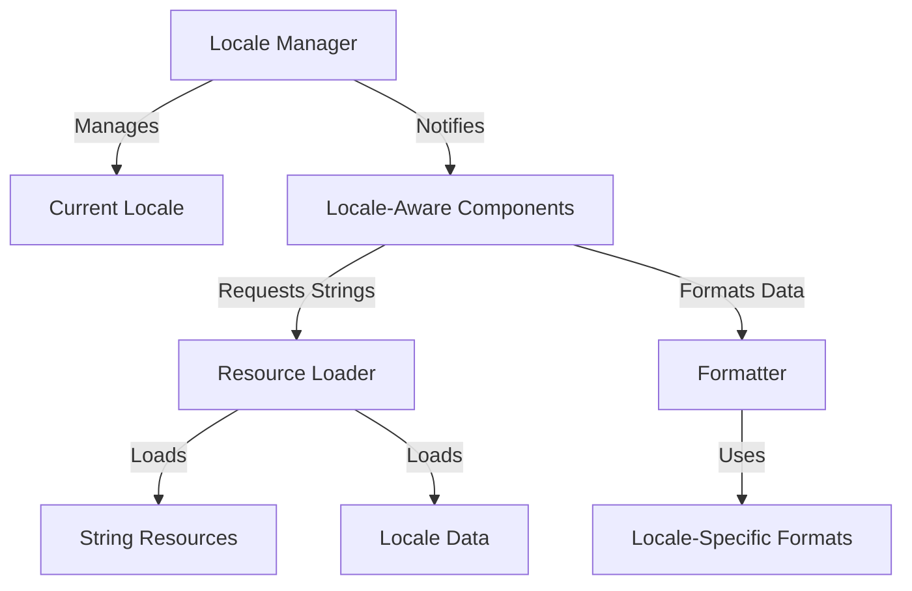
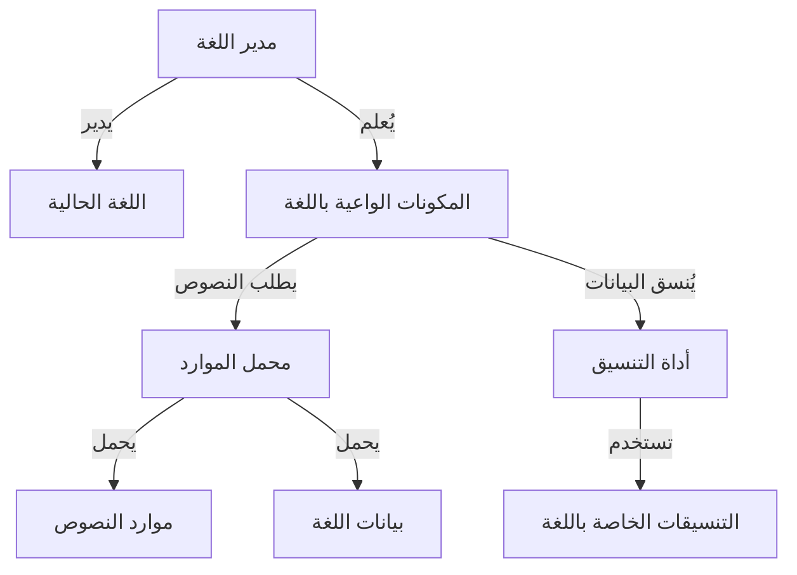

# 🌐 Language Support System

<div dir="rtl">

# 🌐 نظام دعم اللغات

</div>

## 📋 Overview | نظرة عامة

The Language Support system provides comprehensive internationalization (i18n) and localization (l10n) capabilities for the application. It enables the app to support multiple languages, right-to-left (RTL) layouts, and locale-specific formatting for dates, numbers, and currencies.

<div dir="rtl">

## 📋 نظرة عامة

يوفر نظام دعم اللغات إمكانات شاملة للتدويل (i18n) والتهيئة المحلية (l10n) للتطبيق. يمكن التطبيق من دعم لغات متعددة، وتخطيطات من اليمين إلى اليسار (RTL)، وتنسيقات خاصة باللغة المحلية للتواريخ والأرقام والعملات.

</div>

## 🎯 Key Features | الميزات الرئيسية

### 1. Multi-language Support
- **Multiple Languages**: Support for multiple languages with easy addition of new ones
- **RTL Support**: Full right-to-left language support (e.g., Arabic, Hebrew)
- **Language Switching**: Change app language on-the-fly without restart
- **System Language Detection**: Automatically detect and apply device language

### 2. String Localization
- **String Resources**: Store all UI strings in resource files
- **Pluralization**: Handle different plural forms in different languages
- **Gender Agreement**: Support for gender-specific translations
- **Text Direction**: Automatic handling of RTL and LTR text directions

### 3. Locale-specific Formatting
- **Date & Time**: Format dates and times according to locale
- **Numbers**: Format numbers, decimals, and percentages
- **Currencies**: Display currencies with correct symbols and formatting
- **Measurement Units**: Support for different measurement systems (metric/imperial)

### 4. Dynamic Content Localization
- **Dynamic Strings**: Localize strings loaded from APIs or databases
- **Formatted Messages**: Support for complex message formatting with placeholders
- **Fallback Mechanism**: Graceful fallback to default language when translation is missing

<div dir="rtl">

## 🎯 المميزات الرئيسية

### 1. دعم تعدد اللغات
- **لغات متعددة**: دعم لغات متعددة مع إمكانية إضافة لغات جديدة بسهولة
- **دعم RTL**: دعم كامل للغات من اليمين إلى اليسار (مثل العربية والعبرية)
- **تبديل اللغة**: تغيير لغة التطبيق أثناء التشغيل دون الحاجة لإعادة التشغيل
- **اكتشاف لغة النظام**: اكتشاف وتطبيق لغة الجهاز تلقائيًا

### 2. توطين النصوص
- **موارد النصوص**: تخزين جميع نصوص واجهة المستخدم في ملفات الموارد
- **الجمع**: التعامل مع صيغ الجمع المختلفة في اللغات المختلفة
- **التوافق مع النوع**: دعم الترجمات الخاصة بالنوع (مذكر/مؤنث)
- **اتجاه النص**: معالجة تلقائية لاتجاهات النص من اليمين إلى اليسار والعكس

### 3. التنسيق حسب اللغة المحلية
- **التاريخ والوقت**: تنسيق التواريخ والأوقات وفقًا للغة المحلية
- **الأرقام**: تنسيق الأرقام والكسور العشرية والنسب المئوية
- **العملات**: عرض العملات بالرموز والتنسيق الصحيح
- **وحدات القياس**: دعم أنظمة القياس المختلفة (متري/إمبراطوري)

### 4. توطين المحتوى الديناميكي
- **نصوص ديناميكية**: توطين النصوص المحملة من واجهات برمجة التطبيقات أو قواعد البيانات
- **الرسائل المنسقة**: دعم تنسيق الرسائل المعقدة مع العناصر النائبة
- **آلية التراجع**: العودة بسلاسة إلى اللغة الافتراضية عند عدم وجود ترجمة

</div>

## 🏗️ Architecture | البنية المعمارية

### System Components


### Data Flow
1. App starts and initializes with system or saved locale
2. Locale Manager loads appropriate string resources and locale data
3. UI components request strings and format data based on current locale
4. When language changes, Locale Manager updates all locale-aware components
5. Components refresh their content with the new language

<div dir="rtl">

## 🏗️ البنية المعمارية

### مكونات النظام


### تدفق البيانات
1. يبدأ التطبيق ويتم تهيئته باستخدام لغة النظام أو اللغة المحفوظة
2. يقوم مدير اللغة بتحميل موارد النصوص وبيانات اللغة المناسبة
3. تطلب مكونات واجهة المستخدم النصوص وتنسق البيانات بناءً على اللغة الحالية
4. عند تغيير اللغة، يقوم مدير اللغة بتحديث جميع المكونات الواعية باللغة
5. تقوم المكونات بتحديث محتواها باللغة الجديدة

</div>

## 🛠 Implementation | التنفيذ

### 1. Locale Manager

```kotlin
class LocaleManager @Inject constructor(
    private val context: Context,
    private val preferences: SharedPreferences
) {
    
    companion object {
        private const val SELECTED_LANGUAGE = "selected_language"
        private const val SELECTED_COUNTRY = "selected_country"
        private const val DEFAULT_LANGUAGE = "en"
        private const val DEFAULT_COUNTRY = "US"
    }
    
    private var currentLocale: Locale = getSavedLocale()
    
    fun setLocale(locale: Locale): Context {
        currentLocale = locale
        saveLocale(locale)
        return updateResources(locale)
    }
    
    fun getCurrentLocale(): Locale = currentLocale
    
    fun getDefaultLocale(): Locale = Locale(DEFAULT_LANGUAGE, DEFAULT_COUNTRY)
    
    fun getSupportedLocales(): List<Locale> = listOf(
        Locale("en", "US"), // English (United States)
        Locale("ar", "SA"), // Arabic (Saudi Arabia)
        Locale("es", "ES"), // Spanish (Spain)
        Locale("fr", "FR"), // French (France)
        Locale("de", "DE"), // German (Germany)
        Locale("it", "IT"), // Italian (Italy)
        Locale("pt", "BR"), // Portuguese (Brazil)
        Locale("ru", "RU"), // Russian (Russia)
        Locale("zh", "CN"), // Chinese (Simplified)
        Locale("ja", "JP")  // Japanese (Japan)
    )
    
    fun getDisplayName(locale: Locale, inLocale: Locale = currentLocale): String {
        return locale.getDisplayName(inLocale).replaceFirstChar {
            if (it.isLowerCase()) it.titlecase(inLocale) else it.toString()
        } + " (${locale.displayLanguage})"
    }
    
    private fun getSavedLocale(): Locale {
        val language = preferences.getString(SELECTED_LANGUAGE, null)
        val country = preferences.getString(SELECTED_COUNTRY, null)
        
        return if (language != null && country != null) {
            Locale(language, country)
        } else {
            getSystemLocale()
        }
    }
    
    private fun getSystemLocale(): Locale {
        return if (Build.VERSION.SDK_INT >= Build.VERSION_CODES.N) {
            Resources.getSystem().configuration.locales[0]
        } else {
            @Suppress("DEPRECATION")
            Resources.getSystem().configuration.locale
        }.takeIf { locale ->
            getSupportedLocales().any { it.language == locale.language }
        } ?: Locale(DEFAULT_LANGUAGE, DEFAULT_COUNTRY)
    }
    
    private fun saveLocale(locale: Locale) {
        preferences.edit()
            .putString(SELECTED_LANGUAGE, locale.language)
            .putString(SELECTED_COUNTRY, locale.country)
            .apply()
    }
    
    private fun updateResources(locale: Locale): Context {
        Locale.setDefault(locale)
        
        val config = Configuration(context.resources.configuration).apply {
            setLocale(locale)
            setLayoutDirection(locale)
            
            // Handle RTL
            if (Build.VERSION.SDK_INT >= Build.VERSION_CODES.JELLY_BEAN_MR1) {
                setLayoutDirection(locale)
            }
        }
        
        return if (Build.VERSION.SDK_INT >= Build.VERSION_CODES.N) {
            context.createConfigurationContext(config)
        } else {
            @Suppress("DEPRECATION")
            context.resources.updateConfiguration(config, context.resources.displayMetrics)
            context
        }
    }
    
    fun applyOverrideConfiguration(base: Context, overrideConfiguration: Configuration) {
        if (overrideConfiguration != Configuration()) {
            val uiMode = overrideConfiguration.uiMode
            overrideConfiguration.setTo(base.resources.configuration)
            overrideConfiguration.uiMode = uiMode
        }
    }
}
```

### 2. Base Activity for Locale Handling

```kotlin
abstract class BaseActivity : AppCompatActivity() {
    
    @Inject
    lateinit var localeManager: LocaleManager
    
    override fun attachBaseContext(newBase: Context) {
        super.attachBaseContext(localeManager.setLocale(newBase))
    }
    
    override fun applyOverrideConfiguration(overrideConfiguration: Configuration) {
        super.applyOverrideConfiguration(overrideConfiguration)
        localeManager.applyOverrideConfiguration(baseContext, overrideConfiguration)
    }
    
    override fun onResume() {
        super.onResume()
        // Check if locale has changed
        if (localeManager.getCurrentLocale() != getCurrentLocale()) {
            recreate()
        }
    }
    
    private fun getCurrentLocale(): Locale {
        return if (Build.VERSION.SDK_INT >= Build.VERSION_CODES.N) {
            resources.configuration.locales[0]
        } else {
            @Suppress("DEPRECATION")
            resources.configuration.locale
        }
    }
}
```

### 3. String Resources

#### English (values/strings.xml)
```xml
<resources>
    <string name="app_name">Business Management</string>
    <string name="welcome">Welcome, %1$s!</string>
    <string name="items_count">%1$d items</string>
    <string name="price">Price: %1$s</string>
    <string name="date_format">MM/dd/yyyy</string>
    
    <!-- Plurals -->
    <plurals name="items_remaining">
        <item quantity="zero">No items remaining</item>
        <item quantity="one">1 item remaining</item>
        <item quantity="other">%d items remaining</item>
    </plurals>
    
    <!-- Arrays -->
    <string-array name="months">
        <item>January</item>
        <item>February</item>
        <!-- ... -->
        <item>December</item>
    </string-array>
</resources>
```

#### Arabic (values-ar/strings.xml)
```xml
<resources>
    <string name="app_name">إدارة الأعمال</string>
    <string name="welcome">مرحباً بك، %1$s!</string>
    <string name="items_count">%1$d عنصر</string>
    <string name="price">السعر: %1$s</string>
    <string name="date_format">dd/MM/yyyy</string>
    
    <!-- Plurals -->
    <plurals name="items_remaining">
        <item quantity="zero">لا توجد عناصر متبقية</item>
        <item quantity="one">بقي عنصر واحد</item>
        <item quantity="two">بقي عنصران</item>
        <item quantity="few">بقي %d عناصر</item>
        <item quantity="many">بقي %d عنصراً</item>
        <item quantity="other">بقي %d</item>
    </plurals>
    
    <!-- Arrays -->
    <string-array name="months">
        <item>يناير</item>
        <item>فبراير</item>
        <!-- ... -->
        <item>ديسمبر</item>
    </string-array>
</resources>
```

### 4. Locale-Aware Formatters

```kotlin
class AppFormatters @Inject constructor(
    private val context: Context,
    private val localeManager: LocaleManager
) {
    
    private val numberFormat: NumberFormat by lazy {
        NumberFormat.getNumberInstance(localeManager.getCurrentLocale())
    }
    
    private val currencyFormat: NumberFormat by lazy {
        NumberFormat.getCurrencyInstance(localeManager.getCurrentLocale())
    }
    
    private val dateFormat: DateFormat by lazy {
        DateFormat.getDateInstance(DateFormat.MEDIUM, localeManager.getCurrentLocale())
    }
    
    private val timeFormat: DateFormat by lazy {
        DateFormat.getTimeInstance(DateFormat.SHORT, localeManager.getCurrentLocale())
    }
    
    private val dateTimeFormat: DateFormat by lazy {
        DateFormat.getDateTimeInstance(DateFormat.MEDIUM, DateFormat.SHORT, localeManager.getCurrentLocale())
    }
    
    private val decimalFormat: DecimalFormat by lazy {
        (numberFormat as DecimalFormat).apply {
            applyPattern("#,##0.00")
        }
    }
    
    fun formatNumber(number: Number): String {
        return numberFormat.format(number)
    }
    
    fun formatCurrency(amount: Double, currencyCode: String = "USD"): String {
        return try {
            currencyFormat.currency = Currency.getInstance(currencyCode)
            currencyFormat.format(amount)
        } catch (e: Exception) {
            "$currencyCode ${formatNumber(amount)}"
        }
    }
    
    fun formatDate(date: Date): String {
        return dateFormat.format(date)
    }
    
    fun formatTime(date: Date): String {
        return timeFormat.format(date)
    }
    
    fun formatDateTime(date: Date): String {
        return dateTimeFormat.format(date)
    }
    
    fun formatDecimal(number: Number): String {
        return decimalFormat.format(number)
    }
    
    fun formatString(resId: Int, vararg args: Any): String {
        return try {
            context.getString(resId, *args)
        } catch (e: Exception) {
            ""
        }
    }
    
    fun getQuantityString(resId: Int, quantity: Int, vararg args: Any): String {
        return try {
            val resources = context.resources
            resources.getQuantityString(resId, quantity, *args)
        } catch (e: Exception) {
            quantity.toString()
        }
    }
    
    fun isRTL(): Boolean {
        return localeManager.getCurrentLocale().isRTL()
    }
}

extension fun Locale.isRTL(): Boolean {
    return (this.language == "ar" || this.language == "he" || this.language == "fa")
}
```

### 5. Language Selection Screen

```kotlin
@Composable
fun LanguageSelectionScreen(
    viewModel: LanguageViewModel = hiltViewModel(),
    onLanguageSelected: () -> Unit
) {
    val uiState by viewModel.uiState.collectAsState()
    val context = LocalContext.current
    
    Scaffold(
        topBar = {
            TopAppBar(
                title = { Text(stringResource(id = R.string.select_language)) },
                navigationIcon = {
                    IconButton(onClick = { onLanguageSelected() }) {
                        Icon(
                            imageVector = Icons.Default.ArrowBack,
                            contentDescription = stringResource(id = R.string.back)
                        )
                    }
                }
            )
        }
    ) { padding ->
        LazyColumn(
            modifier = Modifier
                .fillMaxSize()
                .padding(padding)
        ) {
            items(uiState.supportedLocales) { locale ->
                LanguageItem(
                    locale = locale,
                    isSelected = locale == uiState.currentLocale,
                    onClick = {
                        viewModel.setLocale(locale)
                        onLanguageSelected()
                    }
                )
            }
        }
    }
}

@Composable
private fun LanguageItem(
    locale: Locale,
    isSelected: Boolean,
    onClick: () -> Unit
) {
    val displayName = remember(locale) {
        locale.getDisplayName(locale).replaceFirstChar {
            if (it.isLowerCase()) it.titlecase(locale) else it.toString()
        } + " (${locale.displayLanguage})"
    }
    
    val flag = when (locale.language) {
        "en" -> "🇺🇸"
        "ar" -> "🇸🇦"
        "es" -> "🇪🇸"
        "fr" -> "🇫🇷"
        "de" -> "🇩🇪"
        "it" -> "🇮🇹"
        "pt" -> "🇧🇷"
        "ru" -> "🇷🇺"
        "zh" -> "🇨🇳"
        "ja" -> "🇯🇵"
        else -> "🌐"
    }
    
    Row(
        modifier = Modifier
            .fillMaxWidth()
            .clickable(onClick = onClick)
            .padding(16.dp),
        verticalAlignment = Alignment.CenterVertically
    ) {
        Text(
            text = flag,
            style = MaterialTheme.typography.h5,
            modifier = Modifier.padding(end = 16.dp)
        )
        
        Text(
            text = displayName,
            style = MaterialTheme.typography.body1,
            modifier = Modifier.weight(1f)
        )
        
        if (isSelected) {
            Icon(
                imageVector = Icons.Default.Check,
                contentDescription = stringResource(id = R.string.selected),
                tint = MaterialTheme.colors.primary
            )
        }
    }
    
    Divider()
}

@HiltViewModel
class LanguageViewModel @Inject constructor(
    private val localeManager: LocaleManager
) : ViewModel() {
    
    data class LanguageUiState(
        val currentLocale: Locale = localeManager.getCurrentLocale(),
        val supportedLocales: List<Locale> = localeManager.getSupportedLocales()
    )
    
    private val _uiState = MutableStateFlow(LanguageUiState())
    val uiState: StateFlow<LanguageUiState> = _uiState.asStateFlow()
    
    fun setLocale(locale: Locale) {
        localeManager.setLocale(locale)
        _uiState.update { it.copy(currentLocale = locale) }
    }
}
```

## 🧪 Testing | الاختبار

### 1. Unit Tests

```kotlin
@RunWith(JUnit4::class)
class LocaleManagerTest {
    
    @get:Rule
    val hiltRule = HiltAndroidRule(this)
    
    @Inject
    lateinit var context: Context
    
    private lateinit var localeManager: LocaleManager
    private lateinit var preferences: SharedPreferences
    
    @Before
    fun setup() {
        hiltRule.inject()
        
        preferences = context.getSharedPreferences("test_prefs", Context.MODE_PRIVATE)
        preferences.edit().clear().apply()
        
        localeManager = LocaleManager(context, preferences)
    }
    
    @Test
    fun `test set and get locale`() {
        // Given
        val testLocale = Locale("ar", "SA")
        
        // When
        val newContext = localeManager.setLocale(testLocale)
        
        // Then
        val currentLocale = localeManager.getCurrentLocale()
        assertEquals("ar", currentLocale.language)
        assertEquals("SA", currentLocale.country)
        
        // Verify saved preferences
        assertEquals("ar", preferences.getString("selected_language", null))
        assertEquals("SA", preferences.getString("selected_country", null))
        
        // Verify context is updated
        val config = newContext.resources.configuration
        val contextLocale = if (Build.VERSION.SDK_INT >= Build.VERSION_CODES.N) {
            config.locales[0]
        } else {
            @Suppress("DEPRECATION")
            config.locale
        }
        
        assertEquals("ar", contextLocale.language)
        assertEquals("SA", contextLocale.country)
    }
    
    @Test
    fun `test get supported locales`() {
        // When
        val supportedLocales = localeManager.getSupportedLocales()
        
        // Then
        assertTrue(supportedLocales.isNotEmpty())
        assertTrue(supportedLocales.any { it.language == "en" })
        assertTrue(supportedLocales.any { it.language == "ar" })
    }
    
    @Test
    fun `test get display name`() {
        // Given
        val locale = Locale("es", "ES")
        
        // When
        val displayName = localeManager.getDisplayName(locale, Locale.ENGLISH)
        
        // Then
        assertTrue(displayName.contains("Spanish"))
    }
    
    @Test
    fun `test get system locale`() {
        // When
        val systemLocale = localeManager.getSystemLocale()
        
        // Then
        assertNotNull(systemLocale.language)
    }
}

@RunWith(JUnit4::class)
class AppFormattersTest {
    
    @get:Rule
    val hiltRule = HiltAndroidRule(this)
    
    @Inject
    lateinit var context: Context
    
    private lateinit var formatters: AppFormatters
    private lateinit var localeManager: LocaleManager
    
    @Before
    fun setup() {
        hiltRule.inject()
        
        val preferences = context.getSharedPreferences("test_prefs", Context.MODE_PRIVATE)
        localeManager = LocaleManager(context, preferences)
        
        // Set to US English for consistent testing
        localeManager.setLocale(Locale("en", "US"))
        
        formatters = AppFormatters(context, localeManager)
    }
    
    @Test
    fun testFormatNumber() {
        // Given
        val number = 1234.567
        
        // When
        val formatted = formatters.formatNumber(number)
        
        // Then
        assertEquals("1,234.567", formatted)
    }
    
    @Test
    fun testFormatCurrency() {
        // Given
        val amount = 1234.56
        
        // When
        val formatted = formatters.formatCurrency(amount, "USD")
        
        // Then
        assertEquals("$1,234.56", formatted)
    }
    
    @Test
    fun testFormatDate() {
        // Given
        val calendar = Calendar.getInstance().apply {
            set(2023, Calendar.APRIL, 15)
        }
        
        // When
        val formatted = formatters.formatDate(calendar.time)
        
        // Then - Format depends on locale, but should contain month and year
        assertTrue(formatted.contains("Apr"))
        assertTrue(formatted.contains("2023") || formatted.contains("23"))
    }
    
    @Test
    fun testIsRTL() {
        // When
        val isRTL = formatters.isRTL()
        
        // Then - Should be false for English
        assertFalse(isRTL)
        
        // Change to Arabic
        localeManager.setLocale(Locale("ar", "SA"))
        
        // Then - Should be true for Arabic
        assertTrue(formatters.isRTL())
    }
}
```

### 2. Instrumentation Tests

```kotlin
@RunWith(AndroidJUnit4::class)
@MediumTest
class LanguageSelectionTest {
    
    @get:Rule
    val hiltRule = HiltAndroidRule(this)
    
    @get:Rule
    val activityRule = ActivityScenarioRule(MainActivity::class.java)
    
    @Inject
    lateinit var localeManager: LocaleManager
    
    @Before
    fun setup() {
        hiltRule.inject()
    }
    
    @Test
    fun testLanguageChange() {
        // Start with English
        localeManager.setLocale(Locale("en", "US"))
        
        // Launch the app
        activityRule.scenario.onActivity { activity ->
            // Navigate to language selection
            activity.findNavController(R.id.nav_host_fragment).navigate(R.id.languageSelectionFragment)
        }
        
        // Click on Arabic
        onView(withText("العربية (ar)")).perform(click())
        
        // Verify UI updates to Arabic
        onView(withId(R.id.toolbar_title))
            .check(matches(withText("إدارة الأعمال")))
        
        // Verify locale is updated
        assertEquals("ar", localeManager.getCurrentLocale().language)
    }
    
    @Test
    fun testRtlLayout() {
        // Set to Arabic (RTL)
        localeManager.setLocale(Locale("ar", "SA"))
        
        // Launch the app
        activityRule.scenario.onActivity { activity ->
            // Verify RTL layout direction
            assertEquals(
                View.LAYOUT_DIRECTION_RTL,
                activity.window.decorView.layoutDirection
            )
            
            // Verify text alignment in a sample view
            val textView = TextView(activity)
            textView.text = "نص تجريبي"
            
            assertEquals(
                View.TEXT_ALIGNMENT_VIEW_END,
                textView.textAlignment
            )
        }
    }
}
```

## 🚀 Deployment | النشر

### 1. Dependencies

Add to `build.gradle` (app level):

```gradle
dependencies {
    // AndroidX Core KTX
    implementation 'androidx.core:core-ktx:1.10.1'
    
    // Lifecycle
    implementation 'androidx.lifecycle:lifecycle-runtime-ktx:2.6.1'
    
    // Compose
    implementation 'androidx.compose.ui:ui:1.4.3'
    implementation 'androidx.compose.material:material:1.4.3'
    implementation 'androidx.compose.ui:ui-tooling-preview:1.4.3'
    implementation 'androidx.activity:activity-compose:1.7.2'
    
    // Hilt for dependency injection
    implementation 'com.google.dagger:hilt-android:2.46.1'
    kapt 'com.google.dagger:hilt-android-compiler:2.46.1'
    
    // Testing
    testImplementation 'junit:junit:4.13.2'
    androidTestImplementation 'androidx.test.ext:junit:1.1.5'
    androidTestImplementation 'androidx.test.espresso:espresso-core:3.5.1'
    androidTestImplementation 'androidx.compose.ui:ui-test-junit4:1.4.3'
}
```

### 2. AndroidManifest.xml

```xml
<manifest>
    <application
        android:name=".BusinessManagementApp"
        android:allowBackup="true"
        android:icon="@mipmap/ic_launcher"
        android:label="@string/app_name"
        android:roundIcon="@mipmap/ic_launcher_round"
        android:supportsRtl="true"
        android:theme="@style/Theme.BusinessManagement">
        
        <activity
            android:name=".MainActivity"
            android:exported="true"
            android:configChanges="locale|layoutDirection|screenLayout|orientation|screenSize|smallestScreenSize|uiMode"
            android:windowSoftInputMode="adjustResize">
            <intent-filter>
                <action android:name="android.intent.action.MAIN" />
                <category android:name="android.intent.category.LAUNCHER" />
            </intent-filter>
        </activity>
    </application>
</manifest>
```

### 3. Configuration

In `app/src/main/res/values/config.xml`:

```xml
<resources>
    <!-- Language settings -->
    <string name="default_language">en</string>
    <string name="default_country">US</string>
    
    <!-- Supported languages -->
    <string-array name="supported_languages" translatable="false">
        <item>en</item>
        <item>ar</item>
        <item>es</item>
        <item>fr</item>
        <item>de</item>
        <item>it</item>
        <item>pt</item>
        <item>ru</item>
        <item>zh</item>
        <item>ja</item>
    </string-array>
    
    <!-- RTL support -->
    <bool name="is_rtl_enabled">true</bool>
    
    <!-- Date and time formats -->
    <string name="date_format_short">MM/dd/yyyy</string>
    <string name="time_format_short">h:mm a</string>
    <string name="date_time_format">MMM d, yyyy h:mm a</string>
</resources>
```

## 📝 Conclusion | الخاتمة

The Language Support system provides a robust solution for internationalizing your Android application. By implementing the LocaleManager, AppFormatters, and following the patterns described, you can easily support multiple languages, RTL layouts, and locale-specific formatting. The system is designed to be flexible, maintainable, and easy to extend with new languages and regional variations.

<div dir="rtl">

## 📝 الخاتمة

يوفر نظام دعم اللغات حلاً قويًا لعولمة تطبيق Android الخاص بك. من خلال تنفيذ مدير اللغة، وأدوات التنسيق، واتباع الأنماط الموضحة، يمكنك بسهولة دعم لغات متعددة وتخطيطات من اليمين إلى اليسار والتنسيقات الخاصة باللغة المحلية. تم تصميم النظام ليكون مرنًا وسهل الصيانة والتوسع بلغات واختلافات إقليمية جديدة.

</div>

## 📚 Related Documents | المستندات ذات الصلة

1. [UI Components](../ui/01-components.md)
2. [Settings Management](./01-settings.md)
3. [Accessibility](../ui/03-accessibility.md)
4. [Theming and Styling](../ui/02-theming.md)

## 🙋 Support | الدعم

For support, please contact our development team or open an issue in the repository.

<div dir="rtl">

## 🙋 الدعم

للحصول على الدعم، يرجى التواصل مع فريق التطوير أو فتح مشكلة في المستودع.

</div>

```
# 🌍 دعم اللغات والترجمة | Language & Localization Support

## اللغات المدعومة | Supported Languages
- العربية (الافتراضية)
- English (الإنجليزية)
- Français (الفرنسية) - قيد التطوير
- Türkçe (التركية) - قيد التطوير

## دعم RTL (من اليمين إلى اليسار)

### التطبيق التلقائي
- يتم اكتشاف اتجاه النص تلقائيًا بناءً على اللغة المحددة
- يدعم التطبيق التبديل بين RTL و LTR بشكل ديناميكي

### إرشادات التصميم
1. **هوامش وحشو العناصر**:
   - استخدام `paddingStart` و `paddingEnd` بدلاً من `left`/`right`
   - مثال:
     ```xml
     <TextView
         android:layout_width="wrap_content"
         android:layout_height="wrap_content"
         android:paddingStart="16dp"
         android:paddingEnd="16dp"
         android:textDirection="locale" />
     ```

2. **أيقونات الاتجاه**:
   - استخدام `start` و `end` بدلاً من `left` و `right`
   - توفير أيقونات متعددة الاتجاهات:
     - `ic_arrow_back.xml` (للاتجاه الأيسر)
     - `ic_arrow_forward.xml` (للاتجاه الأيمن)

## إدارة النصوص والموارد

### ملفات النصوص
- جميع النصوص في ملفات `strings.xml`
- هيكل المجلدات:
  ```
  /res
    /values/strings.xml         // النصوص الافتراضية (الإنجليزية)
    /values-ar/strings.xml      // النصوص العربية
    /values-fr/strings.xml      // النصوص الفرنسية
    /values-tr/strings.xml      // النصوص التركية
  ```

### تنسيق الأرقام والتواريخ
- استخدام `NumberFormat` و `DateFormat` مع `Locale`
- مثال:
  ```kotlin
  val number = NumberFormat.getNumberInstance(Locale.getDefault()).format(1000)
  val date = DateFormat.getDateInstance(DateFormat.MEDIUM, Locale.getDefault()).format(Date())
  ```

## إضافة لغة جديدة

1. إنشاء مجلد قيم جديد (مثل `values-fr` للفرنسية)
2. نسخ `strings.xml` إلى المجلد الجديد
3. ترجمة النصوص مع الحفاظ على أسماء الموارد كما هي
4. إضافة اللغة إلى قائمة اللغات المدعومة في `Config.kt`

## اختبار الترجمة

### اختبار RTL يدويًا
1. الانتقال إلى إعدادات الجهاز
2. تغيير اللغة إلى العربية
3. إعادة تشغيل التطبيق
4. التحقق من:
   - اتجاه النص
   - محاذاة العناصر
   - أيقونات الاتجاه

### اختبار الترجمة الآلي
```kotlin
@RunWith(AndroidJUnit4::class)
class LocalizationTest {
    
    @Test
    fun testAllStringsAreTranslated() {
        val defaultStrings = getStringResources(R.string::class.java)
        val arabicStrings = getStringResources(R.string::class.java, Locale("ar"))
        
        // التحقق من أن جميع النصوص مترجمة
        defaultStrings.forEach { (key, value) ->
            assertNotEquals("Translation missing for: $key", value, arabicStrings[key])
        }
    }
    
    private fun getStringResources(
        stringClass: Class<*>, 
        locale: Locale = Locale.getDefault()
    ): Map<String, String> {
        // دالة مساعدة للحصول على النصوص من ملفات الموارد
    }
}
```

## أفضل الممارسات

1. **تجنب دمج النصوص**
   - ❌ خاطئ: `"المجموع: " + total`
   - ✅ صحيح: `getString(R.string.total_amount, total)`

2. **استخدام كسور النصوص**
   - استخدم `<string name="welcome">مرحباً %1$s! لديك %2$d إشعار</string>`
   - استخدم `getString(R.string.welcome, userName, notificationCount)`

3. **تجنب الترجمة الحرفية**
   - ❌ "Add to Cart" → "أضف إلى العربة"
   - ✅ استخدم السياق المناسب: "إضافة إلى السلة"

4. **اختبار مع نصوص طويلة**
   - اختبر مع نصوص أطول بنسبة 30% من النص الأصلي
   - تأكد من توافق التخطيط مع النصوص الطويلة

## استكشاف الأخطاء وإصلاحها

### مشكلة: النص لا يظهر بالاتجاه الصحيح
- تأكد من تعيين `android:textDirection="locale"`
- تحقق من إضافة `android:supportsRtl="true"` في `AndroidManifest.xml`

### مشكلة: بعض النصوص غير مترجمة
- تأكد من وجود المفتاح في ملف `strings.xml` الخاص باللغة
- تحقق من أن الترجمة لا تحتوي على أخطاء إملائية

### مشكلة: التواريخ والأرقام غير صحيحة
- تأكد من استخدام `NumberFormat` و `DateFormat` مع `Locale`
- تحقق من إعدادات المنطقة في الجهاز
